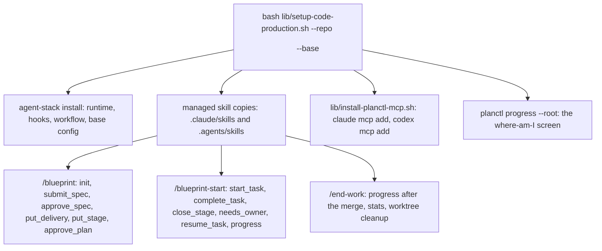

# planctl rollout: the skills on the tools and one installer

Status: SPEC_DRAFT  
Spec lock: unlocked  
Implementation lock: unlocked  
Active Delivery: none  
Unattended decisions: allowed  

<!-- plan:spec:start -->
## The Goal

1. One command, `bash lib/setup-code-production.sh --repo <dir> --base <branch>`, installs the new process into any consumer repository. Afterwards the runtime, hooks and workflow are installed and `code-production.base` is set. The three flow skills exist as managed copies for Claude and Codex, the planctl MCP server is registered once per user, and `planctl progress --root <dir>` answers.
2. The three flow skills (`blueprint`, `blueprint-start`, `end-work`) name only MCP tools and read as one page each. No CLI flags, no Stage result file, no `--reason`; the reply after every write is the three lines the tool returns.
3. A second clone of magnis-app, installed with that one command, runs a plan end to end through the tools while the first clone keeps the current process. The owner compares the two on the event log (`planctl stats`) and the plan file.

## Why now

Today the merge of PR #20 changes nothing for an agent. The launcher runs an old checkout, no MCP server is registered, and the skills still describe the CLI flow. Two of their commands now fail: `needs-owner --reason` and `init` without a base branch. magnis-app carries its own diverged copies of `blueprint` and `blueprint-start` under `.claude/skills` and `.agents/skills`. Its agents read those, not the machine's shared skills.

## The target



The consumer repository carries the skills it runs. Today magnis-app has its own copies under `.claude/skills` and `.agents/skills`, diverged from `shared/skills`; after this plan those three directories are managed files that `agent-stack install` writes from `shared/skills` and `agent-stack check` compares, like the runtime. Consumer-only skills (`fast-precommit`, `quick-fix`, `ship-pr` and the rest) stay untouched. The user-level symlinks (`~/.claude/skills`, `~/.codex/skills`) keep pointing at the checkout, so a host without a consumer repository still has the same skills.

The installer is one shell script in `lib/`, in the shape of `lib/install-linear-mcp.sh` and `lib/setup-planctl.sh`: it validates its two arguments, runs `agent-stack install <repo> --base <branch>`, then `lib/install-planctl-mcp.sh`, then prints the progress screen. It refuses a repository without the seven `agent:*` scripts, as `agent-stack check` does today. It never edits `.claude/settings.json`: hooks stay the consumer's.

`lib/install-planctl-mcp.sh` registers the server once per user, idempotently: `claude mcp add -s user planctl -- planctl mcp` and `codex mcp add planctl -- planctl mcp`, skipping what `claude mcp get planctl` and `codex mcp get planctl` already report. `update.sh` gains the step after `install-linear-mcp.sh`.

### Interfaces

```typescript
interface AgentStackInstallOptions {
  readonly repository: string;
  readonly base: string | null;
}

interface ManagedFile {
  readonly source: string;
  readonly target: string;
  readonly executable: boolean;
  readonly guarded: boolean;
}
```

`agent-stack install` takes `--base <branch>` and writes `code-production.base` into the repository's local Git config; `check` reports a missing value. `ManagedFile` is the existing record; the three skill directories add their `SKILL.md` files to the same list.

### The three skills

`blueprint` opens with `init` (root, title) and reads the returned sections, vocabulary and Goal rule. It writes the SPEC as one text and sends it with `submit_spec`: the `baseRevision` from `init`, the owner's request, the whole SPEC. It shows the owner the three-line reply verbatim and stops. After the owner's word it calls `approve_spec`, then `put_delivery` and `put_stage` with the returned revisions, reading each reply's findings, and stops again with the reply. After the second word: `approve_plan`. No file is edited by hand; no `mdurl` call; no Stage result file.

`blueprint-start` opens with `start_task` (plan) and follows the brief: RED with the printed command, GREEN, the diff review, one commit. Then `complete_task` takes the plan, the Task IDs, the commit and the result sentence. It closes a Stage with `close_stage` and continues with `start_task` again. It records a question with `needs_owner` as the four-part form and clears it with `resume_task`. It asks `progress` for the whole picture and after a context compaction. Delivery: push, CI, ready, the PR URL and the plan URL from the last reply.

`end-work` runs after the owner's merge: `progress` shows the merged state, `planctl stats --since <plan date>` gives the numbers of the retro, and the worktree cleanup stays as today. It never commits.

Each skill exists once, in `shared/skills`; `claude/skills` and `codex/skills` keep their symlinks; the consumer copies are managed files.

### Target tree

| Action | File | Purpose |
|---|---|---|
| CREATE | `lib/setup-code-production.sh` | One command: install the stack into a repository, set the base, register MCP, print progress. |
| CREATE | `lib/install-planctl-mcp.sh` | Register `planctl mcp` for Claude and Codex once per user, idempotently. |
| MODIFY | `update.sh` | Run `install-planctl-mcp.sh` after the Linear step. |
| MODIFY | `shared/code-production/agent-stack.ts` | `--base <branch>` writes the local config; the three skill directories become managed files. |
| MODIFY | `shared/code-production/agent-stack.test.ts` | The base config is written and checked; the skill copies are installed and compared. |
| MODIFY | `shared/skills/blueprint/SKILL.md` | The authoring flow on `init`, `submit_spec`, `approve_spec`, `put_delivery`, `put_stage`, `approve_plan`. |
| MODIFY | `shared/skills/blueprint-start/SKILL.md` | The execution flow on `start_task`, `complete_task`, `close_stage`, `needs_owner`, `resume_task`, `progress`. |
| MODIFY | `shared/skills/end-work/SKILL.md` | The close-out on `progress` and `planctl stats`; no commit. |
| MODIFY | `README.md` | The one-command install for a consumer repository. |
| MODIFY | `shared/code-production/package-contract.md` | The base branch and the managed skill copies as part of the contract. |
| MODIFY | `planctl/test/instruction-audit.test.ts` | The three skills pass the audit with the tool names as vocabulary. |

### Invariants

| Invariant | Test |
|---|---|
| One command installs everything into a fresh clone. | Run `setup-code-production.sh` on a fixture repository with the seven scripts; the runtime, hooks, workflow, base config and the three skill copies exist; `agent-stack check` passes. |
| The installer refuses a repository without the contract. | Run it on a fixture without `agent:verify:pr`; it exits non-zero naming the script. |
| MCP registration is idempotent. | Run `install-planctl-mcp.sh` twice with fake `claude` and `codex` on PATH; each `mcp add` runs once. |
| The skills name only tools. | The instruction audit finds no `planctl <command>` line in the three skills except `planctl stats` and `planctl progress --note`. |
| A consumer copy is a managed file. | Change a consumer's `.claude/skills/blueprint/SKILL.md`; `agent-stack check` reports it stale; `install` restores it. |

### Reuse

| Existing | Used for |
|---|---|
| `shared/code-production/agent-stack.ts` managed files, manifest, `check` | The skill copies and the base config ride the same install and check. |
| `lib/install-linear-mcp.sh` | The registration shape for Claude and Codex. |
| `lib/setup-planctl.sh`, `update.sh` steps | Where the new step lives and how it is run on every host. |
| `planctl mcp`, `planctl progress`, `planctl stats` (PR #20) | Everything the skills call. |
| `shared/code-production/instruction-audit.ts` | The audit that proves the skills speak the vocabulary. |

## New names

| Name | Reason |
|---|---|
| `setup-code-production.sh` | The one command for a consumer repository; `setup-planctl.sh` installs the observer, not the process. |
| `install-planctl-mcp.sh` | The per-user MCP registration, beside `install-linear-mcp.sh`. |

## Not verified

The parallel comparison on the second magnis-app clone is the owner's run, after the merge; this plan makes it possible and does not perform it. The Codex registration is exercised with a fake `codex` on PATH; the live registration is checked at the first install. The skills are read by agents, not executed by tests; the audit proves their vocabulary, not their behavior.

## Owner request

> Тогда давай перепишем аккуратно скиллы, сделаем установщик, и тогда это будет готовая работа. И потом я хочу сделать отдельно другой репозиторий, скопировать в другой ветке. Например, тот же самый Magnus App я хочу сделать в другом каталоге и его протестировать. То есть давай мы сделаем полный бандл, который ставится куда-то, и я его параллельно протестирую. И заодно смогу сравнить с тем, как работают текущие процессы. Вот тогда какие-то корректировки мы сможем дать правильно.
<!-- plan:spec:end -->

<!-- plan:implementation:start -->
## Implementation contract
<!-- plan:implementation:end -->

<!-- plan:execution:start -->
## Execution log
<!-- plan:execution:end -->
