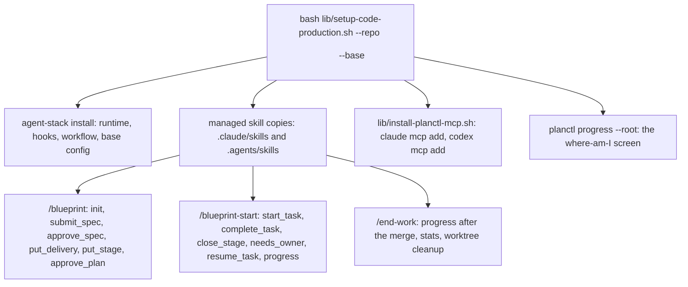

# planctl rollout: the skills on the tools and one installer

Status: SPEC_LOCKED  
Spec lock: sha256:c8b973007e0ab1af1506ce4377f918b476c257f72728f9b93e5ca3e99fc24458 owner:Да, давай это воплотим и запустим параллельно  
Implementation lock: unlocked  
Active Delivery: D1  
Unattended decisions: allowed  

<!-- plan:spec:start -->
## The Goal

1. One command, `bash lib/setup-code-production.sh --repo <dir> --base <branch>`, installs the new process into any consumer repository. Afterwards the runtime, hooks and workflow are installed and `code-production.base` is set. The three flow skills exist as managed copies for Claude and Codex, the planctl MCP server is registered once per user, and `planctl progress --root <dir>` answers.
2. The three flow skills (`blueprint`, `blueprint-start`, `end-work`) name only MCP tools and read as one page each. No CLI flags, no Stage result file, no `--reason`; the reply after every write is the three lines the tool returns.
3. A second clone of magnis-app on this machine, installed with that one command, runs the same kind of plan through the tools while the first clone keeps the current process. Both plans are measured on one yardstick: elapsed time from init to a ready PR, owner messages, agent stops, commits per Stage, CI runs and review findings.

## Why now

Today the merge of PR #20 changes nothing for an agent. The launcher runs an old checkout, no MCP server is registered, and the skills still describe the CLI flow. Two of their commands now fail: `needs-owner --reason` and `init` without a base branch. magnis-app carries its own diverged copies of `blueprint` and `blueprint-start` under `.claude/skills` and `.agents/skills`. Its agents read those, not the machine's shared skills.

## The target



The consumer repository carries the skills it runs. Today magnis-app has its own copies under `.claude/skills` and `.agents/skills`, diverged from `shared/skills`; after this plan those three directories are managed files that `agent-stack install` writes from `shared/skills` and `agent-stack check` compares, like the runtime. Consumer-only skills (`fast-precommit`, `quick-fix`, `ship-pr` and the rest) stay untouched. The user-level symlinks (`~/.claude/skills`, `~/.codex/skills`) keep pointing at the checkout, so a host without a consumer repository still has the same skills.

The installer is one shell script in `lib/`, in the shape of `lib/install-linear-mcp.sh` and `lib/setup-planctl.sh`: it validates its two arguments, runs `agent-stack install <repo> --base <branch>`, then `lib/install-planctl-mcp.sh`, then prints the progress screen. It refuses a repository without the seven `agent:*` scripts, as `agent-stack check` does today. It never edits `.claude/settings.json`: hooks stay the consumer's.

`lib/install-planctl-mcp.sh` registers the server once per user, idempotently: `claude mcp add -s user planctl -- planctl mcp` and `codex mcp add planctl -- planctl mcp`, skipping what `claude mcp get planctl` and `codex mcp get planctl` already report. `update.sh` gains the step after `install-linear-mcp.sh`.

### The A/B on this machine

Clone A is the existing `magnis-app` checkout with its own `.claude/skills` and `.agents/skills` copies of the old flow; nothing changes there. Clone B is a fresh clone of the same origin in another directory, for example `~/Coding/magnis-app-b`, on branches prefixed `b/` so its PRs are told apart. The one command installs the new process into B only. The managed skill copies in B shadow the machine's global skills, and A's old copies shadow them too, so each clone's agent reads its own flow. The MCP registration is per user; A's old skills never name a tool, so A's agents keep the CLI flow.

The same request goes to both clones: a small feature or bug from the magnis-app backlog, one plan each, one agent each. The yardstick is one table with six rows per plan, and every number has a source that exists in both clones:

| Measure | Clone A, current process | Clone B, new process |
|---|---|---|
| Elapsed time, init to ready PR | plan file commit time to the PR's ready event (`gh pr view --json`) | the same |
| Owner messages | count in the session transcript | the same, and `planctl stats` owner-wait rows |
| Agent stops | turns that ended in a question or a refusal, counted in the transcript | refused rows in `planctl stats` beside the transcript count |
| Commits per Stage | `git log` on the plan branch | the same |
| CI runs | `gh run list --branch` | the same, and the CI rows in `planctl stats` |
| Review findings | the reviewer's report on the ready PR | the same |

The event log adds what A cannot record: per-call durations and refusals with reasons. The transcript counts are the common ground, so the comparison never depends on the log alone.

### Interfaces

```typescript
interface AgentStackInstallOptions {
  readonly repository: string;
  readonly base: string | null;
}

interface ManagedFile {
  readonly source: string;
  readonly target: string;
  readonly executable: boolean;
  readonly guarded: boolean;
}
```

`agent-stack install` takes `--base <branch>` and writes `code-production.base` into the repository's local Git config; `check` reports a missing value. `ManagedFile` is the existing record; the three skill directories add their `SKILL.md` files to the same list.

### The three skills

`blueprint` opens with `init` (root, title) and reads the returned sections, vocabulary and Goal rule. It writes the SPEC as one text and sends it with `submit_spec`: the `baseRevision` from `init`, the owner's request, the whole SPEC. It shows the owner the three-line reply verbatim and stops. After the owner's word it calls `approve_spec`, then `put_delivery` and `put_stage` with the returned revisions, reading each reply's findings, and stops again with the reply. After the second word: `approve_plan`. No file is edited by hand; no `mdurl` call; no Stage result file.

`blueprint-start` opens with `start_task` (plan) and follows the brief: RED with the printed command, GREEN, the diff review, one commit. Then `complete_task` takes the plan, the Task IDs, the commit and the result sentence. It closes a Stage with `close_stage` and continues with `start_task` again. It records a question with `needs_owner` as the four-part form and clears it with `resume_task`. It asks `progress` for the whole picture and after a context compaction. Delivery: push, CI, ready, the PR URL and the plan URL from the last reply.

`end-work` runs after the owner's merge: `progress` shows the merged state, `planctl stats --since <plan date>` gives the numbers of the retro, and the worktree cleanup stays as today. It never commits.

Each skill exists once, in `shared/skills`; `claude/skills` and `codex/skills` keep their symlinks; the consumer copies are managed files.

### Target tree

| Action | File | Purpose |
|---|---|---|
| CREATE | `lib/setup-code-production.sh` | One command: install the stack into a repository, set the base, register MCP, print progress. |
| CREATE | `lib/install-planctl-mcp.sh` | Register `planctl mcp` for Claude and Codex once per user, idempotently. |
| MODIFY | `update.sh` | Run `install-planctl-mcp.sh` after the Linear step. |
| MODIFY | `shared/code-production/agent-stack.ts` | `--base <branch>` writes the local config; the three skill directories become managed files. |
| MODIFY | `shared/code-production/agent-stack.test.ts` | The base config is written and checked; the skill copies are installed and compared. |
| MODIFY | `shared/skills/blueprint/SKILL.md` | The authoring flow on `init`, `submit_spec`, `approve_spec`, `put_delivery`, `put_stage`, `approve_plan`. |
| MODIFY | `shared/skills/blueprint-start/SKILL.md` | The execution flow on `start_task`, `complete_task`, `close_stage`, `needs_owner`, `resume_task`, `progress`. |
| MODIFY | `shared/skills/end-work/SKILL.md` | The close-out on `progress` and `planctl stats`; no commit. |
| MODIFY | `README.md` | The one-command install for a consumer repository. |
| MODIFY | `shared/code-production/package-contract.md` | The base branch and the managed skill copies as part of the contract. |
| MODIFY | `planctl/test/instruction-audit.test.ts` | The three skills pass the audit with the tool names as vocabulary. |

### Invariants

| Invariant | Test |
|---|---|
| One command installs everything into a fresh clone. | Run `setup-code-production.sh` on a fixture repository with the seven scripts; the runtime, hooks, workflow, base config and the three skill copies exist; `agent-stack check` passes. |
| The installer refuses a repository without the contract. | Run it on a fixture without `agent:verify:pr`; it exits non-zero naming the script. |
| MCP registration is idempotent. | Run `install-planctl-mcp.sh` twice with fake `claude` and `codex` on PATH; each `mcp add` runs once. |
| The skills name only tools. | The instruction audit finds no `planctl <command>` line in the three skills except `planctl stats` and `planctl progress --note`. |
| A consumer copy is a managed file. | Change a consumer's `.claude/skills/blueprint/SKILL.md`; `agent-stack check` reports it stale; `install` restores it. |

### Reuse

| Existing | Used for |
|---|---|
| `shared/code-production/agent-stack.ts` managed files, manifest, `check` | The skill copies and the base config ride the same install and check. |
| `lib/install-linear-mcp.sh` | The registration shape for Claude and Codex. |
| `lib/setup-planctl.sh`, `update.sh` steps | Where the new step lives and how it is run on every host. |
| `planctl mcp`, `planctl progress`, `planctl stats` (PR #20) | Everything the skills call. |
| `shared/code-production/instruction-audit.ts` | The audit that proves the skills speak the vocabulary. |

## New names

| Name | Reason |
|---|---|
| `setup-code-production.sh` | The one command for a consumer repository; `setup-planctl.sh` installs the observer, not the process. |
| `install-planctl-mcp.sh` | The per-user MCP registration, beside `install-linear-mcp.sh`. |

## Not verified

The parallel comparison on the second magnis-app clone is the owner's run, after the merge; this plan makes it possible and does not perform it. The transcript counts of owner messages and agent stops are read by hand; nothing in this plan automates them. The Codex registration is exercised with a fake `codex` on PATH; the live registration is checked at the first install. The skills are read by agents, not executed by tests; the audit proves their vocabulary, not their behavior.

## Owner request

> Тогда давай перепишем аккуратно скиллы, сделаем установщик, и тогда это будет готовая работа. И потом я хочу сделать отдельно другой репозиторий, скопировать в другой ветке. Например, тот же самый Magnus App я хочу сделать в другом каталоге и его протестировать. То есть давай мы сделаем полный бандл, который ставится куда-то, и я его параллельно протестирую. И заодно смогу сравнить с тем, как работают текущие процессы. Вот тогда какие-то корректировки мы сможем дать правильно.
<!-- plan:spec:end -->

<!-- plan:implementation:start -->
## Implementation contract

<!-- plan:delivery:D1:start -->
<!-- plan:delivery-meta:{"active":true,"depends":[],"predictedExternalWaitMinutes":120} -->
### PR Delivery D1 — The skills on the tools and one installer

Branch: `feat/planctl-rollout`; Depends: none; Gate: cd planctl && bun run agent:verify:docs, cd planctl && bun run agent:verify:pr, cd planctl && bun test ../shared/code-production/agent-stack.test.ts.

Stage graph: `D1-S1 -> D1-S2 -> D1-S3`.

Forecast: 370 active min / 38 credits across 3 Stages; longest dependency path 370 active min; external waits 120 min.

What changed for people. One command installs the new process into a consumer repository. It leaves the runtime, hooks and workflow, the base branch, the three flow skills as managed copies, and the planctl MCP server registered once per user. The three skills speak only the tools. After every write the owner sees the three-line reply. A second clone of magnis-app can run the new process beside the current one.

What changed in the code. agent-stack takes --base and manages the skill copies. Two shell scripts in lib register the server and run the whole install; update.sh gains the registration step. The three skills are rewritten, and the audit proves they name only tools.

How it was proven. The shared agent-stack suite, a setup test with fake claude and codex on PATH, the instruction audit over the three skills, and the package gate. The PR stacks on PR #20 and becomes mergeable after it.

Not in this PR. The owner's parallel run on the second clone and its comparison table.

<!-- plan:stage:D1-S1:start -->
<!-- plan:stage-meta:{"deliveryId":"D1","depends":[],"parallelWith":[],"writes":["shared/code-production/"],"tempRoot":".tmp/code-production/planctl-rollout/D1-S1","predictedActiveMinutes":120,"predictedCredits":12,"verifyActiveMinutes":10,"verifyCredits":1} -->
#### Stage D1-S1 — agent-stack installs the base branch and the managed skill copies

- Owner: agent-1; Profile: strong; Depends: none; Parallel with: none.
- Writes: `shared/code-production/`.
- Temp root: `.tmp/code-production/planctl-rollout/D1-S1` (must be absent at handoff).
- Of which verification: 10 active min / 1 credits.

feat(agent-stack): install the base branch and the three skill copies

Done for Goal outcome 1: one install leaves the base branch set and the skills in the repository. The install command takes --base <branch> and writes code-production.base into the repository's local Git config. The check command reports a missing value with the command that sets it. The three flow skills become managed files. The install writes .claude/skills/<name>/SKILL.md and .agents/skills/<name>/SKILL.md from shared/skills/<name>/SKILL.md. The check reports a changed copy as stale, and consumer-only skills stay untouched. The package contract names both.

Proven by shared/code-production/agent-stack.test.ts. An install with --base writes the value and check passes; a check without it names the git config command. The six skill copies exist after install. An edited copy is stale and install restores it. A consumer-only skill survives install.

##### Tasks

- [ ] ROLL_001 — agent-stack install --base <branch> writes code-production.base into the repository's local Git config, and check reports a missing value with the command that sets it. (50 min)
<!-- plan:task-meta:{"writes":["shared/code-production/agent-stack.ts","shared/code-production/agent-stack.test.ts"],"predictedActiveMinutes":50,"predictedCredits":5,"how":"add --base <branch> to the install command in shared/code-production/agent-stack.ts and write code-production.base with git config in the repository; make check refuse a missing value naming git config code-production.base <branch>; in shared/code-production/agent-stack.test.ts install a fixture with --base and read the value back, then remove it and read the refusal","red":"bun run agent:test:backend -- ../shared/code-production/agent-stack.test.ts -t tst_agent_stack_014"} -->
- [ ] ROLL_002 — install writes the three flow skills into .claude/skills and .agents/skills as managed files from shared/skills; check reports an edited copy; consumer-only skills stay untouched. (60 min)
<!-- plan:task-meta:{"writes":["shared/code-production/agent-stack.ts","shared/code-production/agent-stack.test.ts","shared/code-production/package-contract.md"],"predictedActiveMinutes":60,"predictedCredits":6,"how":"add the six SKILL.md targets for blueprint, blueprint-start and end-work to managedFiles in shared/code-production/agent-stack.ts, sourced from shared/skills; keep them in the manifest so check compares them; state the base branch and the managed skill copies in shared/code-production/package-contract.md; in shared/code-production/agent-stack.test.ts read the six copies after install, edit one and see check report it stale and install restore it, and see a consumer-only skill directory survive install","red":"bun run agent:test:backend -- ../shared/code-production/agent-stack.test.ts -t tst_agent_stack_015"} -->

##### Acceptance criteria

- [ ] `cd planctl && bun test ../shared/code-production/agent-stack.test.ts` exits 0 — the base branch is written and checked, the skill copies are installed, compared and restored
- [ ] Commit

##### Results

<!-- plan:results:D1-S1:start -->
| Task | Commit | UTC start-end | Active / elapsed | Usage | Result / proof |
|---|---|---|---:|---|---|
<!-- plan:results:D1-S1:end -->
<!-- plan:stage:D1-S1:end -->

<!-- plan:stage:D1-S2:start -->
<!-- plan:stage-meta:{"deliveryId":"D1","depends":["D1-S1"],"parallelWith":[],"writes":["lib/","update.sh","README.md","planctl/test/"],"tempRoot":".tmp/code-production/planctl-rollout/D1-S2","predictedActiveMinutes":115,"predictedCredits":12,"verifyActiveMinutes":10,"verifyCredits":1} -->
#### Stage D1-S2 — One command installs the process and registers the MCP server

- Owner: agent-1; Profile: strong; Depends: D1-S1; Parallel with: none.
- Writes: `lib/`, `update.sh`, `README.md`, `planctl/test/`.
- Temp root: `.tmp/code-production/planctl-rollout/D1-S2` (must be absent at handoff).
- Of which verification: 10 active min / 1 credits.

feat(lib): one command installs the process into a repository and registers planctl over MCP

Done for Goal outcome 1: bash lib/setup-code-production.sh --repo <dir> --base <branch> is the whole install. The script validates its two arguments, runs agent-stack install with the base, runs lib/install-planctl-mcp.sh, and prints planctl progress --root for the repository. It refuses a repository without the seven agent scripts, as agent-stack check does, naming the missing script. The script lib/install-planctl-mcp.sh registers planctl mcp for Claude with claude mcp add -s user and for Codex with codex mcp add. It skips what claude mcp get and codex mcp get already report, in the shape of lib/install-linear-mcp.sh. The update.sh script runs it after the Linear step, and README documents the one command.

Proven by planctl/test/setup-code-production.test.ts with fake claude and codex on PATH. One run on a fixture repository with the seven scripts leaves the runtime, hooks, workflow, base config and skill copies in place, and agent-stack check passes. A second run of the registration adds nothing. A fixture without agent:verify:pr is refused with its name. The printed screen names the plan.

##### Tasks

- [ ] ROLL_003 — lib/install-planctl-mcp.sh registers planctl mcp for Claude and Codex once per user; a second run adds nothing, and update.sh runs it after the Linear step. (45 min)
<!-- plan:task-meta:{"writes":["lib/install-planctl-mcp.sh","update.sh","planctl/test/setup-code-production.test.ts"],"predictedActiveMinutes":45,"predictedCredits":5,"how":"create lib/install-planctl-mcp.sh in the shape of lib/install-linear-mcp.sh: claude mcp add -s user planctl -- planctl mcp unless claude mcp get planctl succeeds, codex mcp add planctl -- planctl mcp unless codex mcp get planctl succeeds, a --help text, and a skip with a message when a CLI is absent; add the step to update.sh after install-linear-mcp.sh with a --skip name; in planctl/test/setup-code-production.test.ts put fake claude and codex scripts on PATH that record their arguments, run the script twice and read one add per CLI","red":"bun run agent:test:backend -- test/setup-code-production.test.ts -t tst_unit_planctl_setup_001"} -->
- [ ] ROLL_004 — lib/setup-code-production.sh --repo <dir> --base <branch> installs the stack with the base, registers the server, prints the progress screen, and refuses a repository without the contract. (60 min)
<!-- plan:task-meta:{"writes":["lib/setup-code-production.sh","README.md","planctl/test/setup-code-production.test.ts"],"predictedActiveMinutes":60,"predictedCredits":6,"how":"create lib/setup-code-production.sh that validates --repo and --base, runs bun shared/code-production/agent-stack.ts install <repo> --base <branch>, then lib/install-planctl-mcp.sh, then planctl progress --root <repo>, and exits non-zero with the message of agent-stack when the repository lacks a script; document the one command in README.md under the MCP section; in planctl/test/setup-code-production.test.ts run the script on a fixture with the seven scripts and read the runtime, hooks, workflow, base config and six skill copies, then run it on a fixture without agent:verify:pr and read the refusal naming it","red":"bun run agent:test:backend -- test/setup-code-production.test.ts -t tst_unit_planctl_setup_002"} -->

##### Acceptance criteria

- [ ] `cd planctl && bun run agent:test:backend -- test/setup-code-production.test.ts` exits 0 — one run installs everything, the registration is idempotent, a repository without the contract is refused
- [ ] Commit

##### Results

<!-- plan:results:D1-S2:start -->
| Task | Commit | UTC start-end | Active / elapsed | Usage | Result / proof |
|---|---|---|---:|---|---|
<!-- plan:results:D1-S2:end -->
<!-- plan:stage:D1-S2:end -->

<!-- plan:stage:D1-S3:start -->
<!-- plan:stage-meta:{"deliveryId":"D1","depends":["D1-S2"],"parallelWith":[],"writes":["shared/skills/","planctl/test/"],"tempRoot":".tmp/code-production/planctl-rollout/D1-S3","predictedActiveMinutes":135,"predictedCredits":14,"verifyActiveMinutes":10,"verifyCredits":1} -->
#### Stage D1-S3 — The three skills speak only the tools

- Owner: agent-1; Profile: strong; Depends: D1-S2; Parallel with: none.
- Writes: `shared/skills/`, `planctl/test/`.
- Temp root: `.tmp/code-production/planctl-rollout/D1-S3` (must be absent at handoff).
- Of which verification: 10 active min / 1 credits.

feat(skills): blueprint, blueprint-start and end-work on the planctl tools

Done for Goal outcome 2: each skill reads as one page and names only tools. The blueprint skill opens with init and sends the SPEC with submit_spec, using the returned revision and the owner's request. It shows the three-line reply and stops. After the word it calls approve_spec, then put_delivery and put_stage with the returned revisions, and stops with the reply. After the second word it calls approve_plan. The blueprint-start skill opens with start_task and follows the brief through RED, GREEN, the diff review and one commit. Then complete_task takes the Task IDs, the commit and the result sentence, and close_stage closes the Stage. A question goes through needs_owner as the four-part form and resume_task after the answer. The skill asks progress for the whole picture and after a compaction, and delivers by push, CI and ready. The end-work skill runs after the owner's merge: progress, planctl stats --since the plan date for the retro, the worktree cleanup, and never a commit. The Claude and Codex directories keep their symlinks.

Proven by planctl/test/instruction-audit.test.ts. The three skills carry no planctl <command> line except planctl stats and planctl progress --note, and no --from, --reason or JSON file. Each names every tool of its flow. The audit over the repository passes.

##### Tasks

- [ ] ROLL_005 — blueprint authors a plan through init, submit_spec, approve_spec, put_delivery, put_stage and approve_plan, stops twice for the owner's word, and names no CLI command. (45 min)
<!-- plan:task-meta:{"writes":["shared/skills/blueprint/SKILL.md","planctl/test/instruction-audit.test.ts"],"predictedActiveMinutes":45,"predictedCredits":5,"how":"rewrite shared/skills/blueprint/SKILL.md around the tools: init with root and title, the SPEC as one text through submit_spec with the returned revision and the owner's request, the three-line reply shown verbatim and the first stop, approve_spec after the word, put_delivery and put_stage with returned revisions and their findings, the second stop, approve_plan; keep the Goal examples; in planctl/test/instruction-audit.test.ts add the test that reads the three skills and refuses any planctl <command> line except stats and progress --note, any --from, --reason or JSON file, and requires the tool names of each flow","red":"bun run agent:test:backend -- test/instruction-audit.test.ts -t tst_audit_skills_002"} -->
- [ ] ROLL_006 — blueprint-start executes a plan through start_task, complete_task, close_stage, needs_owner, resume_task and progress, with the brief as the scope and the reply after every write. (50 min)
<!-- plan:task-meta:{"writes":["shared/skills/blueprint-start/SKILL.md","planctl/test/instruction-audit.test.ts"],"predictedActiveMinutes":50,"predictedCredits":5,"how":"rewrite shared/skills/blueprint-start/SKILL.md around the tools: start_task without a Task for the running or next one, the brief as the frozen scope, RED with the printed command, GREEN, the diff review, one commit, complete_task with Task IDs, commit and result sentence, close_stage, needs_owner as the four-part form before any question and resume_task after the answer, progress for the whole picture and after a compaction, the delivery by push, CI and ready with the PR URL and the plan URL from the last reply; keep the rules on parallel agents, deviations and time overruns; extend the audit test with this skill's tool names","red":"bun run agent:test:backend -- test/instruction-audit.test.ts -t tst_audit_skills_002"} -->
- [ ] ROLL_007 — end-work closes a merged Delivery with progress, planctl stats for the retro and the worktree cleanup, and never commits. (30 min)
<!-- plan:task-meta:{"writes":["shared/skills/end-work/SKILL.md","planctl/test/instruction-audit.test.ts"],"predictedActiveMinutes":30,"predictedCredits":3,"how":"rewrite shared/skills/end-work/SKILL.md: confirm the merge through progress, take the retro numbers from planctl stats --since the plan date and the plan's Results rows, post the compact retro on the PR, prove the worktree clean and remove it with its temp roots, never commit; extend the audit test with this skill's tool names","red":"bun run agent:test:backend -- test/instruction-audit.test.ts -t tst_audit_skills_002"} -->

##### Acceptance criteria

- [ ] `cd planctl && bun run agent:test:backend -- test/instruction-audit.test.ts` exits 0 — the three skills name only tools and every tool of their flow
- [ ] `cd planctl && bun run agent:verify:docs` exits 0 — the audit over the repository passes with the rewritten skills
- [ ] Commit

##### Results

<!-- plan:results:D1-S3:start -->
| Task | Commit | UTC start-end | Active / elapsed | Usage | Result / proof |
|---|---|---|---:|---|---|
<!-- plan:results:D1-S3:end -->
<!-- plan:stage:D1-S3:end -->
<!-- plan:delivery:D1:end -->
<!-- plan:implementation:end -->

<!-- plan:execution:start -->
## Execution log

- lock-spec sha256:c8b973007e0ab1af1506ce4377f918b476c257f72728f9b93e5ca3e99fc24458 owner:Да, давай это воплотим и запустим параллельно
<!-- plan:execution:end -->
