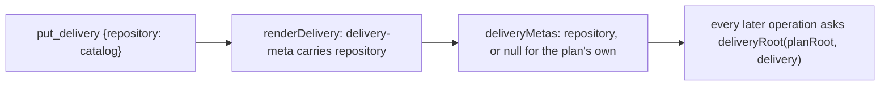
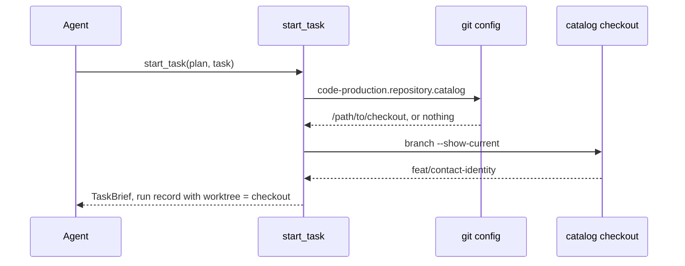
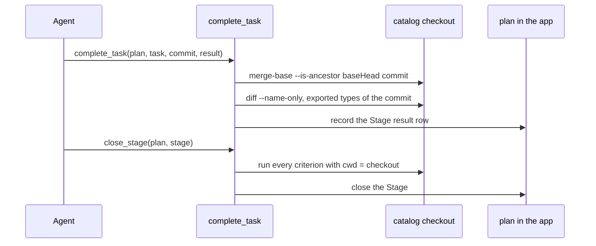
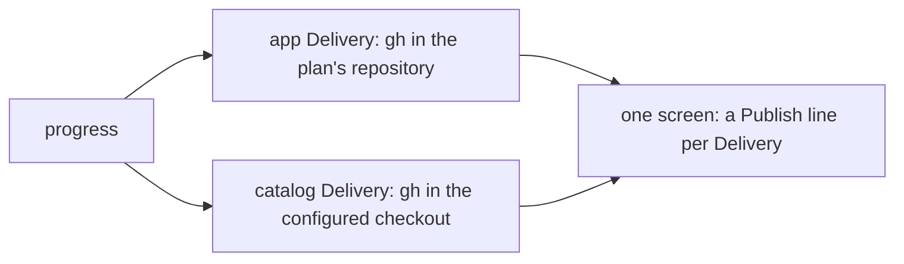

# One plan across two repositories

Status: APPROVED  
Spec lock: sha256:83fbbd5233813f4b648809abee976f6eb50dd4b8b3a0cb8b3ddbb52dde117dc5 owner:Сделай возможность работать в двух репозиториях  
Implementation lock: sha256:5ca0afe4f8482d42056d4b7dfd33e1ec0bd6405b2c90e9cf15587c904c6ca358 agent-unattended  
Active Delivery: D1  
Unattended decisions: allowed  

<!-- plan:spec:start -->
## The Goal

1. A plan in the app carries a Delivery whose branch, commits and PR live in the catalog checkout. There, `start_task`, `complete_task`, `close_stage` and `progress` act, so the identity plan's catalog Stages complete through `complete_task`. Today the tools refuse any commit outside the plan's repository.
2. A Delivery names its repository once, by name, and the checkout path is one git config line per machine. A missing line refuses `start_task` with the command that sets it, so no plan carries a machine path.
3. One `progress` screen shows the PR and CI of every Delivery in its own repository; today it shows the plan's repository only.

## Why now

Now a plan binds every operation to the repository that holds the plan file. Magnis work changes the app and its plugin catalog together, and the identity plan already lists catalog files it cannot deliver. The agent asked to verify catalog commits by hand, outside the tools; a second repository is ordinary work, not an exception.

## The target

### Name the repository of a Delivery



`put_delivery` accepts an optional `repository` name and renders it in the Delivery metadata line; `deliveryMetas` reads it back as a string or null. The plan stays portable: it names the repository, never a path.

| Implementation map | Name the repository |
| --- | --- |
| Owner | `putDelivery` and `deliveryMetas` in `planctl/src/core/plan-update.ts` |
| Target files | `planctl/src/core/plan-update.ts`; `planctl/src/mcp/server.ts`; `planctl/src/cli/main.ts` |
| Input / wake | `DeliveryInput.repository`, absent for the plan's own repository |
| Output / durable state | the `plan:delivery-meta` line of the Delivery carries `repository` |
| RED test | `planctl/test/plan-update.test.ts`: a Delivery put with `repository: "catalog"` reads back with it, one without reads back null |

### Start a Task in the Delivery's checkout



`deliveryRoot(planRoot, delivery)` returns the plan's root for a Delivery without a repository, else the path from `git config code-production.repository.<name>` in the plan's repository. A missing line is refused with the command that sets it. A checkout on another branch than the Delivery's is refused naming both branches. The run record keeps living in the plan's repository, keyed by plan and Task, and its `worktree` names the checkout.

| Implementation map | Start in the checkout |
| --- | --- |
| Owner | `startTask` in `planctl/src/core/plan-update.ts`, through `deliveryRoot` |
| Target files | `planctl/src/core/plan-update.ts`; `planctl/src/mcp/server.ts`; `planctl/src/cli/main.ts` |
| Input / wake | `start_task` for a Task of a Delivery that names a repository |
| Output / durable state | one start record whose `worktree` and `baseHead` come from the checkout |
| RED test | `planctl/test/plan-update.test.ts`: without the config line `start_task` refuses naming `git config code-production.repository.catalog`; on the wrong branch it refuses naming both; on the right branch the record's `worktree` is the checkout |

### Complete and close a Stage there



`complete_task` checks the commit's ancestry and its paths in the Delivery's checkout and reads the exported types there. The result row is still written into the plan, in the app. `close_stage` runs the criteria with the checkout as the working directory. A commit from the plan's repository handed to a catalog Delivery is refused as not descending from the start base.

| Implementation map | Complete and close in the checkout |
| --- | --- |
| Owner | `completeTask` and `closePlanStage` in `planctl/src/core/plan-update.ts` |
| Target files | `planctl/src/core/plan-update.ts`; `planctl/src/core/plan-gate.ts`; `planctl/src/mcp/server.ts`; `planctl/src/cli/main.ts` |
| Input / wake | `complete_task` and `close_stage` for a Stage of a Delivery that names a repository |
| Output / durable state | the result row and the closed Stage in the plan; nothing written in the checkout |
| RED test | `planctl/test/mcp.test.ts`: a catalog Delivery completes with a commit from the catalog fixture and is refused with a commit from the app fixture; `close_stage` runs its criterion in the catalog fixture |

### Progress across both repositories



`planProgress` asks for the publication of every Delivery in its own checkout and renders one line per Delivery with its repository name, PR and CI. The active Delivery keeps its place; the others follow it.

| Implementation map | Progress across repositories |
| --- | --- |
| Owner | `planProgress` in `planctl/src/core/plan-progress.ts` and `renderProgressView` in `planctl/src/cli/render.ts` |
| Target files | `planctl/src/core/plan-progress.ts`; `planctl/src/cli/render.ts`; `planctl/src/mcp/server.ts`; `planctl/src/cli/main.ts` |
| Input / wake | `progress` on a plan with two Deliveries in two repositories |
| Output / durable state | nothing written; one Publish line per Delivery on the screen |
| RED test | `planctl/test/plan-progress.test.ts`: two fake publications answered per checkout render as two Publish lines naming their repositories |

## Target tree

| Action | Path | Reason |
| --- | --- | --- |
| MODIFY | `planctl/src/core/plan-update.ts` | `DeliveryInput.repository`, `DeliveryMeta.repository`, `deliveryRoot`, and start, complete and close acting in that root. |
| MODIFY | `planctl/src/core/plan-gate.ts` | `undeclaredExportedTypes` reads the commit in the Delivery's checkout. |
| MODIFY | `planctl/src/core/plan-progress.ts` | Publication per Delivery in its own checkout; the repository name on the view. |
| MODIFY | `planctl/src/cli/render.ts` | One Publish line per Delivery with its repository. |
| MODIFY | `planctl/src/mcp/server.ts` | `put_delivery` takes `repository`; start, complete, close and progress pass the plan root and let the core resolve the checkout. |
| MODIFY | `planctl/src/cli/main.ts` | The same for the CLI commands; `put-delivery --help` shows `repository`. |
| MODIFY | `planctl/test/plan-update.test.ts`, `planctl/test/mcp.test.ts`, `planctl/test/plan-progress.test.ts` | The RED tests of the four flows, on a second fixture repository. |
| MODIFY | `shared/code-production/laws/plan-format.md` | The Delivery field and the config line. |
| MODIFY | `shared/skills/blueprint/SKILL.md`, `shared/skills/blueprint-start/SKILL.md` | Name the repository at `put_delivery`; create the branch in the checkout and set the config line before `start_task`. |

## Interfaces

```typescript
export interface DeliveryInput {
  readonly id: string;
  readonly title: string;
  readonly branch: string;
  readonly depends: readonly string[];
  readonly gate: readonly string[];
  readonly active: boolean;
  readonly stageGraph: string;
  readonly predictedExternalWaitMinutes: number;
  readonly description: string;
  /** The repository the branch, the commits and the PR live in, by name; absent: the plan's own repository. */
  readonly repository?: string;
}

export interface DeliveryMeta {
  readonly id: string;
  readonly active: boolean;
  readonly depends: readonly string[];
  readonly branch: string;
  readonly predictedExternalWaitMinutes: number;
  readonly repository: string | null;
}

/** The checkout a Delivery's operations run in: the plan's root, or `git config code-production.repository.<name>` of the plan's repository. */
export declare function deliveryRoot(planRoot: string, delivery: DeliveryMeta): string;

export interface ProgressView {
  readonly plan: string;
  readonly state: "SPEC_DRAFT" | "SPEC_LOCKED" | "APPROVED";
  readonly goal: readonly string[];
  readonly currentTask: {
    readonly id: string;
    readonly startedAt: string;
    readonly checkpoint: string | null;
  } | null;
  readonly delivery: {
    readonly id: string;
    readonly repository: string | null;
    readonly completedTasks: number;
    readonly totalTasks: number;
    readonly closedStages: readonly string[];
    readonly openStages: readonly string[];
  } | null;
  readonly publications: readonly {
    readonly deliveryId: string;
    readonly repository: string | null;
    readonly publication: ProgressView["publication"];
  }[];
  readonly publication: {
    readonly prUrl: string;
    readonly headSha: string;
    readonly runId: string;
    readonly attempt: number;
    readonly ci: string;
  } | {
    readonly error: string;
  } | null;
}
```

`StartTaskInput`, `CompleteTaskInput` and `TaskRunV3` keep their fields; `TaskRunV3.worktree` names the checkout the Task runs in.

## Invariants

- Step 1 → Verify: `put_delivery` with `repository: "catalog"` renders it in the metadata line and `deliveryMetas` reads it. A Delivery without it reads null (`planctl/test/plan-update.test.ts`).
- Step 2 → Verify: `start_task` on a catalog Task without the config line refuses naming `git config code-production.repository.catalog <path>`. With the checkout on another branch it refuses naming both branches. On the right branch the record's `worktree` is the checkout and `baseHead` its HEAD (`planctl/test/plan-update.test.ts`).
- Step 3 → Verify: `complete_task` accepts a commit made in the catalog fixture and refuses one made in the app fixture as not descending from the start base. The result row lands in the plan (`planctl/test/mcp.test.ts`).
- Step 4 → Verify: `close_stage` runs a criterion that exists only in the catalog fixture and closes the Stage (`planctl/test/mcp.test.ts`).
- Step 5 → Verify: `progress` on a plan with an app Delivery and a catalog Delivery shows two Publish lines, each from the gh answer of its own checkout (`planctl/test/plan-progress.test.ts`).
- Step 6 → Verify: a plan without any `repository` behaves as today: every existing test of start, complete, close and progress passes unchanged.

## Reuse

| Existing owner | Use |
| --- | --- |
| `deliveryMetas` and `renderDelivery` | One more metadata field, read and written where the others are. |
| `code-production.base` in git config | The same mechanism for the checkout path: one config line per machine, refused by name when missing. |
| `taskRunPath` and `TaskRunV3.worktree` | The record stays in the plan's repository; its existing `worktree` field names the checkout. |
| `readPublication(root, branch)` | Called once per Delivery with the Delivery's checkout. |
| `located` and `repository` in the server | The plan root is found as today; the core resolves the checkout from it. |
| `undeclaredExportedTypes(root, commit, body)` | Given the checkout instead of the plan root. |

## New names

| Name | Reason |
| --- | --- |
| `repository` on a Delivery | The name of the repository a Delivery lives in, the word the catalog rulebook already uses. |
| `deliveryRoot` | The one function every operation asks for the checkout of a Delivery. |
| `code-production.repository.<name>` | The git config line that binds a repository name to a checkout on this machine, beside `code-production.base`. |
| `publications` on `ProgressView` | The publication of every Delivery, where today there is one. |

## Not verified

- The layout of the owner's catalog checkouts for the identity work is not inspected; the config line will name whichever worktree the agent creates.
- `gh` authentication in the catalog checkout is assumed to be the one the app checkout uses.
- The catalog's own hooks run its gates on a catalog commit; this plan does not check them, only the commit's ancestry, paths and types.
- The installed runtime copy in the catalog is not read by this plan; the tools run from the source checkout.
<!-- plan:spec:end -->

<!-- plan:implementation:start -->
## Implementation contract

<!-- plan:delivery:D1:start -->
<!-- plan:delivery-meta:{"active":true,"depends":[],"predictedExternalWaitMinutes":30} -->
### PR Delivery D1 — A plan across two repositories

Branch: `feat/planctl-multirepo`; Depends: none; Gate: cd planctl && bun run agent:verify:pr.

Stage graph: `D1-S1 -> D1-S2 -> D1-S3 -> D1-S4`.

Forecast: 250 active min / 0 credits across 4 Stages; longest dependency path 250 active min; external waits 30 min.

What changed for people. A plan in the app can carry a Delivery whose branch, commits and PR live in the catalog checkout. The agent names the repository once and sets one config line on the machine. Start, complete, close and progress then act there with the same tools.

What changed in the code. DeliveryInput and DeliveryMeta carry repository. The function deliveryRoot resolves the checkout from the config line code-production.repository.<name>. The functions startTask, completeTask, closePlanStage and planProgress act in that checkout. The server and the CLI pass the plan root and let the core resolve the rest.

How it was proven. Unit tests on a second fixture repository. The field round-trips. Start refuses a missing line and a wrong branch. Completion refuses a commit from the plan's repository. Close runs a criterion in the checkout. Progress shows two Publish lines.

Not in this PR. A Delivery in a third repository is the same mechanism; the catalog's own hooks and gates stay the catalog's.

<!-- plan:stage:D1-S1:start -->
<!-- plan:stage-meta:{"deliveryId":"D1","depends":[],"parallelWith":[],"writes":["planctl/src/core/plan-update.ts","planctl/src/mcp/server.ts","planctl/src/cli/main.ts","planctl/test/plan-update.test.ts","planctl/test/mcp.test.ts","shared/skills/blueprint/SKILL.md","shared/code-production/laws/plan-format.md"],"tempRoot":".tmp/code-production/planctl-multirepo/D1-S1","predictedActiveMinutes":80,"predictedCredits":0,"verifyActiveMinutes":10,"verifyCredits":0} -->
#### Stage D1-S1 — Name the repository of a Delivery

- Owner: claude; Profile: strong; Depends: none; Parallel with: none.
- Writes: `planctl/src/core/plan-update.ts`, `planctl/src/mcp/server.ts`, `planctl/src/cli/main.ts`, `planctl/test/plan-update.test.ts`, `planctl/test/mcp.test.ts`, `shared/skills/blueprint/SKILL.md`, `shared/code-production/laws/plan-format.md`.
- Temp root: `.tmp/code-production/planctl-multirepo/D1-S1` (must be absent at handoff).
- Of which verification: 10 active min / 0 credits.

feat(planctl): a Delivery names its repository

Done for the first and second Goal outcomes. A Delivery carries an optional repository name, rendered in its metadata line and read back by deliveryMetas. The function deliveryRoot resolves the checkout from one git config line of the plan's repository and refuses a missing line with the command that sets it. The plan stays portable: it names the repository, never a path.

Proven by the plan-update tests on the field round trip and on deliveryRoot, the MCP test on put_delivery with repository, and the instruction audit on the skill and the law.

##### Tasks

- [ ] MR_001 — Add `repository` to `DeliveryInput` and `DeliveryMeta` in `planctl/src/core/plan-update.ts` and render it in the Delivery metadata line. (25 min)
<!-- plan:task-meta:{"writes":["planctl/src/core/plan-update.ts","planctl/test/plan-update.test.ts"],"predictedActiveMinutes":25,"predictedCredits":0,"how":"Write tst_scripts_planupdate_030 in planctl/test/plan-update.test.ts: putDelivery with repository renders it in the delivery-meta line and deliveryMetas reads it; a Delivery without it reads null. Extend DeliveryInput, DeliveryMeta, renderDelivery and deliveryMetas in planctl/src/core/plan-update.ts.","red":"bun run agent:test:backend -- test/plan-update.test.ts -t tst_scripts_planupdate_030"} -->
- [ ] MR_002 — Add `deliveryRoot` in `planctl/src/core/plan-update.ts` and accept `repository` in `put_delivery` and `put-delivery`. (30 min)
<!-- plan:task-meta:{"writes":["planctl/src/core/plan-update.ts","planctl/src/mcp/server.ts","planctl/src/cli/main.ts","planctl/test/mcp.test.ts","planctl/test/plan-update.test.ts"],"predictedActiveMinutes":30,"predictedCredits":0,"how":"Write tst_unit_planctl_mcp_005 in planctl/test/mcp.test.ts: put_delivery with repository saves it; deliveryRoot without the config line throws naming git config code-production.repository.catalog, with it returns the configured path. Add deliveryRoot to planctl/src/core/plan-update.ts, the field to the put_delivery schema in planctl/src/mcp/server.ts and to the put-delivery help in planctl/src/cli/main.ts.","red":"bun run agent:test:backend -- test/mcp.test.ts -t tst_unit_planctl_mcp_005"} -->
- [ ] MR_003 — Name the Delivery field and the config line in `shared/skills/blueprint/SKILL.md` and `shared/code-production/laws/plan-format.md`. (15 min)
<!-- plan:task-meta:{"writes":["shared/skills/blueprint/SKILL.md","shared/code-production/laws/plan-format.md"],"predictedActiveMinutes":15,"predictedCredits":0,"how":"Add one sentence to the Implementation contract step of shared/skills/blueprint/SKILL.md and one to the Delivery paragraph of shared/code-production/laws/plan-format.md; the instruction audit over the skills stays green.","red":"bun run agent:test:backend -- test/instruction-audit.test.ts"} -->

##### Acceptance criteria

- [ ] `cd planctl && bun run agent:test:backend -- test/plan-update.test.ts` exits 0 — the field round-trips and deliveryRoot refuses and resolves
- [ ] `cd planctl && bun run agent:test:backend -- test/mcp.test.ts` exits 0 — put_delivery carries the repository
- [ ] `cd planctl && bun run typecheck` exits 0 — the new field compiles everywhere
- [ ] Commit

##### Results

<!-- plan:results:D1-S1:start -->
| Task | Commit | UTC start-end | Active / elapsed | Usage | Result / proof |
|---|---|---|---:|---|---|
<!-- plan:results:D1-S1:end -->
<!-- plan:stage:D1-S1:end -->

<!-- plan:stage:D1-S2:start -->
<!-- plan:stage-meta:{"deliveryId":"D1","depends":["D1-S1"],"parallelWith":[],"writes":["planctl/src/core/plan-update.ts","planctl/src/mcp/server.ts","planctl/src/cli/main.ts","planctl/test/plan-update.test.ts","shared/skills/blueprint-start/SKILL.md"],"tempRoot":".tmp/code-production/planctl-multirepo/D1-S2","predictedActiveMinutes":60,"predictedCredits":0,"verifyActiveMinutes":10,"verifyCredits":0} -->
#### Stage D1-S2 — Start a Task in the Delivery's checkout

- Owner: claude; Profile: strong; Depends: D1-S1; Parallel with: none.
- Writes: `planctl/src/core/plan-update.ts`, `planctl/src/mcp/server.ts`, `planctl/src/cli/main.ts`, `planctl/test/plan-update.test.ts`, `shared/skills/blueprint-start/SKILL.md`.
- Temp root: `.tmp/code-production/planctl-multirepo/D1-S2` (must be absent at handoff).
- Of which verification: 10 active min / 0 credits.

feat(planctl): start a Task in the Delivery's checkout

Done for the first Goal outcome. The function startTask asks deliveryRoot for the checkout of the Task's Delivery. A checkout on another branch is refused naming both branches. The start record stays in the plan's repository, with worktree and baseHead taken from that checkout. The blueprint-start skill creates the branch in the checkout and sets the config line before the first start.

Proven by the plan-update test on a second fixture repository and the instruction audit.

##### Tasks

- [ ] MR_004 — Resolve the checkout with `deliveryRoot` in `startTask` of `planctl/src/core/plan-update.ts`: refuse a wrong branch, record `worktree` and `baseHead` from it. (35 min)
<!-- plan:task-meta:{"writes":["planctl/src/core/plan-update.ts","planctl/src/mcp/server.ts","planctl/src/cli/main.ts","planctl/test/plan-update.test.ts"],"predictedActiveMinutes":35,"predictedCredits":0,"how":"Write tst_scripts_planupdate_031 in planctl/test/plan-update.test.ts with a second repository as the catalog: start_task on its Delivery refuses without the config line, refuses on the wrong branch naming both, and on the right branch records worktree and baseHead of the checkout. Change startTask in planctl/src/core/plan-update.ts; the server and the CLI keep passing the plan root.","red":"bun run agent:test:backend -- test/plan-update.test.ts -t tst_scripts_planupdate_031"} -->
- [ ] MR_005 — Tell `shared/skills/blueprint-start/SKILL.md` to create the Delivery branch in the checkout and set the config line before `start_task`. (15 min)
<!-- plan:task-meta:{"writes":["shared/skills/blueprint-start/SKILL.md"],"predictedActiveMinutes":15,"predictedCredits":0,"how":"Add the two sentences to the Start section of shared/skills/blueprint-start/SKILL.md; the instruction audit stays green.","red":"bun run agent:test:backend -- test/instruction-audit.test.ts"} -->

##### Acceptance criteria

- [ ] `cd planctl && bun run agent:test:backend -- test/plan-update.test.ts` exits 0 — start refuses and records in the checkout
- [ ] `cd planctl && bun run typecheck` exits 0 — the start path compiles
- [ ] Commit

##### Results

<!-- plan:results:D1-S2:start -->
| Task | Commit | UTC start-end | Active / elapsed | Usage | Result / proof |
|---|---|---|---:|---|---|
<!-- plan:results:D1-S2:end -->
<!-- plan:stage:D1-S2:end -->

<!-- plan:stage:D1-S3:start -->
<!-- plan:stage-meta:{"deliveryId":"D1","depends":["D1-S2"],"parallelWith":[],"writes":["planctl/src/core/plan-update.ts","planctl/src/core/plan-gate.ts","planctl/src/mcp/server.ts","planctl/src/cli/main.ts","planctl/test/mcp.test.ts"],"tempRoot":".tmp/code-production/planctl-multirepo/D1-S3","predictedActiveMinutes":70,"predictedCredits":0,"verifyActiveMinutes":10,"verifyCredits":0} -->
#### Stage D1-S3 — Complete and close a Stage in the checkout

- Owner: claude; Profile: strong; Depends: D1-S2; Parallel with: none.
- Writes: `planctl/src/core/plan-update.ts`, `planctl/src/core/plan-gate.ts`, `planctl/src/mcp/server.ts`, `planctl/src/cli/main.ts`, `planctl/test/mcp.test.ts`.
- Temp root: `.tmp/code-production/planctl-multirepo/D1-S3` (must be absent at handoff).
- Of which verification: 10 active min / 0 credits.

feat(planctl): complete and close a Stage in the Delivery's checkout

Done for the first Goal outcome. The function completeTask checks the commit's ancestry, its paths and its exported types in the Delivery's checkout and writes the result row into the plan. The function closePlanStage runs the criteria with the checkout as the working directory. A commit from the plan's repository handed to a catalog Delivery is refused as not descending from the start base.

Proven by the MCP test driving a catalog Delivery through start, complete and close on a second fixture repository.

##### Tasks

- [ ] MR_006 — Check ancestry, diff paths and exported types in the Delivery's checkout in `completeTask` of `planctl/src/core/plan-update.ts`. (35 min)
<!-- plan:task-meta:{"writes":["planctl/src/core/plan-update.ts","planctl/src/core/plan-gate.ts","planctl/src/mcp/server.ts","planctl/src/cli/main.ts","planctl/test/mcp.test.ts"],"predictedActiveMinutes":35,"predictedCredits":0,"how":"Write tst_unit_planctl_mcp_006 in planctl/test/mcp.test.ts: a catalog Delivery completes with a commit made in the catalog fixture and is refused with a commit made in the app fixture. Resolve the checkout in completeTask and pass it to stageResultCommitPaths and undeclaredExportedTypes in planctl/src/core/plan-gate.ts.","red":"bun run agent:test:backend -- test/mcp.test.ts -t tst_unit_planctl_mcp_006"} -->
- [ ] MR_007 — Run `closePlanStage` criteria with the Delivery's checkout as cwd, from `planctl/src/mcp/server.ts` and `planctl/src/cli/main.ts`. (25 min)
<!-- plan:task-meta:{"writes":["planctl/src/core/plan-update.ts","planctl/src/mcp/server.ts","planctl/src/cli/main.ts","planctl/test/mcp.test.ts"],"predictedActiveMinutes":25,"predictedCredits":0,"how":"Write tst_unit_planctl_mcp_007 in planctl/test/mcp.test.ts: close_stage runs a criterion that exists only in the catalog fixture and closes the Stage. Pass deliveryRoot of the Stage's Delivery as options.root to closePlanStage in the server and the CLI.","red":"bun run agent:test:backend -- test/mcp.test.ts -t tst_unit_planctl_mcp_007"} -->

##### Acceptance criteria

- [ ] `cd planctl && bun run agent:test:backend -- test/mcp.test.ts` exits 0 — a catalog Delivery completes and closes in its checkout
- [ ] `cd planctl && bun run typecheck` exits 0 — the completion path compiles
- [ ] Commit

##### Results

<!-- plan:results:D1-S3:start -->
| Task | Commit | UTC start-end | Active / elapsed | Usage | Result / proof |
|---|---|---|---:|---|---|
<!-- plan:results:D1-S3:end -->
<!-- plan:stage:D1-S3:end -->

<!-- plan:stage:D1-S4:start -->
<!-- plan:stage-meta:{"deliveryId":"D1","depends":["D1-S3"],"parallelWith":[],"writes":["planctl/src/core/plan-progress.ts","planctl/src/cli/render.ts","planctl/src/mcp/server.ts","planctl/src/cli/main.ts","planctl/test/plan-progress.test.ts"],"tempRoot":".tmp/code-production/planctl-multirepo/D1-S4","predictedActiveMinutes":40,"predictedCredits":0,"verifyActiveMinutes":10,"verifyCredits":0} -->
#### Stage D1-S4 — Progress across both repositories

- Owner: claude; Profile: strong; Depends: D1-S3; Parallel with: none.
- Writes: `planctl/src/core/plan-progress.ts`, `planctl/src/cli/render.ts`, `planctl/src/mcp/server.ts`, `planctl/src/cli/main.ts`, `planctl/test/plan-progress.test.ts`.
- Temp root: `.tmp/code-production/planctl-multirepo/D1-S4` (must be absent at handoff).
- Of which verification: 10 active min / 0 credits.

feat(planctl): progress shows every Delivery in its own repository

Done for the third Goal outcome. The function planProgress asks for the publication of every Delivery in its own checkout. The screen shows one Publish line per Delivery with its repository name, PR and CI; the active Delivery keeps its place.

Proven by the plan-progress test answering two fake publications per checkout.

##### Tasks

- [ ] MR_008 — Ask the publication of every Delivery in its own checkout in `planProgress` of `planctl/src/core/plan-progress.ts` and render one Publish line per Delivery. (30 min)
<!-- plan:task-meta:{"writes":["planctl/src/core/plan-progress.ts","planctl/src/cli/render.ts","planctl/src/mcp/server.ts","planctl/src/cli/main.ts","planctl/test/plan-progress.test.ts"],"predictedActiveMinutes":30,"predictedCredits":0,"how":"Write tst_unit_planctl_progress_004 in planctl/test/plan-progress.test.ts: two Deliveries, one in a catalog fixture, two fake gh answers keyed by checkout, two Publish lines naming their repositories. Add publications and the repository name to ProgressView, resolve each Delivery's checkout with deliveryRoot, render in planctl/src/cli/render.ts.","red":"bun run agent:test:backend -- test/plan-progress.test.ts -t tst_unit_planctl_progress_004"} -->

##### Acceptance criteria

- [ ] `cd planctl && bun run agent:test:backend -- test/plan-progress.test.ts` exits 0 — two Publish lines, one per repository
- [ ] `cd planctl && bun run agent:verify:pr` exits 0 — the complete gate for the finished PR
- [ ] Commit

##### Results

<!-- plan:results:D1-S4:start -->
| Task | Commit | UTC start-end | Active / elapsed | Usage | Result / proof |
|---|---|---|---:|---|---|
<!-- plan:results:D1-S4:end -->
<!-- plan:stage:D1-S4:end -->
<!-- plan:delivery:D1:end -->
<!-- plan:implementation:end -->

<!-- plan:execution:start -->
## Execution log

- lock-spec sha256:83fbbd5233813f4b648809abee976f6eb50dd4b8b3a0cb8b3ddbb52dde117dc5 owner:Сделай возможность работать в двух репозиториях

- approve sha256:c856b330f5fcdae7f898a2263113d57fa852d03f065abd3ef2a50e0c0441729f owner:Сделай возможность работать в двух репозиториях

- owner_review_pending implementation sha256:c4b8c77c730b880acd812c9b864b4838df4778e6bccd31979b718278533a273c decision:eyJ2ZXJzaW9uIjoxLCJkZWNpZGVkQXQiOiIyMDI2LTEwLTAyVDEwOjAwOjAwWiIsImdvYWxQcmVzZXJ2ZWQiOiJ0aGUgc2FtZSB0ZXN0cyBwcm92ZSB0aGUgc2FtZSBmbG93czsgb25seSB0aGVpciBpZHMgbW92ZSB0byBmcmVlIG51bWJlcnMiLCJkZWNpc2lvbiI6InJlbnVtYmVyIHRoZSBSRUQgdGVzdHMgb2YgdGhlIHBsYW4tdXBkYXRlIHN1aXRlIHRvIDAzMCBhbmQgMDMxOiAwMjggYW5kIDAyOSBhbHJlYWR5IGV4aXN0IHRoZXJlIiwiYWx0ZXJuYXRpdmVzIjpbInJldXNlIHRoZSB0YWtlbiBpZHMgYW5kIGNvbGxpZGUgd2l0aCBleGlzdGluZyB0ZXN0cyJdLCJ3aHlDb250aW51ZU5vdyI6InRoZSBjaGFuZ2UgaXMgYm91bmRlZCBhbmQgcmV2ZXJzaWJsZTsgYSB0ZXN0IGlkIGlzIGEgbmFtZSwgbm90IGEgYmVoYXZpb3IiLCJhZmZlY3RlZFNjb3BlIjpbImltcGxlbWVudGF0aW9uIl0sInJvbGxiYWNrQmFzZSI6ImE2OTY0NDBiMDcwOWFiY2JmN2ZjNGM0NTc3M2I0ODBmYWJlMDhmNDgiLCJ2ZXJpZmljYXRpb24iOlsiYnVuIHJ1biBhZ2VudDp0ZXN0OmJhY2tlbmQgLS0gdGVzdC9wbGFuLXVwZGF0ZS50ZXN0LnRzIl19

- owner_review_pending implementation sha256:38ae226b78896c99c29fb38d4360d5a5c1d2e028df6e45dddb081b83c71eccc8 decision:eyJ2ZXJzaW9uIjoxLCJkZWNpZGVkQXQiOiIyMDI2LTEwLTAyVDEwOjAwOjAwWiIsImdvYWxQcmVzZXJ2ZWQiOiJ0aGUgc2FtZSB0ZXN0cyBwcm92ZSB0aGUgc2FtZSBmbG93czsgb25seSB0aGVpciBpZHMgbW92ZSB0byBmcmVlIG51bWJlcnMiLCJkZWNpc2lvbiI6InJlbnVtYmVyIHRoZSBSRUQgdGVzdHMgb2YgdGhlIHBsYW4tdXBkYXRlIHN1aXRlIHRvIDAzMCBhbmQgMDMxOiAwMjggYW5kIDAyOSBhbHJlYWR5IGV4aXN0IHRoZXJlIiwiYWx0ZXJuYXRpdmVzIjpbInJldXNlIHRoZSB0YWtlbiBpZHMgYW5kIGNvbGxpZGUgd2l0aCBleGlzdGluZyB0ZXN0cyJdLCJ3aHlDb250aW51ZU5vdyI6InRoZSBjaGFuZ2UgaXMgYm91bmRlZCBhbmQgcmV2ZXJzaWJsZTsgYSB0ZXN0IGlkIGlzIGEgbmFtZSwgbm90IGEgYmVoYXZpb3IiLCJhZmZlY3RlZFNjb3BlIjpbImltcGxlbWVudGF0aW9uIl0sInJvbGxiYWNrQmFzZSI6ImE2OTY0NDBiMDcwOWFiY2JmN2ZjNGM0NTc3M2I0ODBmYWJlMDhmNDgiLCJ2ZXJpZmljYXRpb24iOlsiYnVuIHJ1biBhZ2VudDp0ZXN0OmJhY2tlbmQgLS0gdGVzdC9wbGFuLXVwZGF0ZS50ZXN0LnRzIl19

- owner_review_pending implementation sha256:75330e2ffd038f594dde19b567b96a5b2e273e758df9a96e64d29896691748d7 decision:eyJ2ZXJzaW9uIjoxLCJkZWNpZGVkQXQiOiIyMDI2LTEwLTAyVDEwOjAwOjAwWiIsImdvYWxQcmVzZXJ2ZWQiOiJ0aGUgc2FtZSB0ZXN0cyBwcm92ZSB0aGUgc2FtZSBmbG93czsgb25seSB0aGVpciBpZHMgbW92ZSB0byBmcmVlIG51bWJlcnMiLCJkZWNpc2lvbiI6InJlbnVtYmVyIHRoZSBSRUQgdGVzdHMgb2YgdGhlIHBsYW4tdXBkYXRlIHN1aXRlIHRvIDAzMCBhbmQgMDMxOiAwMjggYW5kIDAyOSBhbHJlYWR5IGV4aXN0IHRoZXJlIiwiYWx0ZXJuYXRpdmVzIjpbInJldXNlIHRoZSB0YWtlbiBpZHMgYW5kIGNvbGxpZGUgd2l0aCBleGlzdGluZyB0ZXN0cyJdLCJ3aHlDb250aW51ZU5vdyI6InRoZSBjaGFuZ2UgaXMgYm91bmRlZCBhbmQgcmV2ZXJzaWJsZTsgYSB0ZXN0IGlkIGlzIGEgbmFtZSwgbm90IGEgYmVoYXZpb3IiLCJhZmZlY3RlZFNjb3BlIjpbImltcGxlbWVudGF0aW9uIl0sInJvbGxiYWNrQmFzZSI6ImE2OTY0NDBiMDcwOWFiY2JmN2ZjNGM0NTc3M2I0ODBmYWJlMDhmNDgiLCJ2ZXJpZmljYXRpb24iOlsiYnVuIHJ1biBhZ2VudDp0ZXN0OmJhY2tlbmQgLS0gdGVzdC9wbGFuLXVwZGF0ZS50ZXN0LnRzIl19

- owner_review_pending implementation sha256:5ca0afe4f8482d42056d4b7dfd33e1ec0bd6405b2c90e9cf15587c904c6ca358 decision:eyJ2ZXJzaW9uIjoxLCJkZWNpZGVkQXQiOiIyMDI2LTEwLTAyVDEwOjAwOjAwWiIsImdvYWxQcmVzZXJ2ZWQiOiJ0aGUgc2FtZSB0ZXN0cyBwcm92ZSB0aGUgc2FtZSBmbG93czsgb25seSB0aGVpciBpZHMgbW92ZSB0byBmcmVlIG51bWJlcnMiLCJkZWNpc2lvbiI6InJlbnVtYmVyIHRoZSBSRUQgdGVzdHMgb2YgdGhlIHBsYW4tdXBkYXRlIHN1aXRlIHRvIDAzMCBhbmQgMDMxOiAwMjggYW5kIDAyOSBhbHJlYWR5IGV4aXN0IHRoZXJlIiwiYWx0ZXJuYXRpdmVzIjpbInJldXNlIHRoZSB0YWtlbiBpZHMgYW5kIGNvbGxpZGUgd2l0aCBleGlzdGluZyB0ZXN0cyJdLCJ3aHlDb250aW51ZU5vdyI6InRoZSBjaGFuZ2UgaXMgYm91bmRlZCBhbmQgcmV2ZXJzaWJsZTsgYSB0ZXN0IGlkIGlzIGEgbmFtZSwgbm90IGEgYmVoYXZpb3IiLCJhZmZlY3RlZFNjb3BlIjpbImltcGxlbWVudGF0aW9uIl0sInJvbGxiYWNrQmFzZSI6ImE2OTY0NDBiMDcwOWFiY2JmN2ZjNGM0NTc3M2I0ODBmYWJlMDhmNDgiLCJ2ZXJpZmljYXRpb24iOlsiYnVuIHJ1biBhZ2VudDp0ZXN0OmJhY2tlbmQgLS0gdGVzdC9wbGFuLXVwZGF0ZS50ZXN0LnRzIl19
<!-- plan:execution:end -->
