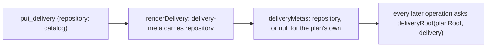
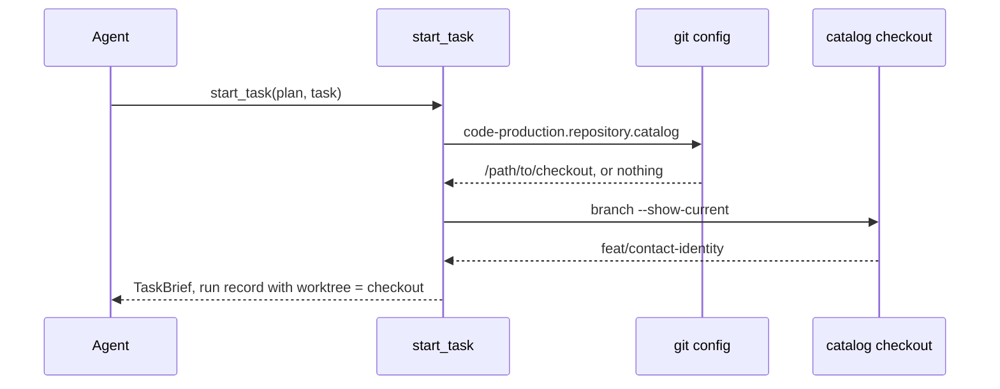
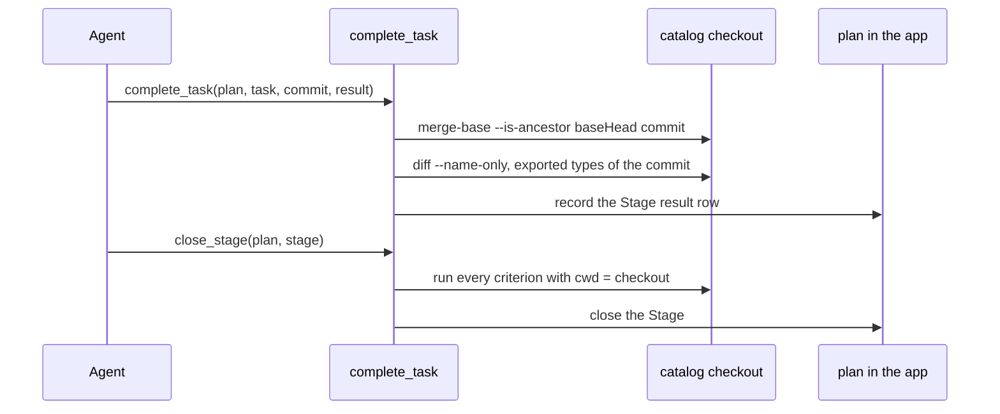
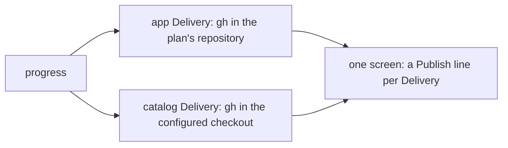

# One plan across two repositories

Status: SPEC_DRAFT  
Spec lock: unlocked  
Implementation lock: unlocked  
Active Delivery: none  
Unattended decisions: allowed  

<!-- plan:spec:start -->
## The Goal

1. A plan in the app carries a Delivery whose branch, commits and PR live in the catalog checkout. There, `start_task`, `complete_task`, `close_stage` and `progress` act, so the identity plan's catalog Stages complete through `complete_task`. Today the tools refuse any commit outside the plan's repository.
2. A Delivery names its repository once, by name, and the checkout path is one git config line per machine. A missing line refuses `start_task` with the command that sets it, so no plan carries a machine path.
3. One `progress` screen shows the PR and CI of every Delivery in its own repository; today it shows the plan's repository only.

## Why now

Now a plan binds every operation to the repository that holds the plan file. Magnis work changes the app and its plugin catalog together, and the identity plan already lists catalog files it cannot deliver. The agent asked to verify catalog commits by hand, outside the tools; a second repository is ordinary work, not an exception.

## The target

### Name the repository of a Delivery



`put_delivery` accepts an optional `repository` name and renders it in the Delivery metadata line; `deliveryMetas` reads it back as a string or null. The plan stays portable: it names the repository, never a path.

| Implementation map | Name the repository |
| --- | --- |
| Owner | `putDelivery` and `deliveryMetas` in `planctl/src/core/plan-update.ts` |
| Target files | `planctl/src/core/plan-update.ts`; `planctl/src/mcp/server.ts`; `planctl/src/cli/main.ts` |
| Input / wake | `DeliveryInput.repository`, absent for the plan's own repository |
| Output / durable state | the `plan:delivery-meta` line of the Delivery carries `repository` |
| RED test | `planctl/test/plan-update.test.ts`: a Delivery put with `repository: "catalog"` reads back with it, one without reads back null |

### Start a Task in the Delivery's checkout



`deliveryRoot(planRoot, delivery)` returns the plan's root for a Delivery without a repository, else the path from `git config code-production.repository.<name>` in the plan's repository. A missing line is refused with the command that sets it. A checkout on another branch than the Delivery's is refused naming both branches. The run record keeps living in the plan's repository, keyed by plan and Task, and its `worktree` names the checkout.

| Implementation map | Start in the checkout |
| --- | --- |
| Owner | `startTask` in `planctl/src/core/plan-update.ts`, through `deliveryRoot` |
| Target files | `planctl/src/core/plan-update.ts`; `planctl/src/mcp/server.ts`; `planctl/src/cli/main.ts` |
| Input / wake | `start_task` for a Task of a Delivery that names a repository |
| Output / durable state | one start record whose `worktree` and `baseHead` come from the checkout |
| RED test | `planctl/test/plan-update.test.ts`: without the config line `start_task` refuses naming `git config code-production.repository.catalog`; on the wrong branch it refuses naming both; on the right branch the record's `worktree` is the checkout |

### Complete and close a Stage there



`complete_task` checks the commit's ancestry and its paths in the Delivery's checkout and reads the exported types there. The result row is still written into the plan, in the app. `close_stage` runs the criteria with the checkout as the working directory. A commit from the plan's repository handed to a catalog Delivery is refused as not descending from the start base.

| Implementation map | Complete and close in the checkout |
| --- | --- |
| Owner | `completeTask` and `closePlanStage` in `planctl/src/core/plan-update.ts` |
| Target files | `planctl/src/core/plan-update.ts`; `planctl/src/core/plan-gate.ts`; `planctl/src/mcp/server.ts`; `planctl/src/cli/main.ts` |
| Input / wake | `complete_task` and `close_stage` for a Stage of a Delivery that names a repository |
| Output / durable state | the result row and the closed Stage in the plan; nothing written in the checkout |
| RED test | `planctl/test/mcp.test.ts`: a catalog Delivery completes with a commit from the catalog fixture and is refused with a commit from the app fixture; `close_stage` runs its criterion in the catalog fixture |

### Progress across both repositories



`planProgress` asks for the publication of every Delivery in its own checkout and renders one line per Delivery with its repository name, PR and CI. The active Delivery keeps its place; the others follow it.

| Implementation map | Progress across repositories |
| --- | --- |
| Owner | `planProgress` in `planctl/src/core/plan-progress.ts` and `renderProgressView` in `planctl/src/cli/render.ts` |
| Target files | `planctl/src/core/plan-progress.ts`; `planctl/src/cli/render.ts`; `planctl/src/mcp/server.ts`; `planctl/src/cli/main.ts` |
| Input / wake | `progress` on a plan with two Deliveries in two repositories |
| Output / durable state | nothing written; one Publish line per Delivery on the screen |
| RED test | `planctl/test/plan-progress.test.ts`: two fake publications answered per checkout render as two Publish lines naming their repositories |

## Target tree

| Action | Path | Reason |
| --- | --- | --- |
| MODIFY | `planctl/src/core/plan-update.ts` | `DeliveryInput.repository`, `DeliveryMeta.repository`, `deliveryRoot`, and start, complete and close acting in that root. |
| MODIFY | `planctl/src/core/plan-gate.ts` | `undeclaredExportedTypes` reads the commit in the Delivery's checkout. |
| MODIFY | `planctl/src/core/plan-progress.ts` | Publication per Delivery in its own checkout; the repository name on the view. |
| MODIFY | `planctl/src/cli/render.ts` | One Publish line per Delivery with its repository. |
| MODIFY | `planctl/src/mcp/server.ts` | `put_delivery` takes `repository`; start, complete, close and progress pass the plan root and let the core resolve the checkout. |
| MODIFY | `planctl/src/cli/main.ts` | The same for the CLI commands; `put-delivery --help` shows `repository`. |
| MODIFY | `planctl/test/plan-update.test.ts`, `planctl/test/mcp.test.ts`, `planctl/test/plan-progress.test.ts` | The RED tests of the four flows, on a second fixture repository. |
| MODIFY | `shared/code-production/laws/plan-format.md` | The Delivery field and the config line. |
| MODIFY | `shared/skills/blueprint/SKILL.md`, `shared/skills/blueprint-start/SKILL.md` | Name the repository at `put_delivery`; create the branch in the checkout and set the config line before `start_task`. |

## Interfaces

```typescript
export interface DeliveryInput {
  readonly id: string;
  readonly title: string;
  readonly branch: string;
  readonly depends: readonly string[];
  readonly gate: readonly string[];
  readonly active: boolean;
  readonly stageGraph: string;
  readonly predictedExternalWaitMinutes: number;
  readonly description: string;
  /** The repository the branch, the commits and the PR live in, by name; absent: the plan's own repository. */
  readonly repository?: string;
}

export interface DeliveryMeta {
  readonly id: string;
  readonly active: boolean;
  readonly depends: readonly string[];
  readonly branch: string;
  readonly predictedExternalWaitMinutes: number;
  readonly repository: string | null;
}

/** The checkout a Delivery's operations run in: the plan's root, or `git config code-production.repository.<name>` of the plan's repository. */
export declare function deliveryRoot(planRoot: string, delivery: DeliveryMeta): string;

export interface ProgressView {
  readonly plan: string;
  readonly state: "SPEC_DRAFT" | "SPEC_LOCKED" | "APPROVED";
  readonly goal: readonly string[];
  readonly currentTask: {
    readonly id: string;
    readonly startedAt: string;
    readonly checkpoint: string | null;
  } | null;
  readonly delivery: {
    readonly id: string;
    readonly repository: string | null;
    readonly completedTasks: number;
    readonly totalTasks: number;
    readonly closedStages: readonly string[];
    readonly openStages: readonly string[];
  } | null;
  readonly publications: readonly {
    readonly deliveryId: string;
    readonly repository: string | null;
    readonly publication: ProgressView["publication"];
  }[];
  readonly publication: {
    readonly prUrl: string;
    readonly headSha: string;
    readonly runId: string;
    readonly attempt: number;
    readonly ci: string;
  } | {
    readonly error: string;
  } | null;
}
```

`StartTaskInput`, `CompleteTaskInput` and `TaskRunV3` keep their fields; `TaskRunV3.worktree` names the checkout the Task runs in.

## Invariants

- Step 1 → Verify: `put_delivery` with `repository: "catalog"` renders it in the metadata line and `deliveryMetas` reads it. A Delivery without it reads null (`planctl/test/plan-update.test.ts`).
- Step 2 → Verify: `start_task` on a catalog Task without the config line refuses naming `git config code-production.repository.catalog <path>`. With the checkout on another branch it refuses naming both branches. On the right branch the record's `worktree` is the checkout and `baseHead` its HEAD (`planctl/test/plan-update.test.ts`).
- Step 3 → Verify: `complete_task` accepts a commit made in the catalog fixture and refuses one made in the app fixture as not descending from the start base. The result row lands in the plan (`planctl/test/mcp.test.ts`).
- Step 4 → Verify: `close_stage` runs a criterion that exists only in the catalog fixture and closes the Stage (`planctl/test/mcp.test.ts`).
- Step 5 → Verify: `progress` on a plan with an app Delivery and a catalog Delivery shows two Publish lines, each from the gh answer of its own checkout (`planctl/test/plan-progress.test.ts`).
- Step 6 → Verify: a plan without any `repository` behaves as today: every existing test of start, complete, close and progress passes unchanged.

## Reuse

| Existing owner | Use |
| --- | --- |
| `deliveryMetas` and `renderDelivery` | One more metadata field, read and written where the others are. |
| `code-production.base` in git config | The same mechanism for the checkout path: one config line per machine, refused by name when missing. |
| `taskRunPath` and `TaskRunV3.worktree` | The record stays in the plan's repository; its existing `worktree` field names the checkout. |
| `readPublication(root, branch)` | Called once per Delivery with the Delivery's checkout. |
| `located` and `repository` in the server | The plan root is found as today; the core resolves the checkout from it. |
| `undeclaredExportedTypes(root, commit, body)` | Given the checkout instead of the plan root. |

## New names

| Name | Reason |
| --- | --- |
| `repository` on a Delivery | The name of the repository a Delivery lives in, the word the catalog rulebook already uses. |
| `deliveryRoot` | The one function every operation asks for the checkout of a Delivery. |
| `code-production.repository.<name>` | The git config line that binds a repository name to a checkout on this machine, beside `code-production.base`. |
| `publications` on `ProgressView` | The publication of every Delivery, where today there is one. |

## Not verified

- The layout of the owner's catalog checkouts for the identity work is not inspected; the config line will name whichever worktree the agent creates.
- `gh` authentication in the catalog checkout is assumed to be the one the app checkout uses.
- The catalog's own hooks run its gates on a catalog commit; this plan does not check them, only the commit's ancestry, paths and types.
- The installed runtime copy in the catalog is not read by this plan; the tools run from the source checkout.
<!-- plan:spec:end -->

<!-- plan:implementation:start -->
## Implementation contract
<!-- plan:implementation:end -->

<!-- plan:execution:start -->
## Execution log
<!-- plan:execution:end -->
