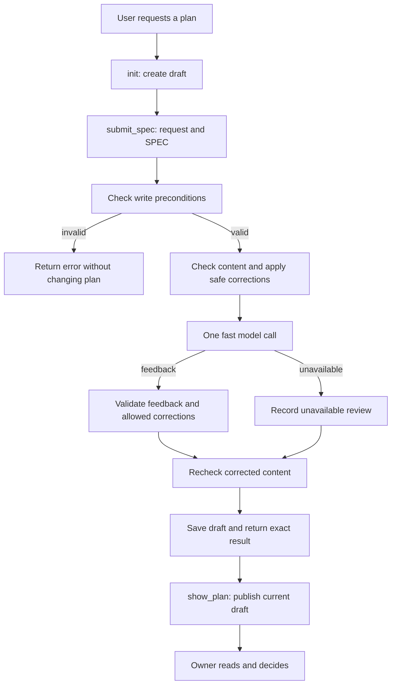

# Planctl MCP: помощь при записи спецификации

Status: SPEC_DRAFT  
Spec lock: unlocked  
Implementation lock: unlocked  
Active Delivery: none  
Unattended decisions: allowed  

<!-- plan:spec:start -->
## The Goal

Агент по просьбе владельца создаёт и уточняет спецификацию через MCP, получает полезные исправления и показывает актуальный документ по ссылке.
Исследование и прямое поручение остаются возможны без плана. Исходный запрос виден в документе, а решение о начале выполнения принимает владелец.
Сегодня такого MCP-интерфейса нет. Первая поставка должна провести один реальный запрос через создание, запись с обратной связью и показ, с одним вызовом быстрой модели на запись.

## Why now

Этот документ — SPEC для обсуждения, а не разрешение реализовать весь описанный маршрут.
Владелец попросил собрать фактуру, объяснить проверки и двигаться небольшими шагами после сбоев управления работой 21 сентября 2026 года.
База исследования: `0_agents` на `b4e353c9e9808f41258746336dcffc2350e583a7`. Незакоммиченные настройки и изменения сервера публикации не входят в эту базу.

### Что подтверждено

| Наблюдение | Источник | Вывод для этого изменения |
|---|---|---|
| Слияние PR #15 изменило 75 файлов: 1504 добавления и 4674 удаления относительно первого родителя merge. Оно затронуло скиллы, инструкции, проверки и установку. | [PR #15](https://github.com/0xmikko/0_agents/pull/15), merge `ecec22b` | Не связывать запуск MCP с массовым пересмотром правил и установок. |
| Вместо одной минимальной пробы агент выбрал 159 операций. Владелец этого объёма не поручал. | Приведённый владельцем диалог в этой сессии | Проверять соответствие Goal исходному запросу; не превращать полноту проверки в разрешение увеличить объём. |
| В сессии GLM агент правильно описал сравнение представлений tools, затем сравнил модели при неизменном интерфейсе. | Сессия `42c03ba5-a96f-459d-83a7-cf0ec5bb510f`, записи 10:46–10:58 UTC; изученный журнал и артефакты эксперимента | Текущая цель должна быть видна рядом с документом. Наличие инструкции не доказывает её соблюдение. |
| Между последним правильным уточнением GLM и неверным выводом compaction не было. | Тот же журнал | Нельзя объяснять все ошибки только потерей контекста или конкретным скиллом. |
| Автоматический выбор работы через focus удалён в PR #16. | [PR #16](https://github.com/0xmikko/0_agents/pull/16) | MCP не выбирает план и не запускает найденную задачу самостоятельно. |
| Обе версии review-plan восстановлены без переписывания в PR #19. | [PR #19](https://github.com/0xmikko/0_agents/pull/19) | Сохранить восстановление; не заменять содержательное ревью быстрой языковой проверкой. |
| Правила уже требуют judge перед показом SPEC, но его реализация осталась в draft PR #17. | `shared/skills/blueprint/SKILL.md:39`, `shared/code-production/laws/plan-format.md:26`, [PR #17](https://github.com/0xmikko/0_agents/pull/17) | Не делать доступность внешней модели условием возможности сохранить или показать черновик. |
| Единственная изученная реальная проба judge вернула 429 из-за недельного лимита подписки. | Проба 21 сентября, 1,9 секунды; результат предыдущей работы сохранён в локальном отчёте | Качество реального ответа модели ещё не доказано. Нельзя отмечать проверку успешной при ошибке провайдера. |
| Нынешний линтер отклоняет длинные предложения, служебные названия в прозе и план на два файла. | `planctl/src/core/plan-gate.ts:179`, `planctl/src/core/plan-gate.ts:285` | Обратная связь по форме не должна автоматически запрещать работу или заставлять раздувать документ. |
| Словарь содержит конечные пары терминов и замен. Проверка не понимает все новые слова и все значения слов. | `shared/code-production/vocabulary.md:1`, `shared/code-production/instruction-audit.ts:96` | Проверять словарь и контекст вместе; не обещать доказательство правильности терминологии. |
| Запись SPEC уже идёт через общий writer с журналом и staging. | `planctl/src/cli/main.ts:790`, `planctl/src/core/plan-update.ts:333`, `planctl/src/core/plan-update.ts:1356` | Подключить MCP к этому механизму, не создавать второй формат плана или собственный редактор файлов. |
| CLI и core местами зависят от process.cwd; CLI печатает текст и сам запускает диспетчер при импорте. | `planctl/src/cli/main.ts:310`, `planctl/src/cli/main.ts:842`, `planctl/src/cli/main.ts:915` | Импорт всего CLI как библиотеки небезопасен для stdio. Нужен небольшой общий участок операций записи. |
| На main renderer использует Mermaid 10; незакоммиченный локальный файл и реально открытая страница используют Mermaid 11. Линтер зависит от Mermaid 10.9.5. | `markdown-server/server.py:187` на базовом SHA; GET `http://u3775:6420/`; `planctl/package.json` | Это расхождение источника и установки. Проверка синтаксиса одной версией не доказывает отображение другой. |

Число 159 взято из диалога владельца. Причинную связь каждой ошибки с изменениями PR #15 мы не установили.
Не подтверждено и самопроизвольное переключение модели на low. Новый SPEC не выдаёт эти предположения за установленный диагноз.

### Запрос владельца, который сохраняем

В этой сессии выбраны: MCP для создания плана; название `submit_spec`; показ через mdurl; проверка при записи вместо отдельного lint tool.
Однозначные ошибки исправляются автоматически. Быстрая модель проверяет словарь, простые правила и соответствие цели запросу.
Обратная связь должна помогать уточнить небольшую задачу. Она не разрешает менять объём, переписывать рабочие скиллы или начинать реализацию.

## The target

### Первая поставка и граница

Один локальный MCP через stdio в существующем пакете planctl. CLI сохраняется и использует тот же writer.
MCP-клиент запускает процесс с явно указанным корнем одного worktree: `planctl mcp --root <absolute-worktree>`.
Здесь нет отдельного сетевого сервиса, порта, новой БД, фонового диспетчера или автоматического поиска активного плана.
Существующий HTTP observer остаётся отдельным читателем прогресса; переносить в него запись файлов worktree не требуется.

Первый каталог содержит четыре инструмента. Он покрывает полный полезный путь от пустого черновика до ссылки.

| Tool | Вход | Результат и побочный эффект |
|---|---|---|
| `init` | Относительный путь плана и название | Создаёт SPEC_DRAFT существующим механизмом; возвращает документ и revision. Существующий файл не перезаписывает. |
| `submit_spec` | Путь, ожидаемая revision, текущий запрос владельца и текст SPEC | Проверяет, применяет разрешённые исправления, сохраняет черновик и возвращает точный текст, исправления, замечания и статус проверки моделью. |
| `show_plan` | Путь существующего плана | Повторно вызывает mdurl для текущей версии, возвращает URL и revision опубликованного документа. Модель не вызывает. |
| `vocabulary` | Без параметров: репозиторий уже задан при запуске | Возвращает существующие общий и проектный словари с источниками. Ничего не записывает. |

Инструменты `lint`, `approve_spec`, `approve_plan` и автоматическое выполнение задач в первый каталог не входят.
Утверждение пока остаётся через существующий процесс после явных слов владельца. Сохранение SPEC не меняет его статус на APPROVED.
`init` и `submit_spec` используют нынешний staging и mutation journal; они не делают commit, push, PR или новый worktree.

### Путь одного запроса



| Момент | Поведение сервера | Что получает агент |
|---|---|---|
| До работы с планом | Ничего не делает, пока инструмент не вызван | Возможность исследовать и выполнять прямой запрос без регистрации плана |
| Перед записью | Проверяет адрес, состояние и ожидаемую версию файла | Конкретную ошибку записи либо разрешение продолжить этот вызов |
| Во время подготовки SPEC | Проверяет содержимое и выполняет узкие исправления | Диагностику, привязанную к строке и цитате |
| Проверка моделью | Один ограниченный вызов без tools | Замечание и конкретное предложение, а не приказ начать другую работу |
| После записи | Возвращает сохранённый текст и SHA-256 файла | Доказательство того, какая версия записана и какие изменения внёс сервер |
| Просмотр | Публикует ровно существующую версию | Ссылку; просмотр разрешён и для незавершённого черновика |

### Goal и исходный запрос

Goal остаётся разделом SPEC. Отдельного сервиса целей или нового хранилища задач не создаём.
В `submit_spec` агент передаёт актуальный запрос владельца явно, без самостоятельно придуманного расширения.
Сервер сохраняет эту цитату в начале SPEC под заголовком `Owner request`. Этот блок создаётся сервером из параметра ownerRequest.
Текст spec не должен содержать второй такой блок. Проверки стиля и автозамены не редактируют цитату владельца.
Весь получившийся SPEC остаётся в существующем Markdown-файле, поэтому запрос переживает перезапуск MCP.

Модель сопоставляет Goal с запросом: какой результат обещан, не потеряно ли ограничение, не добавлены ли чужие задачи.
Например, запрос на одну пробу и цель измерить все операции должны дать замечание о расширении объёма.
Изменение Goal, исходного запроса, ограничений или технического решения модель сама не применяет.

MCP не видит достоверную историю разговора сам по себе. Параметр ownerRequest передаёт агент; это полезное свидетельство для сравнения, но не доказательство согласия владельца.
Цитата и её изменения видны в документе и diff. Проверка моделью остаётся советом, а не авторизацией.

### Какие проверки останавливают запись

Останавливают только нарушения самого контракта записи: неправильные параметры, пустой SPEC, управляющие маркеры внутри пользовательского текста, выход за корень worktree.
Также останавливают попытка создать существующий файл, изменение SPEC_LOCKED или APPROVED через submit_spec, устаревшая revision и конфликт mutation journal.
В ответе MCP возвращает ошибку инструмента с причиной. Предыдущее содержимое файла сохраняется при отказе до записи.
Невозможность записи или staging возвращается явно; обещание полной транзакционности существующего writer этим SPEC не добавляется.

Проверка состояния выполняется до вызова модели. Права записи и ожидаемая версия повторно проверяются непосредственно перед сохранением.
Один процесс MCP последовательно исполняет операции изменения плана. Он не меняет process.cwd между запросами.
После model call нельзя записать результат поверх файла, изменённого за это время другим процессом.
Межпроцессные блокировки для нескольких одновременно пишущих агентов в одном worktree не входят в первую поставку.

### Проверки содержимого и мягкая обратная связь

| Проверка | Что проверяется | Реакция |
|---|---|---|
| Markdown и структура | Целостность блоков, наличие Goal, очевидно пустое описание | Замечание с местом; черновик можно сохранить и показать |
| Mermaid | Реальный parser, номера строк ошибки | Однозначные разрешённые исправления; иначе конкретная диагностика, без придумывания схемы |
| TypeScript | Синтаксис кода в блоках | Замечание; это не typecheck всего проекта и не доказательство правильности API |
| Словарь | Общая таблица и существующая проектная таблица | Разрешённая замена или контекстное замечание |
| Соответствие Goal | Цель относительно исходного запроса и ограничений | Модель цитирует расхождение и предлагает уточнение, но не переписывает цель |
| Понятность | Неясный исполнитель, действие или результат | Короткое предложение исправления; отсутствие идеального стиля не запрещает запись |
| Размер | Фактический размер документа | Информация, без минимального числа строк, файлов или стадий |

Никакого отдельного вызова lint от агента не требуется. Существующие функции разбора используются внутри submit_spec.
Для этого проверки получают структурированный вид замечания. Нельзя определять серьёзность через поиск английских слов в строках старого линтера.
Существующий CLI gate остаётся совместимым; глобально менять его политику и все hooks этой поставкой не предполагается.
Следствие: сохранённый MCP-черновик ещё может получить старые формальные отказы при последующем approve-spec. Этот разрыв обозначаем явно и разбираем отдельно после первой пробы.

### Что исправляется автоматически

Первый набор исправлений узкий и проверяемый: нормализация переводов строк и замена термина по существующему словарю в обычной прозе.
До вызова модели нормализуются только переводы строк. Термин заменяется по явному предложению модели после проверки контекста.
Замена допускается только при точном совпадении с парой словаря и однозначном месте в тексте.
Не затрагиваются Owner request, Goal, ограничения, non-goals, код, команды, пути, имена символов и идентификаторы.
Одинаковое слово с несколькими возможными местами или значениями даёт предложение, а не массовую замену.
Пробелы, обозначающие Markdown-перенос строки, нельзя безусловно обрезать.

Модель возвращает замечания и предложения, а не целиком переписанный документ. Сервер сам проверяет допустимость каждого изменения.
Он не удаляет разделы, не объединяет задачи и не добавляет стадии под видом исправления оформления.
Автоматический ремонт произвольной сломанной Mermaid-схемы не обещается: изменение стрелки может менять смысл процесса.
Для первой версии такой случай получает строку ошибки и предложение; новый вид безопасного исправления добавляется лишь по конкретному примеру.
После разрешённых изменений синтаксические проверки повторяются без второго вызова модели.
Совпадение со словарём само по себе не доказывает сохранение смысла всей прозы. Поэтому каждое применённое изменение возвращается явно и остаётся видимым в Git diff.

### Быстрая модель

Первый исполнитель — Claude Haiku через существующую подписку и CLI. API key и переключение основной модели агента не используются.
В PR #17 уже исследован запуск `claude -p --model haiku --safe-mode --tools "" --strict-mcp-config --no-session-persistence` с JSON-ответом.
Из этой работы можно перенести узкий механизм вызова и разбора ошибки; весь PR с обязательным PASS не переносим.
Окончательная команда сверяется с установленной версией Claude при реализации. Историческая проба доказала только отказ по лимиту.

Промпт получает исходный запрос, SPEC, две таблицы словаря и три вопроса: соответствие Goal, термины, ясность формулировок.
Текст рассматривается как данные. Дочерний процесс не читает рабочие инструкции, не запускает hooks, MCP, tools и собственных агентов.
У него один вызов, ограниченное время ожидания и JSON-схема ответа. Начальное ограничение ожидания — 45 секунд, как в изученной реализации.
Каждое замечание содержит реальную цитату документа. Выдуманная цитата или неправильный JSON не принимаются как результат проверки.
Строки вычисляет сервер по проверенной цитате; модели нельзя доверять произвольные номера строк.

При 429, timeout, недоступном CLI или неправильном ответе черновик сохраняется с reviewStatus unavailable и явной причиной.
Это штатный частичный результат, видимый агенту и владельцу. Он не обозначается checked, не повторяется автоматически и не подменяется другой моделью.
Повторная запись — только ради реального уточнения документа, а не автоматического цикла до похвалы модели.
Повтор того же текста с той же ожидаемой revision после уже выполненной записи возвращает конфликт версии; ошибка доставки не означает право повторно потратить модель.
Если revision актуальна, но итоговый SPEC дословно совпадает с существующим, сервер возвращает no_change до вызова модели.
Кэш проверок, квоты, очереди внешних задач и система оценки моделей пока не нужны.

### Показ плана и Mermaid

show_plan использует существующую команду mdurl. Она публикует копию, поэтому каждый показ после изменения повторяет публикацию.
Сервер не возвращает старую ссылку как доказательство обновления, если mdurl завершился с ошибкой.
Имена публикаций должны различать репозитории и worktree с одинаковыми именами планов; используем стабильный slug из имени плана и короткого хеша его абсолютного пути.
Результат включает revision именно опубликованных байтов. Если исходный файл изменился во время публикации, возвращается явная ошибка; успех с чужой версией недопустим.
Показ не утверждает план, не вызывает модель и не пытается запустить задачи.

Для parser и renderer требуется одна точная версия Mermaid из ветки 11, выбранная и проверенная при реализации.
Её фиксируем в зависимостях planctl и в уже существующем URL скрипта markdown-server; новый renderer не пишем.
Незакоммиченный локальный server.py сначала рассматривается как работа владельца. Его изменения нельзя затереть или забрать в этот PR целиком.
Обновление работающего markdown-server выполняется отдельным явным действием после слияния и просмотра точного diff.
На приёмке открываем одну опубликованную схему и проверяем её фактическое отображение. Один успешный parse этого не заменяет.

### Следующие небольшие шаги

После полезной первой пробы можно добавить put-delivery и put-stage к тому же MCP и механизму обратной связи.
Для стадии проверяется один понятный результат и связь с Goal. Предлагается конкретное уточнение описания, объединение или разделение; сервер сам не меняет состав работ.
Количество стадий и задач не служит автоматическим запретом. Один самостоятельный результат может быть одной задачей.
Дальше можно подключить progress, start-task и complete-task, сохранив их существующие проверки и журнал.
Это направление развития, а не дополнительные задачи первой поставки. Разрешение на него из этого SPEC не следует.

### Interfaces

Ниже предложены контракты первой поставки, а не уже реализованные API. PlanState импортируется из существующего plan-update.
revision — SHA-256 точных байтов файла. Совпадение revision не является утверждением владельца.

```typescript
import { z } from "zod";
import type { PlanState } from "./plan-update";

interface InitPlanInput {
  plan: string;
  title: string;
}

interface SubmitSpecInput {
  plan: string;
  baseRevision: string;
  ownerRequest: string;
  spec: string;
}

interface PlanDocument {
  plan: string;
  revision: string;
  state: PlanState;
  content: string;
}

interface SpecFeedback {
  kind: "structure" | "mermaid" | "typescript" | "vocabulary" | "goal" | "clarity";
  line: number | null;
  quote: string;
  message: string;
  suggestion: string | null;
}

interface SpecCorrection {
  line: number;
  before: string;
  after: string;
  reason: "line_endings" | "vocabulary";
}

interface SubmitSpecResult extends PlanDocument {
  corrections: SpecCorrection[];
  feedback: SpecFeedback[];
  reviewStatus: "checked" | "unavailable";
  reviewError: string | null;
}

interface ShowPlanResult {
  plan: string;
  revision: string;
  url: string;
}

interface VocabularyEntry {
  term: string;
  meaning: string;
  alternatives: string[];
  source: string;
}

const planPath = z.string().min(1);
const revision = z.string().regex(/^[0-9a-f]{64}$/);
const initPlanInput: z.ZodType<InitPlanInput> = z.object({
  plan: planPath,
  title: z.string().min(1),
}).strict();
const submitSpecInput: z.ZodType<SubmitSpecInput> = z.object({
  plan: planPath,
  baseRevision: revision,
  ownerRequest: z.string().min(1),
  spec: z.string().min(1),
}).strict();
const planDocument = z.object({
  plan: planPath,
  revision,
  state: z.enum(["SPEC_DRAFT", "SPEC_LOCKED", "APPROVED"]),
  content: z.string(),
}).strict() satisfies z.ZodType<PlanDocument>;
const specFeedback: z.ZodType<SpecFeedback> = z.object({
  kind: z.enum(["structure", "mermaid", "typescript", "vocabulary", "goal", "clarity"]),
  line: z.number().int().positive().nullable(),
  quote: z.string(),
  message: z.string().min(1),
  suggestion: z.string().nullable(),
}).strict();
const specCorrection: z.ZodType<SpecCorrection> = z.object({
  line: z.number().int().positive(),
  before: z.string(),
  after: z.string(),
  reason: z.enum(["line_endings", "vocabulary"]),
}).strict();
const submitSpecResult: z.ZodType<SubmitSpecResult> = planDocument.extend({
  corrections: z.array(specCorrection),
  feedback: z.array(specFeedback),
  reviewStatus: z.enum(["checked", "unavailable"]),
  reviewError: z.string().nullable(),
}).strict();
const showPlanResult: z.ZodType<ShowPlanResult> = z.object({
  plan: planPath,
  revision,
  url: z.string().url(),
}).strict();
const vocabularyEntry: z.ZodType<VocabularyEntry> = z.object({
  term: z.string().min(1),
  meaning: z.string(),
  alternatives: z.array(z.string().min(1)),
  source: z.string().min(1),
}).strict();
```

Схемы проверяют форму, затем существующий writer проверяет состояние и адреса. Проверка realpath должна исключать выход через симлинк.
Для reviewStatus checked поле reviewError равно null; для unavailable содержит причину. Это проверяется отдельным условием схемы результата.
MCP возвращает structuredContent и совместимое текстовое представление того же результата. stdout содержит только сообщения протокола; диагностика процесса идёт в stderr.
Реализация использует официальный TypeScript MCP SDK и требуемый им Zod. Версии фиксируются в lockfile; собственного JSON-RPC сервера не создаём.
Основание: [документация SDK](https://github.com/modelcontextprotocol/typescript-sdk/tree/v1.x), изученная при подготовке SPEC.

### Code

Алгоритм записи выбран здесь намеренно; детали подключения SDK не требуют нового слоя архитектуры.

```text
check input, plan state and baseRevision
build SPEC with the exact Owner request block
run shared content checks
apply only the finite set of allowed corrections
call the fast reviewer once
validate quoted feedback; apply only allowed vocabulary corrections
run content checks again without calling the model
recheck file revision and writer preconditions
save through the existing journaled writer
return saved bytes, revision, corrections, feedback and review status
```

Функция transform существующего mutatePlanFile должна оставаться чистой: сейчас writer вызывает её дважды.
Вызов модели, mdurl и другие побочные эффекты выполняются вне transform; иначе один submit_spec мог бы дважды потратить модель.
Не исправляем заодно всю реализацию writer. Проверяем этот конкретный контракт на одном счётчике вызовов в поведенческом тесте.

## What changes

Первая реализация добавляет MCP-вход в пакет planctl, обработку submit_spec и небольшой адаптер публикации.
Общие операции создания и записи используются CLI и MCP. Проверки содержимого извлекаются из существующего plan-gate, а не переписываются параллельно.
Парсер словаря расширяется для выдачи значений и источников; существующие synonyms и vocabularyMatches продолжают использовать одну таблицу.

Не добавляются отдельный lint tool, обязательный PASS языковой модели, новое хранилище планов или автоматическая выдача задач.
Скиллы, копы, глобальный rollout, Telegram, Magnis backend и массовое изменение CI не входят в первую поставку.

### Старый план и незавершённая работа

| Объект | Предложенное решение |
|---|---|
| instructions-by-rule.md | Сохранить историю уже влитых изменений. При утверждении нового направления отдельно отметить прекращение оставшегося прежнего объёма. Не объявлять его выполненным. |
| Draft PR #17 с обязательным judge | Не сливать целиком. После решения владельца закрыть как заменённый новым направлением. Использовать только подходящие части вызова Claude с новой семантикой. |
| Focus | Остаётся удалённым. Ни MCP, ни новые инструкции его не возвращают. |
| review-plan для Claude и Codex | Сохраняются версии из PR #19. Быстрая проверка простых правил не заменяет это ревью. |
| Пять замороженных скиллов и копы | Не редактируются. Любое последующее изменение текста показывается и согласуется отдельно. |
| Локальные изменения конфигурации и mdurl | Сохраняются. Их наличие отмечено, но они не включаются в новый PR автоматически. |

Этот SPEC предлагает решение по старому хвосту, но пока не меняет его статусы и не закрывает PR #17.
Утверждение SPEC не должно задним числом отмечать старые невыполненные критерии как выполненные.

### Минимальная поправка маршрута работы

Для обычной работы без плана остаётся отдельная предложенная правка AGENTS.md из этой беседы. Она пока не применена.
Перед подключением MCP для повседневного использования нужно согласовать точный короткий текст в глобальном файле и условие в проектном AGENTS.md.
Правило: выполнять выбранный владельцем утверждённый план; иначе следовать текущему запросу без требования создать план.
Наличие tools и доступной проверки не является приказом их вызвать. Нет обязательного startup-вызова MCP.
Правила Git и проверки реально изменённого кода продолжают действовать. Исследование без изменений не превращается в полный CI-прогон.
Мы не переписываем одновременно законы, скиллы и инструкции всех репозиториев.

## Target tree

Это предполагаемые файлы первой поставки, а не разрешение редактировать их до утверждения SPEC и последующих задач.

| Файл | Назначение изменения |
|---|---|
| planctl/src/cli/main.ts | Команда mcp и вызов общих операций создания/записи вместо их дублирования |
| planctl/src/mcp/server.ts — новый | Stdio, четыре регистрации tools, входные и выходные схемы; фиксированный корень worktree |
| planctl/src/core/spec-submission.ts — новый | Подготовка SPEC, один вызов Claude, разрешённые исправления и явный результат |
| planctl/src/core/plan-update.ts | Повторное использование существующего writer и операции init из двух настоящих клиентов |
| planctl/src/core/plan-gate.ts | Повторно используемые проверки содержимого со структурированными причинами; совместимость старого CLI |
| shared/code-production/instruction-audit.ts | Один парсер словаря для проверки и выдачи vocabulary |
| planctl/package.json и planctl/bun.lock | MCP SDK, Zod и согласованная точная версия Mermaid |
| markdown-server/server.py | Только согласование версии Mermaid; никаких незапрошенных изменений renderer |
| planctl/test/mcp.test.ts — новый | Три поведенческих сценария нового пути через настоящий stdio |
| planctl/test/plan-gate.test.ts | Сохранение поведения существующих проверок после их повторного использования |
| planctl/test/package-boundary.test.ts | Проверка запуска собранного MCP без зависимости от рабочего исходного дерева |
| README.md | Одна инструкция запуска и пределы первой версии |

Новый процесс не ставится во все проекты автоматически. Первый пробный клиент подключается к одному явно выбранному worktree.
Один новый серверный файл нужен для MCP-транспорта, второй — для подготовки SPEC. Отдельных пакетов, интерфейсов провайдеров и plugin-системы нет.
mdurl остаётся отдельной существующей командой. Её shell-вызов передаёт аргументы массивом, без интерполяции текста SPEC в командную строку.

## Verification

Первая реализация проверяется тремя поведенческими сценариями, а не отдельным тестом на каждое предложение правил.

| Сценарий | Шаги и проверяемый результат |
|---|---|
| tst_planctl_mcp_submit_001 | Через SDK-клиент подключить настоящий stdio, вызвать init, передать SPEC с исправимым термином и неясной целью. Проверить один model call, точное исправление, сохранение Goal и цитаты владельца, замечание и корректный журнал writer. |
| tst_planctl_mcp_submit_002 | Передать устаревшую revision и утверждённый план: запись и model call не происходят. Для черновика вернуть 429 от подставного CLI: текст сохранён, reviewStatus unavailable, повторов нет. |
| tst_planctl_mcp_show_003 | Показать документ, изменить через submit_spec и показать снова. Проверить, что публикация содержит новую revision. Ошибка mdurl и одинаковые имена файлов в двух worktree не должны давать ложный успех или подмену документа. |

Для существующих parser и writer используются уже имеющиеся тесты. Их не копируем в новый набор.
Во время разработки запускаются только затронутые файлы через agent:test:backend. Перед публикацией реализации — предусмотренные проектом agent:verify:docs и agent:verify:pr.
По умолчанию тесты не обращаются к подписке, Telegram, PostgreSQL или другому репозиторию. Ответ Claude подставляется на существующей границе дочернего процесса.

Затем одна реальная проба: один запрос владельца, один SPEC, один submit_spec с настоящим Claude, один show_plan.
Для пробы заранее записываем запрос, выбранный документ и ожидаемый результат. Автоматического расширения на коллекцию планов или 159 операций нет.
Открываем опубликованную страницу и проверяем Mermaid глазами или имеющимся браузерным инструментом; номер версии renderer записываем рядом с результатом.
Фиксируем число model calls, какие изменения применены и какие замечания владелец счёл полезными. Не объявляем экономию токенов без сравнения.

## Invariants

| Свойство | Чем доказывается |
|---|---|
| Один submit_spec вызывает модель не более одного раза | Счётчик дочерних вызовов в сценарии записи |
| Автоисправление не меняет Goal и исходный запрос | Сравнение защищённых блоков до и после в сценарии записи |
| Замечания о стиле не мешают сохранить черновик | Сохранённые байты и feedback в том же сценарии |
| Ошибка модели не маскируется успешной проверкой | Явное unavailable и отсутствие повторов в сценарии отказов |
| Несогласованный или устаревший вызов не меняет существующий план | Проверка состояния, revision и неизменных байтов в сценарии отказов |
| Показ относится к текущему документу | Сравнение опубликованного содержимого и revision в сценарии показа |
| Ни один tool не утверждает план и не начинает реализацию | Каталог первой поставки и неизменный SPEC_DRAFT после успешного пути |

## Constraints and non-goals

Цель этой поставки — помочь написать и прочитать один SPEC. Она не гарантирует управляемость любой модели или отсутствие всех ошибок агента.
Нет автоматического выбора плана, рабочего задания, model switching, массового удаления правил или новых требований к каждой беседе.
Нет обязательного количества стадий, минимального объёма документа, отдельного интерфейсного mock-коммита или бесконечных reviewer rounds.
Нет БД для end-work, расписания задач, распределённого редактирования одного worktree, нового observer или реестра экспериментов.
Нет общей миграции всех старых планов на новую форму. Legacy approval gate и изменение его требований — отдельный обсуждаемый шаг.
Эта версия не сохраняет историю всех model responses в новой БД; историю текста хранит Git, результат обратной связи возвращается в разговор.

## Reuse

| Существующий механизм | Как используется |
|---|---|
| createDraftPlan, replaceDraftSpec, mutatePlanFile, journalCreatedPlan | Единственный формат и путь изменения плана |
| protocolSpecHash и существующее SHA-256 представление | Основа проверки версий; revision всего файла имеет отдельно указанную область хеширования |
| Markdown AST, TypeScript parser, Mermaid parser из plan-gate | Проверка фактического содержимого без второго линтера |
| vocabulary.md и проектный docs/graph.md | Единственные таблицы терминов |
| mdurl | Публикация и обновление существующей страницы |
| Узкий вызов Claude из draft PR #17 | Основа subscription-вызова; обязательный PASS и блокировка SPEC не переносятся |
| Официальный MCP TypeScript SDK | Протокол и stdio; собственного транспорта поверх JSON-RPC нет |

Поиск в planctl/src и зависимостях не обнаружил готового MCP-сервера. Существующий Nest server обслуживает observer и progress, а не запись файлов планов.
MCP в magnis-app относится к продуктовым tools; зависимость нового planctl от backend Magnis не вводится.

## Deliveries

Предлагается одна первая поставка: четыре tools, проверки при submit_spec, ограниченная обратная связь модели и показ через mdurl.
Она проверяется на одном реальном запросе. Реализация и подключение ко всем сессиям не объединяются в один rollout.
После разбора результата владелец решает, нужен ли следующий шаг со стадиями. Progress и выполнение задач рассматриваются после этого.
Формальный Implementation contract пока пуст: стадии и задачи будут добавлены только после утверждения этого SPEC.

### Пересечения с открытыми PR

PR #17 пересекается с проверкой плана и вызовом модели; его целиком не сливаем и не продолжаем параллельно новому направлению.
PR #8 касается архива сессий; PR #7 — переменных окружения; PR #2 — скиллов. Их изменения не требуются первой поставке.
План подготовлен в 0_agents, где основная ветка main. Для него используется новая ветка в уже существующем освобождённом worktree, без дополнительного worktree.

## New names

| Name | Reason |
|---|---|
| submit_spec | Выбранное владельцем имя единой операции записи SPEC с исправлениями и обратной связью |
| show_plan | Явная публикация выбранного плана через существующий mdurl |
| vocabulary | Чтение двух уже существующих словарей через MCP |
| Owner request | Видимая точная цитата, с которой сравнивается Goal; хранится в том же SPEC |
| revision, baseRevision | Хеш всего файла для отказа от записи поверх другой версии; не подменяет SPEC lock |
| InitPlanInput, SubmitSpecInput, PlanDocument | Контракты двух операций записи и возвращаемого документа |
| SpecFeedback, SpecCorrection, SubmitSpecResult | Различают замечания, уже применённые исправления и результат сохранения |
| ShowPlanResult, VocabularyEntry | Результаты двух оставшихся tools |
| reviewStatus, reviewError | Явно различают выполненную проверку моделью и недоступную проверку |
| no_change | Ответ на повторную запись одинакового SPEC, чтобы повтор не тратил вызов модели |

## Not verified

MCP ещё не реализован и не подключён. Схемы выше — предложение интерфейса; их компиляция с выбранной версией SDK не проверена.
Полезность ответов Haiku, задержка и расход на реальном новом сценарии не измерены. Подписка ранее возвращала 429; новый платный или subscription-прогон здесь не запускался.
Полная транзакционность существующего writer при ошибке staging не доказана. Первая версия не обещает межпроцессные блокировки.
Подтверждено расхождение версий Mermaid в исходнике, локальном изменении и установленной странице. Автоматическая совместимость всех диаграмм не доказана.
Точный текст поправок AGENTS.md, закрытие старого хвоста и PR #17 ещё требуют решения владельца. В рамках подготовки SPEC они не изменены.
Изменения пяти замороженных скиллов, копов и правил других репозиториев не согласованы и не выполнялись.
<!-- plan:spec:end -->

<!-- plan:implementation:start -->
## Implementation contract
<!-- plan:implementation:end -->

<!-- plan:execution:start -->
## Execution log
<!-- plan:execution:end -->
