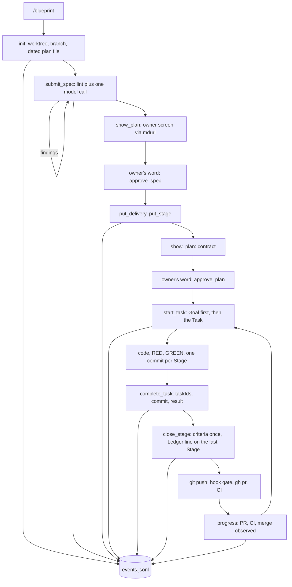

# Planctl MCP: authoring, task recovery and verified delivery

Status: SPEC_LOCKED  
Spec lock: sha256:233ebe90c09f2a3301e9a373526d9ef92d9f6837a454bc823da9b6e5a34b8fb6 owner:давай дальше  
Implementation lock: unlocked  
Active Delivery: D1  
Unattended decisions: allowed  

<!-- plan:spec:start -->
## The Goal

1. An agent writes and executes a plan only through planctl MCP tools. It never edits a plan file by hand.
2. The owner reads one screen per decision: the SPEC first screen, the implementation contract, the progress screen.
3. Work stops only for syntax, structure, a stale revision, a file outside the declared folders or a protected path. Never for a number, a wording or an approval already given.
4. Every tool call leaves one line in an event log outside the repository. A process change is judged by that log, not by memory.

Measured on the log after the first two plans: submit rounds per plan before approval, owner turns per plan, refusals per Task, minutes from `start_task` to `complete_task`.

## Why now

Agents run retired scripts instead of the package commands, because the real path is broken and nobody knows it.
One file missing from a Task list stopped a green Stage for fifty minutes on 22 September. The source removed that fence on 17 September; the catalog repository never received it.
A one-line ledger update after a merge cost a PR, a CI run and a red docs check on 23 September.
An explicit review request was refused on 24 September because a skill said "once".
Progress shows one Delivery as the whole plan, approval bounced on headings, and the only record of any of this is eleven gigabytes of session transcripts.

## The target



### Principle

Context, not gates, and pulled, not pushed. Plan work runs through planctl; anything else the owner asks is done directly, and the plan waits without losing anything. Every brief starts with the Goal. Numbers go to Results and never stop work. planctl refuses five things only. Invalid syntax or structure. A stale `baseRevision`. A commit touching a file outside the Stage folders. A change to a protected path. An exported type absent from Interfaces.

### Server

`planctl mcp` starts over stdio from the 0_agents checkout through the existing `planctl` launcher. One global entry in the user's MCP settings serves every repository; no per-repository file and no arguments. Each call names its plan path, relative to the server's working directory or absolute, and the server takes the repository root from that path. The integration branch comes from the repository's local Git config, `code-production.base`, which `agent-stack install --base <branch>` writes once per clone beside `core.hooksPath`; a missing value refuses with the command that sets it. The MCP SDK and Zod live only in the planctl package.

### Tools

| Tool | Does | Refuses only |
|---|---|---|
| `init` | Creates `docs/plans/<date>-<slug>.md` from the branch, stages it, journals it. Returns the required sections, the size reference, the vocabulary and the Goal rule below. | existing file, the integration branch itself, no `code-production.base` |
| `submit_spec` | Replaces the SPEC with the whole text. Runs lint, then one model call on changed lines. Fixes line endings and unambiguous vocabulary pairs itself. Returns revision, corrections, findings, `checkStatus`. | stale revision, locked plan, over 300 lines |
| `show_plan` | Publishes the saved bytes through mdurl. The first screen is the Goal, Why now, the diagram and Not verified; the rest is folded. | mdurl failure |
| `vocabulary` | Returns terms and their rejected synonyms with sources. | nothing |
| `approve_spec`, `approve_plan` | Record the owner's word for the addressed revision. Run the same lint as submission on the same bytes. | stale revision, lint findings |
| `put_delivery`, `put_stage`, `remove_stage`, `amend`, `add_deviation` | Existing writer operations with structured input. Stage writes are folders. | decoder errors |
| `progress` | "Where am I." Reads the plan, the Git-local records, the PR and CI through `gh`, the installed runtime version. Without `plan`, finds the plan by the branch slug and answers nothing when the branch has none. Runs nothing. | nothing |
| `start_task` | "What do I do now." Without `task`: returns the running Task, or starts the next one in Stage-graph order. With `task`: that Task, for repair or an explicit switch. With `checkpoint`: saves that sentence on the running Task's record. Checks dependencies, records the start, returns the brief below. | unmet dependency, unpublished parent Delivery, nothing left |
| `complete_task` | Takes `taskIds`, `commit`, `result`, optional `deviations`. Derives paths, times, tests and temp roots itself. | commit not ancestral, file outside folders, protected path, undeclared exported type |
| `close_stage` | Runs each machinable criterion once. On the last Stage of a Delivery writes the `Ledger:` header line. | open Tasks |
| `needs_owner`, `resume_task` | Record and clear a question only the owner answers. | nothing |

Publication is not a tool. The agent commits the plan delta, pushes, the pre-push hook runs the complete gate, `gh` opens the PR, and `progress` observes CI and merge. A Task of the next Delivery starts when every parent Delivery has an observed green PR; the owner merges when they choose.

### The two screens

Two questions, two answers: "what do I do now" and "where am I". The tool descriptions the agent reads are those questions; the names stay the CLI's. Both answers are pulled by the agent once the owner has put it on the plan. Nothing about the plan is pushed at session start: a pushed state reads as an order, and the owner's request loses to it. After context compaction one note restores the running Task as state, never as an instruction. Both answers carry the plan path; when the agent needs the whole picture it reads the plan file itself and never writes it. Nothing else is pushed into its context.

`start_task` returns:

```text
Plan      docs/plans/2026-09-24-google-pull-sync.md
Goal      1. sync page twice as fast: 800 ms to 400 ms   2. no repeated suite per Stage
Delivery  D1 · Stage S2 "Retain sync tokens" · Task SYNC_003
Stage     what it solves / what is built / how proven / commit message
Story     Retain the Calendar sync token across restarts
Folders   plugins/sources/google/  packages/testkit/       tests are in scope anywhere
How       persist the token in calendar.ts; cover it in calendar.test.ts
RED       bun run agent:test:backend -- test/tst_bts_calendar_token
Started   2026-09-24 09:12 · forecast 25 min · checkpoint: RED is red, next persist
```

`progress` returns:

```text
Plan      docs/plans/2026-09-24-google-pull-sync.md · APPROVED · advances only when the owner asks
Goal      1. sync page twice as fast   2. no repeated suite per Stage
Now       SYNC_003 running since 09:12 · checkpoint: RED is red, next persist
Delivery  D1: 3 of 5 Tasks · S1 S2 closed · S3 open
Plan      3 of 12 Tasks · D1 in work · D2 D3 not started
Publish   PR #291 ready · CI on 2d3dae6 green · merge: not yet
Runtime   installed 2026-09-14 · source 2026-09-21 · stale
Eligible  SYNC_004 · blocked: none
```

### The Goal rule

The Goal is one to four numbered outcomes the owner will see when the work is done. Each outcome names its measure: a number, a count, a time, or the exact observable state before and after. It promises only what the request asks: no vision, no how, no extra scope. Plain English, one sentence per outcome. Measured on 24 September 2026 on 23 past plans in isolated clones at their base commits, judged against the owner's conversation only. Scores: 6.61 of 8 for this wording, 6.13 without the measure sentence, 6.23 with the asks listed first.

### Checks at submission

Lint, under one second: the required sections exist and are not empty, Mermaid parses, TypeScript blocks compile, vocabulary, plan codes in prose, sentences over thirty words, more than 300 lines.
Model, about five seconds: Sonnet 5 without thinking, tools off, MCP off, no session. Input is the owner request, the Goal rule, the vocabulary pairs and the changed lines with numbers. Output is findings with rule, line, quote and replacement. Deadline fifteen seconds; on timeout the draft is saved with `checkStatus: unavailable` and no retry. Findings advise; lint blocks.

### Event log

Every tool call appends one JSON line to `<agent-memory>/planctl/events.jsonl`, outside any repository. A line carries the time, repository, worktree, plan and revision. It names the tool, the Task, the outcome, the refusal reason and the duration. It records the installed runtime commit and the source commit, never plan text or code.

The log answers five questions. Where agents stop, and why. Submit rounds per plan. Task time against its forecast. Time waiting for the owner. PRs and CI runs per Delivery. `planctl stats <since>` prints those five tables; a process change is compared before and after by runtime commit.

## Target tree

| Action | File | Purpose |
|---|---|---|
| CREATE | `planctl/src/mcp/server.ts` | Register tools and schemas, serve stdio, append events. |
| CREATE | `planctl/src/core/spec-submission.ts` | Lint, safe corrections, one model call, draft write. |
| CREATE | `planctl/src/core/event-log.ts` | Append and read `events.jsonl`; `stats` tables. |
| MODIFY | `planctl/src/cli/main.ts` | Add `mcp` and `stats`; `init` derives the dated file name. |
| MODIFY | `planctl/src/core/plan-update.ts` | Evaluate a transformation once; folders in writes; derive the Stage result; `Ledger:` header; wire the exported-type check. |
| MODIFY | `planctl/src/core/plan-gate.ts` | Structured findings; 300-line limit; What changes no longer required. |
| MODIFY | `planctl/src/core/task-run.ts` | Checkpoint on the start record; resumable completed Task in an unmerged Delivery. |
| MODIFY | `planctl/src/core/plan-progress.ts`, `planctl/src/cli/render.ts` | Whole-plan counts, PR and CI state, runtime version. |
| MODIFY | `planctl/package.json`, `planctl/bun.lock` | MCP SDK, Zod, scoped `agent:verify:commit`. |
| MODIFY | `shared/code-production/agent-stack.ts` | `install --base <branch>` writes `code-production.base`; `check` reports it. |
| MODIFY | `shared/code-production/laws/plan-format.md` | Writes are folders; eight sections; the owner screen. |
| CREATE | `.github/workflows/planctl.yml` | CI for the package; none exists today. |
| CREATE | `planctl/test/mcp.test.ts`, `planctl/test/event-log.test.ts` | Tool sequences, refusals, log lines and stats. |
| MODIFY | existing `planctl/test/*.test.ts` | Extend the tests that own the writer, Task records, gate and progress. |

## Interfaces

```typescript
interface SubmitSpecInput {
  plan: string;
  baseRevision: string;
  ownerRequest: string;
  spec: string;
}

interface SpecFinding {
  rule: "structure" | "mermaid" | "typescript" | "vocabulary" | "size" | "english" | "goal" | "clarity";
  blocking: boolean;
  line: number | null;
  quote: string;
  message: string;
  replacement: string | null;
}

interface SubmitSpecResult {
  revision: string;
  state: "SPEC_DRAFT" | "SPEC_LOCKED" | "APPROVED";
  corrections: {
    line: number;
    before: string;
    after: string;
  }[];
  findings: SpecFinding[];
  checkStatus: "checked" | "no_change" | "unavailable";
  checkError: string | null;
}

interface CompleteTaskInput {
  plan: string;
  taskIds: string[];
  commit: string;
  result: string;
  deviations?: string[];
}

interface TaskBrief {
  plan: string;
  goal: string[];
  deliveryId: string;
  stageId: string;
  taskId: string;
  stageDescription: string;
  story: string;
  folders: string[];
  how: string[];
  red: string;
  startedAt: string;
  forecastMinutes: number;
  checkpoint: string | null;
}

interface ProgressView {
  plan: string;
  state: "SPEC_DRAFT" | "SPEC_LOCKED" | "APPROVED";
  goal: string[];
  currentTask: {
    id: string;
    startedAt: string;
    checkpoint: string | null;
  } | null;
  delivery: {
    id: string;
    completedTasks: number;
    totalTasks: number;
    closedStages: string[];
    openStages: string[];
  } | null;
  wholePlan: {
    completedTasks: number;
    totalTasks: number;
    deliveries: {
      id: string;
      state: "not_started" | "in_work" | "published" | "merged";
    }[];
  };
  publication: {
    prUrl: string;
    ci: "pending" | "green" | "red";
    headSha: string;
    merged: boolean;
  } | null;
  runtime: {
    installed: string;
    source: string;
    stale: boolean;
  };
  next: {
    taskId: string | null;
    blockedBy: string | null;
  };
}

interface EventRecord {
  at: string;
  repository: string;
  worktree: string;
  plan: string;
  revision: string;
  tool: string;
  taskId: string | null;
  outcome: "ok" | "refused" | "error";
  reason: string | null;
  durationMs: number;
  runtimeCommit: string;
  sourceCommit: string;
}
```

## Invariants

| Invariant | Test |
|---|---|
| A clean draft never bounces at approval. | Submit a SPEC with a vocabulary error; fix; approve on the same bytes passes without a new finding. |
| A file inside a Stage folder or any test never refuses a result. | Complete a Task whose commit adds a helper and a test beside the declared file. |
| A file outside the folders or a protected path refuses with its name. | Complete a Task whose commit touches `.github/workflows/`. |
| An exported type absent from Interfaces refuses. | Change an exported type in a commit; complete refuses; declare it; complete passes. |
| Numbers never stop work. | Close a Stage whose Results report 49.8 against a Goal of 50. |
| Whole-plan and Delivery counts are separate. | Two of eight Tasks done in one Delivery report 2 of 8 and 2 of 2. |
| A repeated call returns the saved attempt. | Call `start_task` twice without `task`; one start record, one clock, the same Task. |
| The next Delivery starts on green CI, not on merge. | Parent PR green and unmerged; child Task starts. |
| A transformation runs once. | A criterion command counts one invocation through the writer. |
| Every tool call writes one event line. | Run a sequence; count lines; refusals carry reasons. |

## Reuse

| Existing mechanism | Extended for |
|---|---|
| `createDraftPlan`, `replaceDraftSpec`, `mutatePlanFile`, the journal | Dated file name, one evaluation, `Ledger:` header. |
| `applyOwnerAmendment` (0_agents #23) | A locked SPEC corrected by the owner's word through `amend`, with the implementation lock untouched. |
| `lint` in plan-gate, `lintCommit` | Structured findings, size limit, exported-type check wired into completion. |
| `taskExecutionBrief`, `startTask`, Task records, owner-wait records | Goal first, checkpoint, resumable repair. |
| `recordStageResult`, `coveredByWrites`, `closePlanStage` | Derived Stage result file, folders, criteria once. |
| `projectPlanProgress`, `render.ts` | Whole-plan counts and the progress screen. |
| `vocabulary.md`, `instruction-audit.ts` | The same synonym table for lint, model input and the `vocabulary` tool. |
| `agent-stack` manifest | Installed runtime commit in progress and in events. |
| `mdurl`, `gh`, pre-push hook | Showing, publishing, observing; no second gate. |
| SessionStart hooks in Claude and Codex settings | Nothing at session start: the plan is pulled by `/blueprint-start`, never pushed. After context compaction, one note only when a Task is running in this worktree, worded as state with "the owner's message decides". The `session-brief-hook` branch's `focus --brief` is not adopted. |

Search found no MCP server, event log or stats reader in `planctl/src`; the observer server stores machine snapshots, not tool calls.

## What changes

The MCP server, the submission checker and the event log are new files. The writer, gate, Task records and progress are extended in place. Publication, review and the owner's merge stay outside planctl. Working skills, cops and AGENTS.md are not edited by this plan.

## New names

| Name | Reason |
|---|---|
| `submit_spec`, `show_plan`, `vocabulary` | The three authoring tools the owner named. |
| `Ledger:` header line | The plan carries its own lifecycle; no shared table. |
| `events.jsonl`, `EventRecord`, `planctl stats` | The process record the owner asked for, outside the repository. |
| `TaskBrief`, `ProgressView`, `CompleteTaskInput`, `SpecFinding` | The two screens and the two contracts agents call most. |
| folders | Stage writes at directory granularity; tests in scope anywhere. |

## Not verified

Model latency was measured once, on one fragment: Sonnet 5 without thinking answered in 5.7 seconds. The MCP server, the event log and `stats` are not implemented. Whether Claude Code starts a global MCP server with the worktree as its working directory is checked at the first acceptance run; absolute plan paths do not depend on it. Dependent-PR CI in Magnis, `run_check` with component reuse and an explicit `switch_task` are deferred until a measured need appears.

## Owner request

> Done, let's design planctl mcp

> хотел бы с ней иметь какую-то статистику работы, что потом можно было анализировать. Например, хранить JSON-L

Earlier explicit constraints retained: extend the existing planctl, show plans through mdurl, preserve the agreed skills, minimize repeated tests and reviews, context management instead of gates.
<!-- plan:spec:end -->

<!-- plan:implementation:start -->
## Implementation contract

<!-- plan:delivery:D1:start -->
<!-- plan:delivery-meta:{"active":true,"depends":[],"predictedExternalWaitMinutes":180} -->
### PR Delivery D1 — planctl MCP: one path from plan to green PR

Branch: `feat/planctl-mcp`; Depends: none; Gate: cd planctl && bun run agent:verify:docs, cd planctl && bun run agent:verify:pr.

Stage graph: `D1-S1 -> D1-S2 -> D1-S3 -> D1-S4 -> D1-S5`.

Forecast: 890 active min / 94 credits across 5 Stages; longest dependency path 890 active min; external waits 180 min.

What changed for people. An agent writes and executes a plan through planctl tools over MCP and never edits a plan file by hand. The owner reads one screen per decision and is never asked to approve twice. A file inside the Stage folders or a test never stops work, and every tool call leaves one line in an event log outside the repository.

What changed in the code. The writer evaluates a transformation once, derives the Stage result from the commit, accepts folders as writes and writes the Ledger line itself. The gate returns structured findings, limits the SPEC size and checks exported types at completion. The init command derives the dated file name, progress shows the whole plan with PR, CI and runtime state, and start-task picks the next Task. A stdio server registers the tools, a submission checker runs lint plus one model call, and an event log records every call.

How it was proven. Each Stage adds behavior tests to the existing planctl suites; the package gate runs typecheck, lint, every test and the build; a new workflow runs the same gate in CI.

Not in this PR. Dependent-PR CI in Magnis, run_check with component reuse, an explicit switch_task, and the acceptance run on a real plan, which follows the merge.

<!-- plan:stage:D1-S1:start -->
<!-- plan:stage-meta:{"deliveryId":"D1","depends":[],"parallelWith":[],"writes":["planctl/src/core/","planctl/src/cli/","planctl/test/"],"tempRoot":".tmp/code-production/planctl-mcp/D1-S1","predictedActiveMinutes":150,"predictedCredits":16,"verifyActiveMinutes":15,"verifyCredits":2} -->
#### Stage D1-S1 — The writer derives the Stage result and accepts folders

- Owner: agent-1; Profile: strong; Depends: none; Parallel with: none.
- Writes: `planctl/src/core/`, `planctl/src/cli/`, `planctl/test/`.
- Temp root: `.tmp/code-production/planctl-mcp/D1-S1` (must be absent at handoff).
- Of which verification: 15 active min / 2 credits.

What this Stage solves. complete-task demands a fifteen-field file whose paths must equal the diff, so agents mistype times and paths and stop. The writer already accepts folders and records files beyond a Task's writes. It still refuses a repair of a completed Task, and it lives inside the CLI, which prints instead of returning. The function mutatePlanFile calls its transformation twice, so a criterion command runs twice. Closing a Delivery writes no ledger line of its own.

What is built. The file planctl/src/core/plan-update.ts evaluates a transformation once. Then recordStageResult takes Task IDs, a commit, a result sentence and optional deviations. It derives the paths from the commit and the elapsed time from the start records less the recorded owner waits. It derives the planned tests from each Task's RED command. Active time and usage stay unavailable when nothing measured them. A file under a protected path refuses with its name unless the Task's writes name that path. A test anywhere and any file inside the Stage folders pass. A registered temp root that still exists is reported, not refused. The completion operation moves out of planctl/src/cli/main.ts into the core, takes the repository root as a parameter and returns a structured result the CLI prints. Then closePlanStage writes the header line Ledger: implemented on the last Stage of a Delivery, without a PR number.

How it is proven. The file planctl/test/plan-update.test.ts counts one invocation through the writer. It completes a Task from four inputs against a real commit and accepts a test outside every declared folder. It refuses a workflow file the Task did not name and accepts one it did. It reads the Ledger line after the last Stage closes and sees a Results number below the Goal leave closure untouched.

Commit. feat(planctl): derive the Stage result and take folders as writes — one evaluation per transformation, four inputs per completion, one Ledger line per Delivery.

##### Tasks

- [ ] MCP_001 — A transformation passed to mutatePlanFile runs exactly once, so a criterion command inside it is executed once. (20 min)
<!-- plan:task-meta:{"writes":["planctl/src/core/plan-update.ts","planctl/test/plan-update.test.ts"],"predictedActiveMinutes":20,"predictedCredits":2,"how":"evaluate transform(body) once in mutatePlanFile in planctl/src/core/plan-update.ts and reuse the result for the hard-break header; add the counting-transformation test to planctl/test/plan-update.test.ts","red":"bun run agent:test:backend -- test/plan-update.test.ts -t tst_scripts_planupdate_021"} -->
- [ ] MCP_002 — complete-task records a Task from its IDs, commit and result sentence; it derives paths, elapsed time and planned tests itself and returns a structured result. (75 min)
<!-- plan:task-meta:{"writes":["planctl/src/core/plan-update.ts","planctl/src/cli/main.ts","planctl/test/plan-update.test.ts"],"predictedActiveMinutes":75,"predictedCredits":8,"how":"move the completion operation from planctl/src/cli/main.ts into planctl/src/core/plan-update.ts with the repository root as a parameter and a structured return the CLI prints; derive paths from the commit, elapsed time from the start records less owner waits, planned tests from each Task RED command, and leave active time and usage unavailable when unmeasured; refuse a protected path by name unless the Task's writes name it; accept tests anywhere and files inside the Stage folders; report an existing temp root instead of refusing; accept complete-task --task --commit --result beside --from; cover the derived result, the accepted outside test, both protected-path cases and the reported temp root in planctl/test/plan-update.test.ts","red":"bun run agent:test:backend -- test/plan-update.test.ts -t tst_scripts_planupdate_022"} -->
- [ ] MCP_003 — Closing the last Stage of a Delivery writes the header line Ledger: implemented, and a Results number below the Goal never changes closure. (40 min)
<!-- plan:task-meta:{"writes":["planctl/src/core/plan-update.ts","planctl/test/plan-update.test.ts"],"predictedActiveMinutes":40,"predictedCredits":4,"how":"make closePlanStage in planctl/src/core/plan-update.ts write `Ledger: implemented` into the header when the closed Stage is the last open one of its Delivery, with no PR number; in planctl/test/plan-update.test.ts read the line back, prove an earlier Stage writes none, and close a Stage whose Results report 49.8 against a Goal of 50","red":"bun run agent:test:backend -- test/plan-update.test.ts -t tst_scripts_planupdate_023"} -->

##### Acceptance criteria

- [ ] `cd planctl && bun run agent:test:backend -- test/plan-update.test.ts` exits 0 — one evaluation, four-input completion, folder, test and protected-path rules, the Ledger line, closure untouched by numbers
- [ ] Commit

##### Results

<!-- plan:results:D1-S1:start -->
| Task | Commit | UTC start-end | Active / elapsed | Usage | Result / proof |
|---|---|---|---:|---|---|
<!-- plan:results:D1-S1:end -->
<!-- plan:stage:D1-S1:end -->

<!-- plan:stage:D1-S2:start -->
<!-- plan:stage-meta:{"deliveryId":"D1","depends":["D1-S1"],"parallelWith":[],"writes":["planctl/src/core/","planctl/test/","shared/code-production/laws/"],"tempRoot":".tmp/code-production/planctl-mcp/D1-S2","predictedActiveMinutes":115,"predictedCredits":12,"verifyActiveMinutes":15,"verifyCredits":2} -->
#### Stage D1-S2 — The gate returns findings, limits size and checks exported types at completion

- Owner: agent-1; Profile: strong; Depends: D1-S1; Parallel with: none.
- Writes: `planctl/src/core/`, `planctl/test/`, `shared/code-production/laws/`.
- Temp root: `.tmp/code-production/planctl-mcp/D1-S2` (must be absent at handoff).
- Of which verification: 15 active min / 2 credits.

What this Stage solves. The gate already returns violations with a kind, a line and a text, but a caller gets no rule, no quote and no replacement. Every finding blocks approval, so a 31-word sentence or a synonym refuses the owner's word. It treats 300 lines as a printed metric and demands a What changes section nobody reads. Its exported-type check exists but nothing calls it at completion, so an agent can rewrite a public type without declaring it.

What is built. The file planctl/src/core/plan-gate.ts extends its findings with rule, blocking flag, quote and replacement. Structure, Mermaid, TypeScript syntax and size block; vocabulary, plan codes in prose and sentence length advise. A SPEC over 300 lines is a blocking finding, and What changes is no longer required. The commit-only exported-type check becomes an exported function with its inputs named. Then recordStageResult in planctl/src/core/plan-update.ts calls it for the commit and refuses a changed exported type absent from Interfaces. The file shared/code-production/laws/plan-format.md states eight sections, writes as folders and the owner screen.

How it is proven. The file planctl/test/plan-gate.test.ts reads a finding's quote and line, sees the size finding at 301 lines, sees a 31-word sentence as advisory and no finding for a missing What changes. The file planctl/test/plan-update.test.ts completes a commit that changes an exported type, is refused, declares the type and passes.

Commit. feat(plan-gate): structured findings, advisory wording, a size limit and exported types checked at completion — the checks an agent can act on, at the moment they matter.

##### Tasks

- [ ] MCP_004 — lint returns rule, quote and replacement per finding, blocks only structure, syntax and size, advises on wording and drops What changes. (60 min)
<!-- plan:task-meta:{"writes":["planctl/src/core/plan-gate.ts","planctl/test/plan-gate.test.ts","shared/code-production/laws/plan-format.md"],"predictedActiveMinutes":60,"predictedCredits":6,"how":"extend the finding records of lint in planctl/src/core/plan-gate.ts with rule, blocking, quote and replacement; mark vocabulary, plan codes in prose and sentence length as advisory and make the lock-spec path refuse only blocking findings; add the 300-line size finding and drop What changes from the required sections; rewrite the sections list, the writes rule and the owner screen in shared/code-production/laws/plan-format.md; assert quote, line, the advisory sentence finding, the size finding and the absent What changes finding in planctl/test/plan-gate.test.ts","red":"bun run agent:test:backend -- test/plan-gate.test.ts -t tst_scripts_plangate_019"} -->
- [ ] MCP_005 — complete-task refuses a commit whose changed exported type is absent from the SPEC Interfaces, and accepts it once declared. (40 min)
<!-- plan:task-meta:{"writes":["planctl/src/core/plan-update.ts","planctl/test/plan-update.test.ts"],"predictedActiveMinutes":40,"predictedCredits":4,"how":"export the commit-only exported-type check from planctl/src/core/plan-gate.ts with its inputs named: root, commit and the Interfaces section; call it from recordStageResult in planctl/src/core/plan-update.ts and turn a finding into a refusal naming the type; cover refusal and acceptance in planctl/test/plan-update.test.ts","red":"bun run agent:test:backend -- test/plan-update.test.ts -t tst_scripts_planupdate_024"} -->

##### Acceptance criteria

- [ ] `cd planctl && bun run agent:test:backend -- test/plan-gate.test.ts` exits 0 — findings carry quote and line, the size finding fires, What changes is optional
- [ ] `cd planctl && bun run agent:test:backend -- test/plan-update.test.ts` exits 0 — an undeclared exported type is refused and a declared one passes
- [ ] `cd planctl && bun run agent:verify:docs` exits 0 — the rewritten law passes the instruction audit
- [ ] Commit

##### Results

<!-- plan:results:D1-S2:start -->
| Task | Commit | UTC start-end | Active / elapsed | Usage | Result / proof |
|---|---|---|---:|---|---|
<!-- plan:results:D1-S2:end -->
<!-- plan:stage:D1-S2:end -->

<!-- plan:stage:D1-S3:start -->
<!-- plan:stage-meta:{"deliveryId":"D1","depends":["D1-S2"],"parallelWith":[],"writes":["planctl/src/core/","planctl/src/cli/","planctl/test/"],"tempRoot":".tmp/code-production/planctl-mcp/D1-S3","predictedActiveMinutes":230,"predictedCredits":24,"verifyActiveMinutes":20,"verifyCredits":2} -->
#### Stage D1-S3 — init, progress and start-task become the two screens

- Owner: agent-1; Profile: strong; Depends: D1-S2; Parallel with: none.
- Writes: `planctl/src/core/`, `planctl/src/cli/`, `planctl/test/`.
- Temp root: `.tmp/code-production/planctl-mcp/D1-S3` (must be absent at handoff).
- Of which verification: 20 active min / 2 credits.

What this Stage solves. The init command takes a path the agent must invent. The progress command shows one Delivery as the whole plan and nothing about PR, CI or the installed runtime. It throws on a plan with zero Tasks. The start-task command needs a Task ID the agent must first discover, and it lives inside the CLI. A completed Task in an unmerged Delivery cannot be repaired, and a Task of the next Delivery cannot start before the owner merges.

What is built. In planctl/src/cli/main.ts, init derives docs/plans/<date>-<slug>.md from the branch. It refuses the integration branch and a missing code-production.base, naming the command git config code-production.base <branch>. It returns the required sections, the size reference, the vocabulary and the Goal rule. The start operation moves into the core with the repository root as a parameter and a structured return. Without --task it returns the running Task or starts the next one in Stage-graph order. The --checkpoint flag saves a sentence on the start record. The brief begins with the plan path and the Goal. The file planctl/src/core/plan-update.ts lets a completed Task of an unmerged Delivery start again and record a superseding result. Its Delivery reader exposes depends and branch. A Task starts when every parent Delivery has an observed green PR on its current head. The files planctl/src/core/plan-progress.ts and planctl/src/cli/render.ts show whole-plan and Delivery counts apart and zero totals as zero. They show the observed PR, CI and merge state through an injectable gh reader, and the installed runtime commit against the source. Without a plan argument, progress finds the plan by the branch slug; with --note it prints one line naming the running Task and its checkpoint, or nothing.

How it is proven. The file planctl/test/planctl.test.ts runs init on a fixture branch and reads the dated name, both refusals and the contract. The file planctl/test/plan-progress.test.ts sees 2 of 8 beside 2 of 2 with a fake PR reader, zero totals, staleness and branch lookup. The files planctl/test/task-run.test.ts and planctl/test/plan-update.test.ts run start, complete, start again and complete again with a superseding result. They run two taskless starts on one clock and child eligibility with a green, a pending and a red parent.

Commit. feat(planctl): the two screens — init names the file, start-task picks the Task, progress shows the whole plan with PR, CI and runtime.

##### Tasks

- [ ] MCP_007 — init derives the dated plan file from the branch, refuses the base branch, and returns the sections, size reference, vocabulary and Goal rule. (45 min)
<!-- plan:task-meta:{"writes":["planctl/src/cli/main.ts","planctl/test/planctl.test.ts"],"predictedActiveMinutes":45,"predictedCredits":5,"how":"derive docs/plans/<date>-<slug>.md from the current branch in init in planctl/src/cli/main.ts; refuse when the branch equals code-production.base, and refuse a missing key with the message `git config code-production.base <branch>`; print and return the required sections, the size reference, the vocabulary and the Goal rule; cover the name, both refusals and the contract in planctl/test/planctl.test.ts","red":"bun run agent:test:backend -- test/planctl.test.ts -t tst_scripts_planctl_011"} -->
- [ ] MCP_009 — progress shows whole-plan and Delivery counts, zero totals, PR, CI, merge and runtime state, finds the plan by branch and prints a note. (75 min)
<!-- plan:task-meta:{"writes":["planctl/src/core/plan-progress.ts","planctl/src/cli/render.ts","planctl/src/cli/main.ts","planctl/test/plan-progress.test.ts"],"predictedActiveMinutes":75,"predictedCredits":8,"how":"add whole-plan counts beside the active Delivery in planctl/src/core/plan-progress.ts and return zero totals instead of throwing; read PR, CI and merge state for the Delivery branch through an injectable gh reader and the runtime commit from the manifest against the source checkout in planctl/src/cli/main.ts, taking the repository root as a parameter; render the screen in planctl/src/cli/render.ts; find docs/plans/*-<slug>.md from the branch when no plan is named and answer nothing when none exists; add --note printing one line for a running Task or nothing; cover counts, zero totals, PR states, runtime staleness, branch lookup and the note in planctl/test/plan-progress.test.ts","red":"bun run agent:test:backend -- test/plan-progress.test.ts -t tst_unit_planctl_progress_002"} -->
- [ ] MCP_010 — start-task without a Task returns the running or next Task with a checkpoint and the Goal first; a completed Task can start again. (90 min)
<!-- plan:task-meta:{"writes":["planctl/src/cli/main.ts","planctl/src/core/plan-update.ts","planctl/src/core/task-run.ts","planctl/test/task-run.test.ts","planctl/test/plan-update.test.ts"],"predictedActiveMinutes":90,"predictedCredits":9,"how":"move the start operation from planctl/src/cli/main.ts into planctl/src/core/plan-update.ts with the repository root as a parameter and a structured return; choose the running Task or the next one in Stage-graph order when --task is absent; save --checkpoint on the start record in planctl/src/core/task-run.ts as version 3; print the plan path and the Goal lines first; let a completed Task of an unmerged Delivery start again and let recordStageResult append a superseding result row without counting the Task twice; expose depends and branch from the Delivery reader and let a Task start when every parent Delivery has an observed green PR on its current head; cover start, complete, start again, complete again, two taskless starts on one clock, and green, pending and red parents in planctl/test/task-run.test.ts and planctl/test/plan-update.test.ts","red":"bun run agent:test:backend -- test/task-run.test.ts -t tst_unit_planctl_task_run_002"} -->

##### Acceptance criteria

- [ ] `cd planctl && bun run agent:test:backend -- test/planctl.test.ts` exits 0 — init names the file, refuses the base branch and the missing key, returns the contract
- [ ] `cd planctl && bun run agent:test:backend -- test/plan-progress.test.ts` exits 0 — whole-plan and Delivery counts, zero totals, PR states, runtime staleness, branch lookup, the note
- [ ] `cd planctl && bun run agent:test:backend -- test/task-run.test.ts` exits 0 — next Task, checkpoint, repair and parent eligibility
- [ ] Commit

##### Results

<!-- plan:results:D1-S3:start -->
| Task | Commit | UTC start-end | Active / elapsed | Usage | Result / proof |
|---|---|---|---:|---|---|
<!-- plan:results:D1-S3:end -->
<!-- plan:stage:D1-S3:end -->

<!-- plan:stage:D1-S4:start -->
<!-- plan:stage-meta:{"deliveryId":"D1","depends":["D1-S3"],"parallelWith":[],"writes":["planctl/src/mcp/","planctl/src/core/","planctl/src/cli/","planctl/test/","planctl/package.json","planctl/bun.lock",".github/workflows/","README.md"],"tempRoot":".tmp/code-production/planctl-mcp/D1-S4","predictedActiveMinutes":215,"predictedCredits":23,"verifyActiveMinutes":20,"verifyCredits":3} -->
#### Stage D1-S4 — The MCP server, the event log and the package's own CI

- Owner: agent-1; Profile: strong; Depends: D1-S3; Parallel with: none.
- Writes: `planctl/src/mcp/`, `planctl/src/core/`, `planctl/src/cli/`, `planctl/test/`, `planctl/package.json`, `planctl/bun.lock`, `.github/workflows/`, `README.md`.
- Temp root: `.tmp/code-production/planctl-mcp/D1-S4` (must be absent at handoff).
- Of which verification: 20 active min / 3 credits.

What this Stage solves. No MCP entrypoint exists, so agents parse CLI prose with regular expressions. No record of any tool call exists outside session transcripts. The package's commit check runs the whole suite, the source repository has no CI, and nothing tells a machine how to register the server once.

What is built. The file planctl/src/mcp/server.ts registers the authoring and execution tools with Zod schemas over the core operations, which now take the repository root as a parameter. It takes that root from each plan path and the base from code-production.base. It never changes its own working directory. Every answer carries structured content and the same text. The file planctl/src/core/event-log.ts appends one EventRecord per call to ~/.local/share/planctl/events.jsonl and prints the five stats tables. The file planctl/src/cli/main.ts adds mcp and stats. The file planctl/package.json adds the MCP SDK and Zod and scopes agent:verify:commit to typecheck plus the test files whose basenames match the changed sources plus every changed test file. The file .github/workflows/planctl.yml runs agent:verify:docs and agent:verify:pr on every pull request. The file README.md documents the one global registration for Claude and Codex and the optional post-compaction note.

How it is proven. The file planctl/test/mcp.test.ts drives one server launched outside both fixtures through init, start_task, complete_task and close_stage in two repositories and reads one refusal with its reason. The file planctl/test/event-log.test.ts counts one line per call and reads the stats tables. The file planctl/test/package-boundary.test.ts runs the scoped commit check on a fixture change and reads which tests ran, and reads the workflow file.

Commit. feat(planctl): the MCP server, the event log and the package's CI — the same operations over stdio, one line per call, one gate in CI.

##### Tasks

- [ ] MCP_011 — planctl mcp serves the tools over stdio with schemas over the core operations, passing each plan's repository root explicitly and the base from Git config. (105 min)
<!-- plan:task-meta:{"writes":["planctl/src/mcp/server.ts","planctl/src/cli/main.ts","planctl/package.json","planctl/bun.lock","README.md","planctl/test/mcp.test.ts"],"predictedActiveMinutes":105,"predictedCredits":11,"how":"add the MCP SDK and Zod to planctl/package.json and planctl/bun.lock; create planctl/src/mcp/server.ts registering the tools with input schemas, structured content and text, passing the repository root from each plan path into the core operations and reading code-production.base there, never changing the process working directory; add the mcp command to planctl/src/cli/main.ts with diagnostics on stderr; document the one global registration for Claude and Codex in README.md; in planctl/test/mcp.test.ts launch one server outside two fixture repositories and drive init, start_task, complete_task, close_stage and one refusal in each","red":"bun run agent:test:backend -- test/mcp.test.ts -t tst_unit_planctl_mcp_001"} -->
- [ ] MCP_012 — Every tool call appends one event line to ~/.local/share/planctl/events.jsonl and planctl stats prints the five tables from the log. (60 min)
<!-- plan:task-meta:{"writes":["planctl/src/core/event-log.ts","planctl/src/mcp/server.ts","planctl/src/cli/main.ts","planctl/test/event-log.test.ts"],"predictedActiveMinutes":60,"predictedCredits":6,"how":"create planctl/src/core/event-log.ts appending EventRecord lines to ~/.local/share/planctl/events.jsonl, with the plan field empty for a call that resolved no plan, and computing the five stats tables from start, complete, submit, needs_owner and resume events; call it from every tool in planctl/src/mcp/server.ts and add stats to planctl/src/cli/main.ts; count lines per call, read a refusal reason and the tables in planctl/test/event-log.test.ts","red":"bun run agent:test:backend -- test/event-log.test.ts -t tst_unit_planctl_event_log_001"} -->
- [ ] MCP_013 — The package's commit check runs typecheck plus the tests matching the changed files, and a workflow runs the package gate on every pull request. (30 min)
<!-- plan:task-meta:{"writes":["planctl/package.json",".github/workflows/planctl.yml","planctl/test/package-boundary.test.ts"],"predictedActiveMinutes":30,"predictedCredits":3,"how":"set agent:verify:commit in planctl/package.json to typecheck plus bun test over the test files whose basenames match the changed source files and every changed test file, computed from git diff --cached --name-only in one shell line; create .github/workflows/planctl.yml running agent:install, agent:verify:docs and agent:verify:pr with the declared Bun version; in planctl/test/package-boundary.test.ts stage one source change in a fixture, run the command and read which tests ran, and read the workflow's commands","red":"bun run agent:test:backend -- test/package-boundary.test.ts -t tst_unit_planctl_package_002"} -->

##### Acceptance criteria

- [ ] `cd planctl && bun run agent:test:backend -- test/mcp.test.ts` exits 0 — one server serves two repositories through the execution sequence and reads a refusal
- [ ] `cd planctl && bun run agent:test:backend -- test/event-log.test.ts` exits 0 — one line per call and the five tables
- [ ] `cd planctl && bun run agent:test:backend -- test/package-boundary.test.ts` exits 0 — the scoped commit check selects the matching tests and the workflow names the package gate
- [ ] Commit

##### Results

<!-- plan:results:D1-S4:start -->
| Task | Commit | UTC start-end | Active / elapsed | Usage | Result / proof |
|---|---|---|---:|---|---|
<!-- plan:results:D1-S4:end -->
<!-- plan:stage:D1-S4:end -->

<!-- plan:stage:D1-S5:start -->
<!-- plan:stage-meta:{"deliveryId":"D1","depends":["D1-S4"],"parallelWith":[],"writes":["planctl/src/core/","planctl/src/mcp/","planctl/test/"],"tempRoot":".tmp/code-production/planctl-mcp/D1-S5","predictedActiveMinutes":180,"predictedCredits":19,"verifyActiveMinutes":15,"verifyCredits":2} -->
#### Stage D1-S5 — submit_spec and show_plan: lint, safe corrections, one model call

- Owner: agent-1; Profile: strong; Depends: D1-S4; Parallel with: none.
- Writes: `planctl/src/core/`, `planctl/src/mcp/`, `planctl/test/`.
- Temp root: `.tmp/code-production/planctl-mcp/D1-S5` (must be absent at handoff).
- Of which verification: 15 active min / 2 credits.

What this Stage solves. The owner sees drafts that fail the lint approval later runs, so approval bounces on formatting. Wording is never checked before the owner reads. Nothing proves that a plan can be authored end to end through the tools alone.

What is built. The file planctl/src/core/spec-submission.ts replaces the whole SPEC through the existing writer. It refuses a stale revision, a locked plan and more than 300 lines. It fixes line endings and unambiguous vocabulary pairs and runs the same lint approval uses, so approval on the same bytes cannot find anything new. It makes at most one model call for the changed lines. The call is the measured claude -p invocation with the sonnet model, tools off, MCP config strict, no session persistence, JSON output and thinking off. The call receives the owner request, the Goal rule, the vocabulary pairs and the changed lines. A fifteen-second deadline kills the process and ends in checkStatus unavailable without retry. Invalid output ends the same way. The file planctl/src/mcp/server.ts registers submit_spec, show_plan and vocabulary; show_plan publishes the saved bytes through mdurl and returns the URL and revision, or the error when publishing fails.

How it is proven. The file planctl/test/spec-submission.test.ts submits a SPEC with a vocabulary error, reads the correction and the finding, approves the same bytes and sees no new finding. It resubmits unchanged and sees no_change with no model call. It forces a timeout and an invalid answer through an injected runner and sees unavailable both times. The file planctl/test/mcp.test.ts drives init, submit_spec, approve_spec, put_delivery, put_stage, approve_plan, start_task, complete_task and close_stage through one client using returned revisions. The fixture never edits the plan itself. The test reads URL and revision from show_plan with an injected publisher.

Commit. feat(planctl): submit_spec with lint, safe corrections and one bounded model call — the owner reads a checked draft and never approves twice.

##### Tasks

- [ ] MCP_014 — submit_spec writes the whole SPEC through the writer, applies safe corrections, returns revision and findings, and refuses stale revisions, locked plans and oversize drafts. (60 min)
<!-- plan:task-meta:{"writes":["planctl/src/core/spec-submission.ts","planctl/src/mcp/server.ts","planctl/test/spec-submission.test.ts"],"predictedActiveMinutes":60,"predictedCredits":6,"how":"create planctl/src/core/spec-submission.ts: refuse stale revision, locked plan and over 300 lines; fix line endings and unambiguous vocabulary pairs; run lint; write through replaceDraftSpec and mutatePlanFile; register submit_spec in planctl/src/mcp/server.ts; in planctl/test/spec-submission.test.ts cover corrections, findings, the three refusals, and approval on the same bytes finding nothing new","red":"bun run agent:test:backend -- test/spec-submission.test.ts -t tst_unit_planctl_spec_submission_001"} -->
- [ ] MCP_015 — One bounded model call checks the changed lines against the Goal rule and the vocabulary. Unchanged text calls nothing; a timeout ends in unavailable without retry. (45 min)
<!-- plan:task-meta:{"writes":["planctl/src/core/spec-submission.ts","planctl/test/spec-submission.test.ts"],"predictedActiveMinutes":45,"predictedCredits":5,"how":"call the model once per changed submission from planctl/src/core/spec-submission.ts through an injectable runner whose production form is the measured claude -p invocation: --model sonnet, --tools empty, --strict-mcp-config, --no-session-persistence, --output-format json, MAX_THINKING_TOKENS=0, no API key; give it the owner request, the Goal rule, the vocabulary pairs and the changed lines; kill it at fifteen seconds; decode the JSON findings as advisory; return no_change for an unchanged submission and unavailable with the cause on timeout or invalid output; cover checked, no_change and both unavailable causes with a fake runner in planctl/test/spec-submission.test.ts","red":"bun run agent:test:backend -- test/spec-submission.test.ts -t tst_unit_planctl_spec_submission_002"} -->
- [ ] MCP_016 — show_plan publishes through mdurl and returns URL and revision; vocabulary returns the terms; one client authors and executes a plan. (60 min)
<!-- plan:task-meta:{"writes":["planctl/src/mcp/server.ts","planctl/test/mcp.test.ts"],"predictedActiveMinutes":60,"predictedCredits":6,"how":"register show_plan and vocabulary in planctl/src/mcp/server.ts; publish through an injectable mdurl runner with a stable worktree-aware slug and return an error instead of a stale URL when publishing fails; in planctl/test/mcp.test.ts drive init, submit_spec, approve_spec, put_delivery, put_stage, approve_plan, start_task, complete_task and close_stage through one client with returned revisions and no fixture-side plan edit, and read URL, revision and the vocabulary rows","red":"bun run agent:test:backend -- test/mcp.test.ts -t tst_unit_planctl_mcp_002"} -->

##### Acceptance criteria

- [ ] `cd planctl && bun run agent:test:backend -- test/spec-submission.test.ts` exits 0 — corrections, findings, three refusals, approval finds nothing new, checked, no_change and unavailable
- [ ] `cd planctl && bun run agent:test:backend -- test/mcp.test.ts` exits 0 — one client authors and executes a plan through the tools alone
- [ ] Commit

##### Results

<!-- plan:results:D1-S5:start -->
| Task | Commit | UTC start-end | Active / elapsed | Usage | Result / proof |
|---|---|---|---:|---|---|
<!-- plan:results:D1-S5:end -->
<!-- plan:stage:D1-S5:end -->
<!-- plan:delivery:D1:end -->
<!-- plan:implementation:end -->

<!-- plan:execution:start -->
## Execution log

- lock-spec sha256:233ebe90c09f2a3301e9a373526d9ef92d9f6837a454bc823da9b6e5a34b8fb6 owner:давай дальше

- put-delivery D1

- replace-delivery D1

- put-stage D1-S1

- put-stage D1-S2

- put-stage D1-S3

- put-stage D1-S4

- put-stage D1-S5

- replace-stage D1-S1

- replace-stage D1-S2

- replace-stage D1-S3

- replace-stage D1-S4

- replace-stage D1-S5

- replace-stage D1-S1

- replace-stage D1-S2

- replace-stage D1-S3

- replace-stage D1-S4

- replace-stage D1-S5

- replace-stage D1-S5

- replace-stage D1-S1

- replace-stage D1-S2

- replace-stage D1-S4

- replace-stage D1-S5

- replace-stage D1-S3

- replace-stage D1-S1

- replace-stage D1-S2

- replace-stage D1-S3

- replace-stage D1-S4

- replace-stage D1-S5

- replace-stage D1-S2

- replace-stage D1-S3

- replace-stage D1-S5
<!-- plan:execution:end -->
