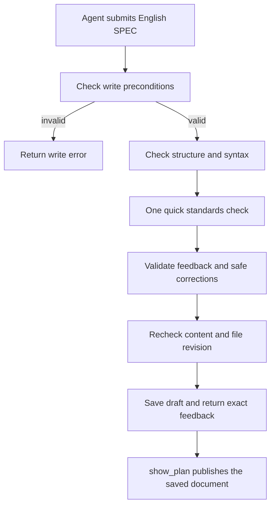

# Planctl MCP: fast standards feedback when writing a SPEC

Status: SPEC_DRAFT  
Spec lock: unlocked  
Implementation lock: unlocked  
Active Delivery: none  
Unattended decisions: allowed  

<!-- plan:spec:start -->
## The Goal

An agent submits an English SPEC once and receives the saved draft, safe corrections and exact feedback on the plan standards through MCP.
One changed submission makes at most one lightweight model call. The proposed model deadline is five seconds; actual latency remains to be measured.
Every reported issue identifies the rule, source location, offending text and proposed correction. The user's Goal, scope and approval remain unchanged by automatic fixes.

## Why now

There are currently no MCP tools for writing planctl specifications. Agents must construct CLI arguments and intermediate files, then interpret separate checks.
The owner wants these checks inside submission, with quick, specific feedback and a small first delivery.
This SPEC uses `0_agents` at `b4e353c9e9808f41258746336dcffc2350e583a7` as its code baseline.

| Current fact | Evidence | Required change |
|---|---|---|
| SPEC writing already has a canonical writer, mutation journal and staging behavior. | `planctl/src/cli/main.ts:790`, `planctl/src/core/plan-update.ts:333`, `planctl/src/core/plan-update.ts:1356` | Reuse that writer from MCP. |
| The existing checker parses Markdown, TypeScript and Mermaid and loads two vocabulary tables. | `planctl/src/core/plan-gate.ts:179`, `planctl/src/core/plan-gate.ts:285` | Reuse its checks inside submit_spec. |
| Current checks also reject long sentences and plans affecting two files. | `planctl/src/core/plan-gate.ts:285` | Return specific standards feedback without forcing a larger plan. |
| The proposed mandatory judge exists only in draft PR #17; its real subscription probe returned 429. | [PR #17](https://github.com/0xmikko/0_agents/pull/17), recorded probe on 21 September | A failed model call must remain visible and must not prevent saving a draft. |
| Mermaid differs between the committed renderer, local changes and running service. | `markdown-server/server.py:187`, `planctl/package.json`, GET `http://u3775:6420/` | Align parser and renderer versions and verify one actual diagram. |

The old change mixed many concerns: merging PR #15 changed 75 files, adding 1504 lines and deleting 4674 against its first parent.
The owner also showed an agent expanding one requested probe into 159 operations. The new acceptance probe remains one request and one submission.
The GLM session changed the comparison despite a recent clarification. Goal feedback must therefore compare the promised outcome with the actual supplied request.
These observations justify narrow scope. They do not establish that one skill caused every failure or that the model switched its reasoning level automatically.

## The target

### First useful delivery

Add a local stdio MCP interface to the existing planctl package: `planctl mcp --root <absolute-worktree>`.
The process serves one explicitly selected worktree. CLI and MCP share the existing plan format and writer.
No database, HTTP service, automatic plan selection or background task dispatcher is needed.
The existing observer remains a separate reader of progress.

| Tool | Input | Result |
|---|---|---|
| `init` | Plan path and title | Creates a SPEC_DRAFT document and returns its content and revision. |
| `submit_spec` | Plan path, expected revision, owner's request and SPEC text | Checks the English SPEC, applies allowed corrections, saves it and returns precise feedback. |
| `show_plan` | Existing plan path | Runs mdurl and returns the current published URL and document revision. |
| `vocabulary` | None; the repository is fixed at startup | Returns existing common and project terms with their meanings and sources. |

There is no separate lint tool. Submission does not approve the plan, create worktrees, commit, push or start implementation.
Creating and updating the document retain the existing writer's staging behavior.
Research and direct work require no MCP call or plan. Planning tools are used when the owner requests a plan.

### Submission flow



| Step | Server action | Agent receives |
|---|---|---|
| Address | Validate parameters, path, draft state and expected revision | A concrete error before model spending if writing is invalid |
| Local checks | Parse structure, diagrams and code blocks; normalize line endings | Structured findings with source locations |
| Model check | Check the supplied standards once against the request, SPEC and vocabulary | Only offending quotations and concrete corrections |
| Correction | Apply the permitted mechanical edits and repeat local checks | An explicit list of applied changes |
| Save | Recheck the file and call the existing writer | Saved content, new revision, remaining findings and model status |
| Display | Republish through mdurl | A URL for that saved revision, without another model call |

### The standards checked on submission

The model is a quick standards checker. Its job is the finite checklist below; it does not conduct an architecture review or rewrite the document.
The prompt contains this checklist, the owner's request, the SPEC and the two vocabulary tables. It does not load the repository, session history or skill catalogue.

| Rule | Check | Feedback |
|---|---|---|
| English | Authored plan prose is English. Verbatim owner quotations and code identifiers are exempt. | Quote the non-English passage and suggest an English correction. |
| Goal | The SPEC starts with The Goal and states the intended outcome. The outcome respects the supplied request and constraints. | Quote the incorrect or expanded outcome and suggest a correction. |
| Vocabulary | Prose uses the supplied terms for their defined meanings. | Return the exact inappropriate term in context and its canonical replacement. |
| Structure | Required sections exist and contain relevant text; an unfinished section is identified precisely. | Name the missing or misplaced section and where it belongs. |
| Clarity | A description names the action and intended result plainly. | Quote the unclear passage and give one concise alternative. |
| Mermaid | The diagram parses with the renderer's pinned version. | Return parser location and error; suggest a repair only when meaningful. |
| TypeScript | Code blocks parse as TypeScript. | Return syntax diagnostics; do not claim project type correctness. |

Local parsers check structure and syntax. The model checks English, Goal, contextual vocabulary and simple wording.
It returns no general assessment, additional requirements, research tasks or new plan sections.
The document starts with The Goal. The server appends the verbatim request in an Owner request block at the end of SPEC.
This keeps the requested outcome first while retaining the exact input used for comparison.

Example of useful feedback:

```json
{
  "rule": "vocabulary",
  "line": 42,
  "quote": "Create a new lane for this change.",
  "message": "Use Delivery for one branch and one pull request.",
  "replacement": "Create a new Delivery for this change."
}
```

The server verifies that a model quotation exists and computes its location. An invented quotation is not accepted as a finding.
Remaining findings refer to the saved document. Correction locations refer to the submitted SPEC and include both original and replacement text.
The ownerRequest argument is supplied by the agent; comparing against it cannot prove that the owner actually authorized the work.

### Fast, bounded execution

Use the existing Claude subscription through a lightweight model, initially Haiku. No API key or change to the main agent's model is involved.
Make one call for a changed submission, with tools, hooks, plugins and session persistence disabled.
The proposed deadline is five seconds including CLI startup. This is a target for the first real probe, not an observed performance claim.
The old 45-second judge timeout is not the intended interactive behavior.
Parse a strict JSON response containing findings only. Return empty findings when the check finds nothing.
There are no automatic retries, additional reviewers or repeated calls until a PASS appears.

On timeout, 429, unavailable CLI or invalid output, save the draft and return checkStatus unavailable with its exact cause.
Successful execution returns checked; that status means the check ran, not that every finding was fixed or the owner approved the document.
show_plan does not call the model. An unchanged submission returns no_change before calling it.
The first real probe records total submission latency and model latency separately. If the target is missed, report the result without silently relaxing it.

### Automatic corrections and write errors

Normalize line endings and apply an explicit vocabulary correction only when it matches a supplied vocabulary pair and one unambiguous prose location.
Protect The Goal, Owner request, constraints, non-goals, code, commands, file paths and identifiers from automatic changes.
Do not remove meaningful Markdown line-break spaces. Do not repair a diagram by inventing or redirecting its edges.
For other issues, return the offending text and suggested correction to the writing agent.
English translation of whole paragraphs and changes of requirements are suggestions, not automatic edits in the first delivery.
Every applied edit is returned explicitly. A dictionary match alone cannot prove preservation of meaning in every context.

Reject writing for invalid parameters, empty SPEC, injected plan control markers, paths outside the worktree, locked plans, stale revisions or journal conflicts.
Resolve paths to prevent escape through symlinks. Validate these conditions before the model call and recheck the document immediately before writing.
One MCP process sequences its writes and uses a fixed working directory. The model call happens outside the writer's transform function, which currently runs twice.
Content findings do not prevent draft storage or display. They remain visible in the result.
The existing writer does not promise a fully atomic file, index and journal transaction. Storage failures are returned explicitly; broader transaction changes are outside this delivery.

### Display through mdurl

show_plan invokes the existing mdurl command with argument arrays, never by interpolating document text into a shell command.
Republish on every request because mdurl serves a copy. Use a stable slug that distinguishes identical filenames in different worktrees.
Return the revision of the published bytes; if the source changes during publication, report an error instead of claiming a matching publication.
A failed mdurl call does not return a previous URL as a successful update.
Pin one exact Mermaid 11 release in planctl and the existing renderer script URL. Verify one rendered diagram in the real published page.
The dirty local renderer file belongs to existing work and must not be overwritten or included wholesale.

### Interfaces

These are proposed contracts for the first delivery. PlanState comes from plan-update; revision is SHA-256 of the complete file.

```typescript
import { z } from "zod";
import type { PlanState } from "./plan-update";

interface InitPlanInput {
  plan: string;
  title: string;
}

interface SubmitSpecInput {
  plan: string;
  baseRevision: string;
  ownerRequest: string;
  spec: string;
}

interface PlanDocument {
  plan: string;
  revision: string;
  state: PlanState;
  content: string;
}

interface SpecFeedback {
  rule: "english" | "structure" | "mermaid" | "typescript" | "vocabulary" | "goal" | "clarity";
  line: number | null;
  quote: string;
  message: string;
  replacement: string | null;
}

interface SpecCorrection {
  line: number;
  before: string;
  after: string;
  reason: "line_endings" | "vocabulary";
}

interface SubmitSpecResult extends PlanDocument {
  corrections: SpecCorrection[];
  feedback: SpecFeedback[];
  checkStatus: "checked" | "unavailable";
  checkError: string | null;
}

interface ShowPlanResult {
  plan: string;
  revision: string;
  url: string;
}

interface VocabularyEntry {
  term: string;
  meaning: string;
  alternatives: string[];
  source: string;
}

const planPath = z.string().min(1);
const revision = z.string().regex(/^[0-9a-f]{64}$/);
const initPlanInput: z.ZodType<InitPlanInput> = z.object({
  plan: planPath,
  title: z.string().min(1),
}).strict();
const submitSpecInput: z.ZodType<SubmitSpecInput> = z.object({
  plan: planPath,
  baseRevision: revision,
  ownerRequest: z.string().min(1),
  spec: z.string().min(1),
}).strict();
const planDocument = z.object({
  plan: planPath,
  revision,
  state: z.enum(["SPEC_DRAFT", "SPEC_LOCKED", "APPROVED"]),
  content: z.string(),
}).strict() satisfies z.ZodType<PlanDocument>;
const specFeedback: z.ZodType<SpecFeedback> = z.object({
  rule: z.enum(["english", "structure", "mermaid", "typescript", "vocabulary", "goal", "clarity"]),
  line: z.number().int().positive().nullable(),
  quote: z.string(),
  message: z.string().min(1),
  replacement: z.string().nullable(),
}).strict();
const specCorrection: z.ZodType<SpecCorrection> = z.object({
  line: z.number().int().positive(),
  before: z.string(),
  after: z.string(),
  reason: z.enum(["line_endings", "vocabulary"]),
}).strict();
const submitSpecResult: z.ZodType<SubmitSpecResult> = planDocument.extend({
  corrections: z.array(specCorrection),
  feedback: z.array(specFeedback),
  checkStatus: z.enum(["checked", "unavailable"]),
  checkError: z.string().nullable(),
}).strict();
const showPlanResult: z.ZodType<ShowPlanResult> = z.object({
  plan: planPath,
  revision,
  url: z.string().url(),
}).strict();
const vocabularyEntry: z.ZodType<VocabularyEntry> = z.object({
  term: z.string().min(1),
  meaning: z.string(),
  alternatives: z.array(z.string().min(1)),
  source: z.string().min(1),
}).strict();
```

For checked, checkError is null; unavailable requires a nonempty cause. Validate that relationship in the result schema.
The model receives the same feedback shape restricted to its four rules: English, Goal, vocabulary and clarity.
The server validates quotations and recomputes line numbers. Structural findings may have a null location when the relevant section is absent.
Use the official TypeScript MCP SDK and its required Zod dependency; pin versions in the lockfile.
Return structuredContent and a text representation of the same result. Reserve stdout for MCP and write diagnostics to stderr.

### Code

```text
validate input, draft state and baseRevision
return no_change if the submitted document is unchanged
check structure and syntax; normalize line endings
call the lightweight model once within the deadline
validate exact quotations and allowed vocabulary replacements
apply permitted corrections; repeat local checks without the model
recheck the file revision and writer preconditions
save through the existing writer
return saved text, corrections, findings and check status
```

## What changes

Add the MCP entrypoint and the submission operation. Reuse the writer, content parsers, dictionary tables and mdurl command.
Extract structured findings from existing checks; do not classify errors by parsing their English message text.
Keep existing CLI behavior compatible. In particular, its approval gate is not silently replaced by the new soft submission check.
Consequently, the old approve-spec may still reject a draft accepted for storage. Changing that policy is a separate, explicit decision.

The next candidate is put-stage with the same style of precise feedback on one useful result and its relation to Goal.
It may suggest splitting or combining work, but does not do either automatically. Progress and task execution follow only if the first delivery proves useful.
There are no additional implementation tasks hidden in that direction.

### Existing work and instructions

Keep the completed history in instructions-by-rule.md. Propose stopping its unfinished remainder without marking it completed.
Do not merge draft PR #17 wholesale; its narrow subscription-call mechanism may inform this implementation after approval.
Closing that PR and recording the old plan's disposition remain explicit owner decisions.
Focus stays removed, and both restored review-plan versions stay intact.
The five frozen working skills and reviewer definitions are outside this change.

Before routine use, agree the previously proposed short AGENTS.md wording: follow an approved plan chosen for this task; otherwise follow the current request directly.
That wording is not applied by this documentation PR. Git and code-verification rules continue to apply to actual code changes.
No startup MCP call or rollout across repositories is included.

## Target tree

| File | Purpose |
|---|---|
| planctl/src/cli/main.ts | Add the mcp command and call shared writing operations. |
| planctl/src/mcp/server.ts — new | Register four tools and their schemas over stdio for one worktree. |
| planctl/src/core/spec-submission.ts — new | Coordinate the bounded model check, corrections and submission result. |
| planctl/src/core/plan-update.ts | Expose the existing initialization and writing operations to both real callers. |
| planctl/src/core/plan-gate.ts | Reuse content checks as structured findings while preserving the existing CLI. |
| shared/code-production/instruction-audit.ts | Share one vocabulary parser between validation and vocabulary output. |
| planctl/package.json and planctl/bun.lock | Add SDK and Zod dependencies and pin the renderer-compatible Mermaid version. |
| markdown-server/server.py | Pin the agreed Mermaid release; preserve unrelated local changes. |
| planctl/test/mcp.test.ts — new | Cover the three behavior scenarios below. |
| planctl/test/plan-gate.test.ts | Retain existing parser behavior when exposing shared checks. |
| planctl/test/package-boundary.test.ts | Verify the built MCP starts without the source tree. |
| README.md | Document the one-worktree invocation and first-delivery limits. |

Only two production files are new: the transport and the submission operation. There is no provider framework or extra package.
Installation and updating the running renderer follow review and merge; they are not side effects of drafting this plan.

## Verification

| Scenario | Steps and expected behavior |
|---|---|
| tst_planctl_mcp_submit_001 | Connect an SDK client to real stdio, initialize a draft and submit a short English SPEC with a vocabulary error and an unclear Goal. Observe one model call, exact findings, one permitted correction, unchanged protected text and the existing writer journal. |
| tst_planctl_mcp_submit_002 | Submit a stale revision and a locked plan: no write and no model call. Return 429 or exceed the deadline for a valid draft: save it with unavailable, the actual reason and no retry. |
| tst_planctl_mcp_show_003 | Publish, update through submit_spec and publish again. Observe new content and the matching revision. Publication failure and equal filenames in different worktrees must not produce a false success. |

Reuse existing parser and writer tests rather than copying them. Use agent:test:backend for affected files during implementation.
Before publishing implementation, run the required agent:verify:docs and agent:verify:pr checks.
Automated tests substitute the child-process result; they do not require a live subscription, Telegram, PostgreSQL or Magnis backend.
One real acceptance probe uses one owner request, one SPEC and one submission. Check a vocabulary correction, response timing and the published Mermaid diagram.
Record whether the owner finds the feedback useful. Do not expand this into a benchmark collection or claim unmeasured token savings.

## Invariants

| Invariant | Proof |
|---|---|
| At most one model call per changed submission | Invocation count in the submission scenario |
| Precise, actionable standards feedback | Expected rule, quotation, source location and replacement in the submission scenario |
| Automatic corrections preserve Goal, owner quotation and scope constraints | Protected-block comparison in the submission scenario |
| Model failure is visible and bounded | Unavailable result, deadline and zero retries in the failure scenario |
| Invalid writes do not consume the model or replace the document | Revision and state refusal cases |
| Display shows the published version being reported | Published-byte comparison in the display scenario |
| Submission does not approve a plan or start implementation | Draft state after the complete initial flow |

## Constraints and non-goals

This delivery assists specification writing. It cannot guarantee that any agent will always follow the owner's intent.
The checker does not invent requirements, demand more stages or impose a document-length target.
There is no full architecture review, autonomous approval, background execution or general rewrite of agent instructions.
There is no database for end-work, new observer, distributed same-worktree editor, mandatory mock-only commit or experiment register.
Plan files remain canonical. Feedback is returned to the conversation; model responses do not require a new persistent store.

## Reuse

| Mechanism | Use |
|---|---|
| createDraftPlan, replaceDraftSpec, mutatePlanFile, journalCreatedPlan | One plan format and writer |
| Markdown AST, TypeScript and Mermaid parsers in plan-gate | Existing content checks |
| vocabulary.md and project docs/graph.md | Existing terms and meanings |
| mdurl | Existing publication command and page |
| Subscription CLI investigation in PR #17 | Reuse only the necessary invocation and response handling |
| Official MCP TypeScript SDK | Standard stdio protocol and schema handling |

Search of planctl/src and its dependencies found no existing MCP server. The Nest observer does not provide plan-file writing.
The product MCP in magnis-app is not a dependency of this work.

## Deliveries

One initial delivery exposes the four tools and verifies the complete authoring path on one real request.
Stage authoring and task execution remain later decisions. Formal implementation tasks are added after this SPEC is agreed.
The document is prepared on a new branch in an existing available worktree; no additional worktree was created.
PR #17 overlaps with checking and Claude invocation. Open PRs #8, #7 and #2 concern session archives, environment configuration and skills; they are not prerequisites.

## New names

| Name | Reason |
|---|---|
| submit_spec | Owner-selected name for writing a checked specification |
| show_plan | Publish an explicitly selected plan through mdurl |
| vocabulary | Expose the two existing term tables |
| Owner request | Preserve the comparison input after the authored SPEC, keeping Goal first |
| revision, baseRevision | Identify complete file versions without replacing SPEC approval locks |
| InitPlanInput, SubmitSpecInput, PlanDocument | Contracts for creation, submission and the saved document |
| SpecFeedback, SpecCorrection, SubmitSpecResult | Distinguish reported issues, applied edits and submission outcome |
| ShowPlanResult, VocabularyEntry | Contracts for publication and existing dictionary entries |
| checkStatus, checkError | Distinguish a completed standards check from an unavailable check |
| no_change | Reject duplicate unchanged submissions before spending a model call |

## Not verified

MCP is not implemented. The proposed interfaces have not been compiled against a selected SDK release.
The five-second deadline is proposed and unmeasured. Actual Haiku quality and latency need the single real acceptance probe; no new subscription call was made while drafting.
Full file/index/journal atomicity and simultaneous writes from independent processes are not promised.
The Mermaid version mismatch is observed; rendering after version alignment is not yet verified.
The AGENTS.md wording, old plan disposition and closure of PR #17 remain unapproved. Existing skills, reviewers and local configuration are unchanged.
<!-- plan:spec:end -->

<!-- plan:implementation:start -->
## Implementation contract
<!-- plan:implementation:end -->

<!-- plan:execution:start -->
## Execution log
<!-- plan:execution:end -->
