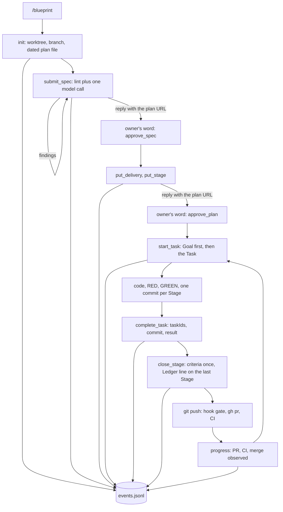

# Planctl MCP: authoring, task recovery and verified delivery

Status: APPROVED  
Spec lock: sha256:367c0c1c5dfd95bf4c81459e91a1189c44cc0dd971dd62afafccf1278a996294 owner:делать две штуки публикации - это достаточно странная идея  
Implementation lock: sha256:6edd2c38739f9ce50ace6d0f5040566d28f3c8edf5adba3c16e567f8b7414fd5 owner:делать две штуки публикации - это достаточно странная идея  
Active Delivery: D1  
Unattended decisions: allowed  

<!-- plan:spec:start -->
## The Goal

1. An agent writes and executes a plan only through planctl MCP tools. It never edits a plan file by hand.
2. The owner reads one screen per decision: the SPEC first screen, the implementation contract, the progress screen.
3. Work stops only for syntax, structure, a stale revision, a file outside the declared folders or an unnamed protected path. Never for a number, a wording or an approval already given.
4. Every tool call leaves one line in an event log outside the repository. A process change is judged by that log, not by memory.

Measured on the log after the first two plans: submit rounds per plan before approval, approvals and owner waits per plan, refusals per Task, minutes from `start_task` to `complete_task`.

## Why now

Agents run retired scripts instead of the package commands, because the real path is broken and nobody knows it.
One file missing from a Task list stopped a green Stage for fifty minutes on 22 September. The source removed that fence on 17 September; the catalog repository never received it.
A one-line ledger update after a merge cost a PR, a CI run and a red docs check on 23 September.
An explicit review request was refused on 24 September because a skill said "once".
Progress shows one Delivery as the whole plan, approval bounced on headings, and the only record of any of this is eleven gigabytes of session transcripts.

## The target



### Principle

Context, not gates, and pulled, not pushed. Plan work runs through planctl; anything else the owner asks is done directly, and the plan waits without losing anything. Every brief starts with the Goal. Numbers go to Results and never stop work. planctl refuses five things only. Invalid syntax or structure. A stale `baseRevision`. A commit touching a file outside the Stage folders. A change to a protected path the Task's writes do not name: `.github/`, `.githooks/`, `.claude/`, `.agents/`, `.codex/`, `CLAUDE.md`, `AGENTS.md`. An exported type absent from Interfaces.

### Server

`planctl mcp` starts over stdio from the 0_agents checkout through the existing `planctl` launcher. One global entry in the user's MCP settings serves every repository; no per-repository file and no arguments. Each call names its plan path, relative to the server's working directory or absolute. The server takes the repository root from that path, or from the `root` argument of a planless `progress`. The integration branch comes from the repository's local Git config, `code-production.base`, set once per clone with `git config code-production.base <branch>` and shared by its linked worktrees; a missing value refuses with that command. The MCP SDK and Zod live only in the planctl package. Every tool that writes the plan republishes it through mdurl at the same slug and returns `url` and `reply`, the lines the agent shows the owner verbatim. There is no separate publish step, because an agent forgets a second one.

### Tools

| Tool | Does | Refuses only |
|---|---|---|
| `init` | Creates `docs/plans/<date>-<slug>.md` from the branch, stages it, journals it. Returns the required sections, the vocabulary and the Goal rule below. | existing file, the integration branch itself, no `code-production.base` |
| `submit_spec` | Replaces the SPEC with the whole text. Runs lint, then one model call on changed lines. Fixes line endings and unambiguous vocabulary pairs itself. Publishes the saved bytes. Returns revision, corrections, findings, `checkStatus`, `url` and `reply`. | stale revision, locked plan, mdurl failure |
| `vocabulary` | Returns terms and their rejected synonyms with sources. | nothing |
| `approve_spec`, `approve_plan` | Record the owner's word for the addressed revision. Run the same lint as submission on the same bytes, so it finds nothing new. | stale revision, lint errors |
| `put_delivery`, `put_stage`, `remove_stage`, `amend`, `add_deviation` | Existing writer operations with structured input; each refuses with every error of the submitted part at once and returns the whole-plan findings, `url` and `reply`; a put leaves no line in the Execution log. Stage writes are folders. | decoder errors, forecast arithmetic, every lint error of the part, mdurl failure |
| `progress` | "Where am I." Reads the plan, the Git-local records, the PR and CI through `gh`, the installed runtime version. Without `plan`, takes `root` and finds the plan by that repository's branch slug, answering nothing when the branch has none. Runs nothing. | nothing |
| `start_task` | "What do I do now." Without `task`: returns the running Task, or starts the next one in Stage-graph order. With `task`: that Task, for repair or an explicit switch. With `checkpoint`: saves that sentence on the running Task's record. Checks dependencies, records the start, returns the brief below. | unmet dependency, unpublished parent Delivery, nothing left |
| `complete_task` | Takes `taskIds`, `commit`, `result`, optional `deviations`. Derives paths, elapsed time, planned tests and temp roots itself; active minutes is elapsed less recorded owner waits, an estimate; a temp root still present is reported. | commit not ancestral, file outside folders, unnamed protected path, undeclared exported type |
| `close_stage` | Runs each machinable criterion once. On the last Stage of a Delivery writes the `Ledger:` header line. | open Tasks |
| `needs_owner`, `resume_task` | Record and clear a question only the owner answers. The question is a form: what this is about, the options with their consequences, the recommendation and the form of the answer. Clearing an absent wait changes nothing. | nothing |

Publication is not a tool. The agent commits the plan delta, pushes, the pre-push hook runs the complete gate, `gh` opens the PR, and `progress` observes CI and merge. A Task of the next Delivery starts when every parent Delivery has an observed green PR; the owner merges when they choose.

### The two screens

Two questions, two answers: "what do I do now" and "where am I". The tool descriptions the agent reads are those questions; the names stay the CLI's. Both answers are pulled by the agent once the owner has put it on the plan. Nothing about the plan is pushed at session start: a pushed state reads as an order, and the owner's request loses to it. After context compaction one note restores the running Task as state, never as an instruction. Both answers carry the plan path; when the agent needs the whole picture it reads the plan file itself and never writes it. Nothing else is pushed into its context.

`start_task` returns:

```text
Plan      docs/plans/2026-09-24-google-pull-sync.md
Goal      1. sync page twice as fast: 800 ms to 400 ms   2. no repeated suite per Stage
Delivery  D1 · Stage S2 "Retain sync tokens" · Task SYNC_003
Stage     what it solves / what is built / how proven / commit message
Story     Retain the Calendar sync token across restarts
Folders   plugins/sources/google/  packages/testkit/       tests are in scope anywhere
How       persist the token in calendar.ts; cover it in calendar.test.ts
RED       bun run agent:test:backend -- test/tst_bts_calendar_token
Started   2026-09-24 09:12 · forecast 25 min · checkpoint: RED is red, next persist
```

`progress` returns:

```text
Plan      docs/plans/2026-09-24-google-pull-sync.md · APPROVED · advances only when the owner asks
Goal      1. sync page twice as fast   2. no repeated suite per Stage
Now       SYNC_003 running since 09:12 · checkpoint: RED is red, next persist
Delivery  D1: 3 of 5 Tasks · S1 S2 closed · S3 open
Plan      3 of 12 Tasks · D1 in work · D2 D3 not started
Publish   PR #291 ready · CI on 2d3dae6 green · merge: not yet
Runtime   installed 2026-09-14 · source 2026-09-21 · stale
Eligible  SYNC_004 · blocked: none
```

### The Goal rule

The Goal is one to four numbered outcomes the owner will see when the work is done. Each outcome names its measure: a number, a count, a time, or the exact observable state before and after. It promises only what the request asks: no vision, no how, no extra scope. Plain English, one sentence per outcome. Measured on 24 September 2026 on 23 past plans in isolated clones at their base commits, one judge, judged against the owner's conversation only. Scores: 6.61 of 8 for this wording, 6.13 without the measure sentence, 6.23 with the asks listed first over 22 cases after one judge error. The runner's audit flags are recorded, not resolved. Raw results: `planctl/bench/goal-eval/rounds/` and `rounds4/` at commit c5308c6, 0_agents PR #25.

### Checks at submission

Lint, 0.55 seconds on this plan, reports every error at once with rule, line, quote and replacement, like a compiler. The errors: a missing or empty section, Mermaid or TypeScript that fails to parse, vocabulary, plan codes in prose, sentences over thirty words, story shape. No size limit. Approval runs the same lint on the same bytes and finds nothing new.
Model, about five seconds: Sonnet 5 without thinking, tools off, MCP off, no session. Input is the owner request, the Goal rule, the vocabulary pairs and the changed lines with numbers. Output is findings with rule, line, quote and replacement. Deadline fifteen seconds; on timeout the draft is saved with `checkStatus: unavailable` and no retry. Model findings advise; lint errors block, all of them at once.

The reply the agent shows the owner after any write is three fixed lines; after a write that is not a submission the Checks line is absent.

```text
Plan: http://u3775:6420/dev/<slug>
Revision <revision>, <state>
Checks: <n> errors, <m> model notes
```

### Event log

Every tool call appends one JSON line to `~/.local/share/planctl/events.jsonl`, outside any repository. A line carries the time, repository, worktree, plan and revision; a call that resolved no plan leaves plan and revision empty. A `complete_task` line carries every Task ID; a `start_task` line the Delivery and the forecast; a `progress` line the PR, the CI head and the run it observed. It names the tool, the Task, the outcome, the refusal reason and the duration. It records the installed runtime commit and the source commit, never plan text or code.

The log answers five questions. Where agents stop, and why. Submit rounds per plan. Task time against its forecast. Time waiting for the owner. PRs and CI runs per Delivery. `planctl stats <since>` prints those five tables; a process change is compared before and after by the server's source commit; the consumer's installed runtime is context.

## Target tree

| Action | File | Purpose |
|---|---|---|
| CREATE | `planctl/src/mcp/server.ts` | Register tools and schemas, serve stdio, append events; the repository root travels with each call. |
| CREATE | `planctl/src/core/spec-submission.ts` | Lint, safe corrections, one model call, draft write. |
| CREATE | `planctl/src/mcp/publish.ts` | mdurl publication and the three-line reply after every write. |
| CREATE | `planctl/src/core/event-log.ts` | Append and read `events.jsonl`; `stats` tables. |
| MODIFY | `planctl/src/cli/main.ts` | Add `mcp` and `stats`; `init` derives the dated file name; start and complete move to the core. |
| MODIFY | `planctl/src/core/plan-update.ts` | Evaluate a transformation once; start, complete and the journal take a root parameter; derive the Stage result; superseding result; Delivery `depends` and `branch`; `Ledger:` header; wire the exported-type check; all story errors in one refusal; Execution log for locks, approvals, amendments and closures only. |
| MODIFY | `planctl/src/core/plan-gate.ts` | Findings with rule, blocking, quote and replacement; every error at once; What changes no longer required; the commit-only check exported. |
| MODIFY | `planctl/src/core/task-run.ts` | `TaskRunV3` with a checkpoint and a nullable identity; a completed Task in an unmerged Delivery starts again. |
| MODIFY | `planctl/src/machine/sessions/session-source.ts`, `planctl/src/machine/app.module.ts` | Read `TaskRunV3` by its identity. |
| MODIFY | `planctl/src/core/plan-progress.ts`, `planctl/src/core/snapshot-protocol.ts`, `planctl/src/cli/render.ts` | Whole-plan counts, zero totals, PR and CI state, runtime version, unavailable parts, `--note`. |
| MODIFY | `planctl/package.json`, `planctl/bun.lock` | MCP SDK, Zod. |
| MODIFY | `shared/code-production/laws/plan-format.md` | Writes are folders; eight sections; the owner screen; a Stage description is the future commit message of the finished Stage. |
| MODIFY | `README.md` | The one global MCP registration for Claude and Codex; the optional post-compaction note. |
| CREATE | `.github/workflows/planctl.yml` | CI for the package; none exists today. |
| CREATE | `planctl/test/mcp.test.ts`, `planctl/test/event-log.test.ts`, `planctl/test/spec-submission.test.ts` | Tool sequences, refusals, log lines, stats, submission. |
| MODIFY | `planctl/test/plan-update.test.ts`, `planctl/test/plan-gate.test.ts`, `planctl/test/task-run.test.ts`, `planctl/test/plan-progress.test.ts`, `planctl/test/planctl.test.ts`, `planctl/test/package-boundary.test.ts` | The tests that own the writer, gate, Task records, progress, CLI and package. |

## Interfaces

```typescript
interface SubmitSpecInput {
  plan: string;
  baseRevision: string;
  ownerRequest: string;
  spec: string;
}

interface GateViolation {
  kind: "missing-receipt" | "unknown-receipt" | "stray-receipt" | "criterion-failed" | "open-box" | "unapproved-plan" | "awaiting-owner" | "protocol-shape" | "lock-mismatch";
  rule: "structure" | "mermaid" | "typescript" | "vocabulary" | "codes" | "sentence" | "story" | "goal" | "clarity" | null;
  blocking: boolean;
  line: number;
  quote: string;
  text: string;
  replacement: string | null;
}

interface SubmitSpecResult {
  revision: string;
  state: "SPEC_DRAFT" | "SPEC_LOCKED" | "APPROVED";
  corrections: {
    line: number;
    before: string;
    after: string;
  }[];
  findings: GateViolation[];
  checkStatus: "checked" | "no_change" | "unavailable";
  checkError: string | null;
  url: string;
  reply: string;
}

interface CompleteTaskInput {
  plan: string;
  taskIds: string[];
  commit: string;
  result: string;
  deviations?: string[];
}

interface TaskBrief {
  plan: string;
  goal: string[];
  deliveryId: string;
  stageId: string;
  taskId: string;
  stageDescription: string;
  story: string;
  folders: string[];
  how: string[];
  red: string;
  startedAt: string;
  forecastMinutes: number;
  checkpoint: string | null;
}

interface ProgressView {
  plan: string;
  state: "SPEC_DRAFT" | "SPEC_LOCKED" | "APPROVED";
  goal: string[];
  currentTask: {
    id: string;
    startedAt: string;
    checkpoint: string | null;
  } | null;
  delivery: {
    id: string;
    completedTasks: number;
    totalTasks: number;
    closedStages: string[];
    openStages: string[];
  } | null;
  wholePlan: {
    completedTasks: number;
    totalTasks: number;
    deliveries: {
      id: string;
      state: "not_started" | "in_work" | "published" | "merged";
    }[];
  };
  publication: {
    prUrl: string;
    ci: "pending" | "green" | "red";
    headSha: string;
    runId: string;
    attempt: number;
    merged: boolean;
  } | {
    error: string;
  } | null;
  runtime: {
    installed: string;
    source: string;
    stale: boolean;
  } | null;
  next: {
    taskId: string | null;
    blockedBy: string | null;
  };
}

interface TaskRunIdentity {
  readonly machineId: string;
  readonly agentId: string;
  readonly repositoryId: string;
  readonly planRevision: string;
}

interface TaskRunV3 extends Omit<TaskRunV1, "version"> {
  readonly version: 3;
  readonly worktree: string;
  readonly branch: string;
  readonly checkpoint: string | null;
  readonly identity: TaskRunIdentity | null;
  readonly ownerWait: OwnerWaitMarker | null;
  readonly accumulatedOwnerWaitSeconds: number;
  readonly lastAccountedOwnerWaitStartedAt: string | null;
}

type TaskRun = TaskRunV1 | TaskRunV2 | TaskRunV3;

interface DeliveryMeta {
  readonly id: string;
  readonly active: boolean;
  readonly depends: readonly string[];
  readonly branch: string;
  readonly predictedExternalWaitMinutes: number;
}

interface StageResultReceipt {
  readonly version: 1;
  readonly plan: string;
  readonly deliveryId: string;
  readonly stageId: string;
  readonly taskIds: readonly string[];
  readonly commit: string;
  readonly startedAt: string;
  readonly endedAt: string;
  readonly activeMinutes: number;
  readonly elapsedMinutes: number;
  readonly usage: UsageReceipt | null;
  readonly paths: readonly string[];
  readonly tests: readonly {
    readonly id: string;
    readonly command: string;
  }[];
  readonly result: string;
  readonly deviations: readonly string[];
  readonly tempRoots: readonly {
    readonly path: string;
    readonly state: "absent" | "present";
  }[];
}

interface PlanProgressSnapshot {
  readonly deliveryId: string;
  readonly tasks: TaskCount;
  readonly wholePlan: TaskCount;
  readonly activeMinutes: ProgressAmount;
  readonly credits: ProgressAmount;
  readonly completionPercent: number;
  readonly stages: readonly StageProgressSnapshot[];
}

interface NeedsOwnerInput {
  plan: string;
  taskId: string;
  context: string;
  options: {
    label: string;
    consequence: string;
  }[];
  recommendation: string;
  answerForm: string;
}

interface EventRecord {
  at: string;
  repository: string;
  worktree: string;
  plan: string;
  revision: string;
  tool: string;
  deliveryId: string | null;
  taskIds: string[];
  forecastMinutes: number | null;
  prUrl: string | null;
  ciHeadSha: string | null;
  ciRunId: string | null;
  ciAttempt: number | null;
  outcome: "ok" | "refused" | "error";
  reason: string | null;
  durationMs: number;
  runtimeCommit: string | null;
  sourceCommit: string;
}
```

## Invariants

| Invariant | Test |
|---|---|
| A clean draft never bounces at approval. | Submit a SPEC with a vocabulary error; fix; approve on the same bytes passes without a new finding. Put a Stage; approve the plan on the same bytes finds nothing new. |
| A file inside a Stage folder or any test never refuses a result. | Complete a Task whose commit adds a helper and a test beside the declared file. |
| A protected path refuses with its name unless the Task's writes name it. | Complete a Task whose commit touches `.github/workflows/` unnamed: refused. Name it in the Task: passes. |
| An exported type absent from Interfaces refuses. | Change an exported type in a commit; complete refuses; declare it; complete passes. |
| Numbers never stop work. | Close a Stage whose Results report 49.8 against a Goal of 50. |
| Whole-plan and Delivery counts are separate. | Two of eight Tasks done in one Delivery report 2 of 8 and 2 of 2. |
| A repeated call returns the saved attempt. | Call `start_task` twice without `task`; one start record, one clock, the same Task. |
| The next Delivery starts on green CI, not on merge. | Parent PR green and unmerged; child Task starts. |
| A transformation runs once. | A criterion command counts one invocation through the writer. |
| Every write is published. | Put a Stage through an injected mdurl runner; the runner received the new bytes and the reply names the URL. |
| The plan carries no mutation history. | Put a Stage twice; the Execution log gains no line. |
| Every tool call writes one event line. | Run a sequence; count lines; refusals carry reasons. |

## Reuse

| Existing mechanism | Extended for |
|---|---|
| `createDraftPlan`, `replaceDraftSpec`, `mutatePlanFile`, the journal | Dated file name, one evaluation, `Ledger:` header. |
| `applyOwnerAmendment` (0_agents #23) | A locked SPEC corrected by the owner's word through `amend`; on an approved plan the same word keeps the approval when only the SPEC changed. |
| `lint` in plan-gate, `lintCommit` | Structured findings, every error at once, exported-type check wired into completion. |
| `taskExecutionBrief`, `startTask`, Task records, owner-wait records | Goal first, checkpoint, resumable repair. |
| `recordStageResult`, `coveredByWrites`, `closePlanStage` | Derived Stage result file, folders, criteria once. |
| `projectPlanProgress`, `render.ts` | Whole-plan counts and the progress screen. |
| `vocabulary.md`, `instruction-audit.ts` | The same synonym table for lint, model input and the `vocabulary` tool. |
| `agent-stack` manifest | Installed runtime commit in progress and in events. |
| `mdurl`, `gh`, pre-push hook | Showing, publishing, observing; no second gate. |
| SessionStart hooks in Claude and Codex settings | Nothing at session start: the plan is pulled by `/blueprint-start`, never pushed. After context compaction, `planctl progress --note` prints one line only when a Task is running in this worktree, worded as state with "the owner's message decides"; the hook that calls it is documented, not installed. The `session-brief-hook` branch's `focus --brief` is not adopted. |

Search found no MCP server, event log or stats reader in `planctl/src`; the observer server stores machine snapshots, not tool calls.

## What changes

The MCP server, the submission checker and the event log are new files. The writer, gate, Task records and progress are extended in place. Publication, review and the owner's merge stay outside planctl. Working skills, cops and AGENTS.md are not edited by this plan.

## New names

| Name | Reason |
|---|---|
| `submit_spec`, `vocabulary` | The two authoring tools; publication lives inside every writing tool. |
| `url`, `reply` | What every writing tool returns for the owner, so the agent never publishes twice or forgets to. |
| `Ledger:` header line | The plan carries its own lifecycle; no shared table. |
| `events.jsonl`, `EventRecord`, `planctl stats` | The process record the owner asked for, outside the repository. |
| `TaskBrief`, `ProgressView`, `CompleteTaskInput`, `NeedsOwnerInput`, `TaskRunV3`, `TaskRunIdentity` | The two screens, the completion contract, the owner question form and the start record with a checkpoint and an optional observer identity. |
| folders | Stage writes at directory granularity; tests in scope anywhere. |

## Not verified

Model latency was measured once, on one fragment: Sonnet 5 without thinking answered in 5.7 seconds. Lint time and model latency are hand measurements without a saved record. Stage forecasts are estimates. The first acceptance run, not this plan's tests, checks the live integrations. Those are the registration in Claude and Codex, the subscription subprocess, real gh output, mdurl publication, the compaction hook and the workflow run. Folder writes, files beyond a Task's writes and structured violations already exist in the source; this plan extends them. The MCP server, the event log and `stats` are not implemented. Whether Claude Code starts a global MCP server with the worktree as its working directory is checked at the first acceptance run; absolute plan paths do not depend on it. Dependent-PR CI in Magnis, `run_check` with component reuse and an explicit `switch_task` are deferred until a measured need appears.

## Owner request

> Done, let's design planctl mcp

> хотел бы с ней иметь какую-то статистику работы, что потом можно было анализировать. Например, хранить JSON-L

Earlier explicit constraints retained: extend the existing planctl, show plans through mdurl, preserve the agreed skills, minimize repeated tests and reviews, context management instead of gates.
<!-- plan:spec:end -->

<!-- plan:implementation:start -->
## Implementation contract

<!-- plan:delivery:D1:start -->
<!-- plan:delivery-meta:{"active":true,"depends":[],"predictedExternalWaitMinutes":180} -->
### PR Delivery D1 — planctl MCP: one path from plan to green PR

Branch: `feat/planctl-mcp`; Depends: none; Gate: cd planctl && bun run agent:verify:docs, cd planctl && bun run agent:verify:pr.

Stage graph: `D1-S1 -> D1-S2 -> D1-S3 -> D1-S4 -> D1-S5`.

Forecast: 1005 active min / 104 credits across 5 Stages; longest dependency path 1005 active min; external waits 180 min.

What changed for people. An agent writes and executes a plan through planctl tools over MCP and never edits a plan file by hand. The owner reads one screen per decision and is never asked to approve twice. A file inside the Stage folders or a test never stops work, and every tool call leaves one line in an event log outside the repository.

What changed in the code. The writer evaluates a transformation once, derives the Stage result from the commit, accepts folders as writes and writes the Ledger line itself. The gate reports every error at once with a replacement and checks exported types at completion. The init command derives the dated file name, progress shows the whole plan with PR, CI and runtime state, and start-task picks the next Task. A stdio server registers the tools, a submission checker runs lint plus one model call, and an event log records every call.

How it was proven. Each Stage adds behavior tests to the existing planctl suites; the package gate runs typecheck, lint, every test and the build; a new workflow runs the same gate in CI.

Not in this PR. Dependent-PR CI in Magnis, run_check with component reuse, an explicit switch_task, and the acceptance run on a real plan, which follows the merge.

<!-- plan:stage:D1-S1:start -->
<!-- plan:stage-meta:{"deliveryId":"D1","depends":[],"parallelWith":[],"writes":["planctl/src/core/","planctl/src/cli/","planctl/test/"],"tempRoot":".tmp/code-production/planctl-mcp/D1-S1","predictedActiveMinutes":215,"predictedCredits":21,"verifyActiveMinutes":15,"verifyCredits":2} -->
#### Stage D1-S1 — The writer derives the Stage result and accepts folders

- Owner: agent-1; Profile: strong; Depends: none; Parallel with: none.
- Writes: `planctl/src/core/`, `planctl/src/cli/`, `planctl/test/`.
- Temp root: `.tmp/code-production/planctl-mcp/D1-S1` (must be absent at handoff).
- Of which verification: 15 active min / 2 credits.

feat(planctl): derive the Stage result and name the plan from the branch

Done for Goal outcome 3: work stops only for the five refusals. The function mutatePlanFile evaluates its transformation once, so a criterion command runs once. Then recordStageResult takes Task IDs, a commit, a result sentence and optional deviations and derives the rest. Paths come from the commit. Elapsed minutes is the UTC interval from the earliest start record. Active minutes is that interval less the recorded owner waits and is labelled an estimate. Planned tests come from each Task's RED command; usage stays unavailable. A protected path refuses by name unless the Task's writes name it. A test anywhere and a file inside the Stage folders pass. A temp root still present is reported, not refused. The completion, init and journal operations take the repository root as a parameter and return structured results the CLI prints, because one MCP server serves several repositories. The init operation derives docs/plans/<date>-<slug>.md from the branch, refuses the base branch and a missing code-production.base, and returns the authoring contract. Then closePlanStage writes the header line Ledger: implemented on the last Stage of a Delivery without a PR number, because the PR does not exist yet. The Execution log keeps locks, approvals, amendments and closures; a put leaves no line.

Proven by planctl/test/plan-update.test.ts. It counts one invocation through the writer. It completes a Task from four inputs against a real commit whose record spans 30 minutes with a 20-minute owner wait and reads 30 elapsed and 10 active. It accepts a test outside every declared folder, refuses a workflow file the Task did not name and accepts one it did. It reads the Ledger line after the last Stage closes, sees a Results number below the Goal leave closure untouched and sees a repeated put add no log line. Proven by planctl/test/planctl.test.ts: init on a fixture branch yields the dated name, both refusals and the contract.

##### Tasks

- [ ] MCP_001 — A transformation passed to mutatePlanFile runs exactly once, so a criterion command inside it is executed once. (30 min)
<!-- plan:task-meta:{"writes":["planctl/src/core/plan-update.ts","planctl/test/plan-update.test.ts"],"predictedActiveMinutes":30,"predictedCredits":2,"how":"evaluate transform(body) once in mutatePlanFile in planctl/src/core/plan-update.ts and reuse the result for the hard-break header; add the counting-transformation test to planctl/test/plan-update.test.ts; make appendExecution record only lock-spec, approve, amend and close-stage so a put operation leaves no line in the plan; prove a repeated put-stage adds no Execution log line in planctl/test/plan-update.test.ts","red":"bun run agent:test:backend -- test/plan-update.test.ts -t tst_scripts_planupdate_021"} -->
- [ ] MCP_002 — complete-task records a Task from its IDs, commit and result sentence, derives paths, times and planned tests itself and returns a structured result. (80 min)
<!-- plan:task-meta:{"writes":["planctl/src/core/plan-update.ts","planctl/src/cli/main.ts","planctl/test/plan-update.test.ts"],"predictedActiveMinutes":80,"predictedCredits":8,"how":"move the completion operation from planctl/src/cli/main.ts into planctl/src/core/plan-update.ts with the repository root as a parameter and a structured return the CLI prints; give mutatePlanFile, verifyStagedPlan, journalPath and journalCreatedPlan the same root parameter; derive paths from the commit, elapsed minutes as the UTC interval from the earliest start record, active minutes as that interval less the recorded owner waits and labelled an estimate, planned tests from each Task RED command, and leave usage unavailable; refuse a protected path by name unless the Task's writes name it; accept tests anywhere and files inside the Stage folders; report an existing temp root instead of refusing; accept complete-task --task --commit --result beside --from; cover the 30-minute record with a 20-minute wait, the accepted outside test, both protected-path cases and the reported temp root in planctl/test/plan-update.test.ts","red":"bun run agent:test:backend -- test/plan-update.test.ts -t tst_scripts_planupdate_022"} -->
- [ ] MCP_003 — Closing the last Stage of a Delivery writes the header line Ledger: implemented, and a Results number below the Goal never changes closure. (40 min)
<!-- plan:task-meta:{"writes":["planctl/src/core/plan-update.ts","planctl/test/plan-update.test.ts"],"predictedActiveMinutes":40,"predictedCredits":4,"how":"make closePlanStage in planctl/src/core/plan-update.ts write `Ledger: implemented` into the header when the closed Stage is the last open one of its Delivery, with no PR number; in planctl/test/plan-update.test.ts read the line back, prove an earlier Stage writes none, and close a Stage whose Results report 49.8 against a Goal of 50","red":"bun run agent:test:backend -- test/plan-update.test.ts -t tst_scripts_planupdate_023"} -->
- [ ] MCP_007 — init derives the dated plan file from the branch, refuses the base branch, and returns the sections, vocabulary and Goal rule. (50 min)
<!-- plan:task-meta:{"writes":["planctl/src/core/plan-update.ts","planctl/src/cli/main.ts","planctl/test/planctl.test.ts"],"predictedActiveMinutes":50,"predictedCredits":5,"how":"move init from planctl/src/cli/main.ts into planctl/src/core/plan-update.ts with the repository root as a parameter and a structured return the CLI prints; derive docs/plans/<date>-<slug>.md from the current branch; refuse when the branch equals code-production.base, and refuse a missing key with the message `git config code-production.base <branch>`; print and return the required sections, the vocabulary and the Goal rule; cover the name, both refusals and the contract in planctl/test/planctl.test.ts","red":"bun run agent:test:backend -- test/planctl.test.ts -t tst_scripts_planctl_011"} -->

##### Acceptance criteria

- [ ] `cd planctl && bun run agent:test:backend -- test/plan-update.test.ts` exits 0 — one evaluation, four-input completion, folder, test and protected-path rules, the Ledger line, no log line per put
- [ ] `cd planctl && bun run agent:test:backend -- test/planctl.test.ts` exits 0 — init names the file, refuses the base branch and the missing key, returns the contract
- [ ] Commit

##### Results

<!-- plan:results:D1-S1:start -->
| Task | Commit | UTC start-end | Active / elapsed | Usage | Result / proof |
|---|---|---|---:|---|---|
<!-- plan:results:D1-S1:end -->
<!-- plan:stage:D1-S1:end -->

<!-- plan:stage:D1-S2:start -->
<!-- plan:stage-meta:{"deliveryId":"D1","depends":["D1-S1"],"parallelWith":[],"writes":["planctl/src/core/","planctl/test/","shared/code-production/laws/",".github/workflows/"],"tempRoot":".tmp/code-production/planctl-mcp/D1-S2","predictedActiveMinutes":155,"predictedCredits":17,"verifyActiveMinutes":15,"verifyCredits":2} -->
#### Stage D1-S2 — The gate reports every error at once and checks exported types at completion

- Owner: agent-1; Profile: strong; Depends: D1-S1; Parallel with: none.
- Writes: `planctl/src/core/`, `planctl/test/`, `shared/code-production/laws/`, `.github/workflows/`.
- Temp root: `.tmp/code-production/planctl-mcp/D1-S2` (must be absent at handoff).
- Of which verification: 15 active min / 2 credits.

feat(plan-gate): every error at once with a replacement, exported types checked at completion, CI for the package

Done for Goal outcome 1: the owner is never asked to approve twice. The function lint in planctl/src/core/plan-gate.ts returns every error of a plan at once, each with rule, blocking flag, line, quote and replacement, the way a compiler does. The errors are structure, Mermaid and TypeScript syntax, vocabulary, plan codes in prose, sentence length and story shape; there is no size limit. Approval runs the same lint on the same bytes and finds nothing new. What changes is no longer a required section. The writer's assertTaskContract collects every story error of a Stage into one refusal instead of throwing at the first. The commit-only exported-type check is an exported function with its inputs named, and recordStageResult calls it for the commit, refusing a changed exported type absent from Interfaces. An owner amendment of the SPEC on an approved plan keeps the approval under the same word when only the SPEC changed. Declaring a type must not cost a second approval. The law shared/code-production/laws/plan-format.md now states eight sections, writes as folders, the owner screen, and that a Stage description is the future commit message of the finished Stage. The file .github/workflows/planctl.yml runs the package gate on every pull request; agent:verify:commit stays the full suite, measured at 32 seconds.

Proven by planctl/test/plan-gate.test.ts: a finding carries rule, quote, line and replacement; one call returns three errors; a missing What changes raises nothing. Proven by planctl/test/plan-update.test.ts: a Stage with a story beginning with Fix and a 205-character story is refused with both errors at once. A commit changing an exported type is refused; the SPEC is amended under the owner's word; the completion passes without another approval. Proven by planctl/test/package-boundary.test.ts: the workflow names the package gate.

##### Tasks

- [ ] MCP_004 — lint returns every error at once with rule, line, quote and replacement; the writer reports all story errors together; What changes is dropped. (60 min)
<!-- plan:task-meta:{"writes":["planctl/src/core/plan-gate.ts","planctl/src/core/plan-update.ts","shared/code-production/laws/plan-format.md","planctl/test/plan-gate.test.ts","planctl/test/plan-update.test.ts"],"predictedActiveMinutes":60,"predictedCredits":6,"how":"extend the finding records of lint in planctl/src/core/plan-gate.ts with rule, blocking, quote and replacement and keep every lint finding an error; drop What changes from the required sections; in planctl/src/core/plan-update.ts collect every story error of assertTaskContract into one refusal instead of throwing at the first; rewrite the sections list, the writes rule, the owner screen and the Stage description in shared/code-production/laws/plan-format.md: a Stage description is the future commit message of the finished Stage, subject line first, then what was done for which Goal outcome and why this way, then how it is proven; assert rule, quote, line and replacement, three errors from one call, the two story errors in one refusal and the absent What changes finding in planctl/test/plan-gate.test.ts and planctl/test/plan-update.test.ts","red":"bun run agent:test:backend -- test/plan-gate.test.ts test/plan-update.test.ts -t tst_scripts_plangate_findings"} -->
- [ ] MCP_005 — A commit changing an exported type absent from Interfaces is refused by name; the owner's amendment declaring it keeps the plan approved. (55 min)
<!-- plan:task-meta:{"writes":["planctl/src/core/plan-gate.ts","planctl/src/core/plan-update.ts","planctl/test/plan-update.test.ts"],"predictedActiveMinutes":55,"predictedCredits":6,"how":"export the commit-only exported-type check from planctl/src/core/plan-gate.ts with its inputs named: root, commit and the Interfaces section; call it from recordStageResult in planctl/src/core/plan-update.ts and turn a finding into a refusal naming the type; cover refusal and acceptance in planctl/test/plan-update.test.ts; let applyOwnerAmendment on an APPROVED plan keep APPROVED and relock the implementation under the same owner word when only the SPEC changed; cover completion refused, amend, completion passes in planctl/test/plan-update.test.ts","red":"bun run agent:test:backend -- test/plan-update.test.ts -t tst_scripts_planupdate_024"} -->
- [ ] MCP_013 — A workflow runs the package gate on every pull request of the source repository; the commit check stays the full 32-second suite. (25 min)
<!-- plan:task-meta:{"writes":[".github/workflows/planctl.yml","planctl/test/package-boundary.test.ts"],"predictedActiveMinutes":25,"predictedCredits":3,"how":"create .github/workflows/planctl.yml running agent:install, agent:verify:docs and agent:verify:pr with the declared Bun version; leave agent:verify:commit in planctl/package.json as typecheck plus the full suite, measured at 32 seconds; read the workflow's commands in planctl/test/package-boundary.test.ts","red":"bun run agent:test:backend -- test/package-boundary.test.ts -t tst_unit_planctl_package_002"} -->

##### Acceptance criteria

- [ ] `cd planctl && bun run agent:test:backend -- test/plan-gate.test.ts` exits 0 — rule, quote, line and replacement, three errors at once, no What changes finding
- [ ] `cd planctl && bun run agent:test:backend -- test/plan-update.test.ts` exits 0 — the exported-type refusal, the amendment that keeps approval, two story errors in one refusal
- [ ] `cd planctl && bun run agent:test:backend -- test/package-boundary.test.ts` exits 0 — the workflow names the package gate
- [ ] Commit

##### Results

<!-- plan:results:D1-S2:start -->
| Task | Commit | UTC start-end | Active / elapsed | Usage | Result / proof |
|---|---|---|---:|---|---|
<!-- plan:results:D1-S2:end -->
<!-- plan:stage:D1-S2:end -->

<!-- plan:stage:D1-S3:start -->
<!-- plan:stage-meta:{"deliveryId":"D1","depends":["D1-S2"],"parallelWith":[],"writes":["planctl/src/core/","planctl/src/cli/","planctl/src/machine/","planctl/test/"],"tempRoot":".tmp/code-production/planctl-mcp/D1-S3","predictedActiveMinutes":245,"predictedCredits":25,"verifyActiveMinutes":20,"verifyCredits":2} -->
#### Stage D1-S3 — progress and start-task become the two screens

- Owner: agent-1; Profile: strong; Depends: D1-S2; Parallel with: none.
- Writes: `planctl/src/core/`, `planctl/src/cli/`, `planctl/src/machine/`, `planctl/test/`.
- Temp root: `.tmp/code-production/planctl-mcp/D1-S3` (must be absent at handoff).
- Of which verification: 20 active min / 2 credits.

feat(planctl): the two screens, start-task picks the Task and keeps a checkpoint, progress shows the whole plan

Done for Goal outcome 2: two screens answer what do I do now and where am I. The start, progress, needs-owner and resume-task operations moved into the core with the repository root as a parameter and structured returns. Without --task, start-task returns the running Task or starts the next one in Stage-graph order. The --checkpoint flag saves a sentence on the start record, and the brief begins with the plan path and the Goal. The file planctl/src/core/task-run.ts adds TaskRunV3: a checkpoint, the worktree and a nullable observer identity. A local clone writes the record without observer configuration, and a linked worktree never reads another worktree's Task; planctl/src/machine reads V3 by its identity. A completed Task of an unmerged Delivery starts again and records a superseding result, which clears the Stage's closed criteria so close_stage runs them again. The Delivery reader exposes depends and branch. A Task starts when its Delivery is active or when every parent Delivery has an observed green PR on its current head. Starting it makes its Delivery active without approval. The needs-owner question is a form: what this is about, the options with consequences, the recommendation and the form of the answer. The files planctl/src/core/plan-progress.ts, planctl/src/core/snapshot-protocol.ts and planctl/src/cli/render.ts show whole-plan and Delivery counts apart and zero totals as zero. They show the observed PR, CI and merge state through an injectable gh reader and the installed runtime commit against the source. A staged draft, a missing manifest and a failed gh read leave their part marked unavailable; nothing throws. Without a plan argument, progress takes a root and finds the plan by the branch slug; with --note it prints one line for a running Task, or nothing.

Proven by planctl/test/plan-progress.test.ts: 2 of 8 beside 2 of 2 with a fake PR reader, zero totals, staleness and branch lookup. The draft, the missing manifest and the failed gh read are marked unavailable. Proven by planctl/test/task-run.test.ts and planctl/test/plan-update.test.ts: start, complete, close, start again, complete again with a superseding result, close again with the criteria run again. They also run two taskless starts on one clock, a local checkpoint without observer configuration and two linked worktrees with the same plan. They save and clear a needs-owner form and start an inactive child Delivery under a green, a pending and a red parent.

##### Tasks

- [ ] MCP_009 — progress shows whole-plan and Delivery counts, PR, CI and runtime state, marks missing parts unavailable, finds the plan by branch, prints a note. (95 min)
<!-- plan:task-meta:{"writes":["planctl/src/core/plan-progress.ts","planctl/src/core/snapshot-protocol.ts","planctl/src/core/plan-update.ts","planctl/src/cli/main.ts","planctl/src/cli/render.ts","planctl/test/plan-progress.test.ts","planctl/test/server-progress.test.ts","planctl/test/server-transitions.test.ts","planctl/test/distributed-e2e.test.ts","planctl/test/server-ingest.test.ts"],"predictedActiveMinutes":95,"predictedCredits":10,"how":"add whole-plan counts beside the active Delivery in planctl/src/core/plan-progress.ts, decode them in planctl/src/core/snapshot-protocol.ts, and return zero totals instead of throwing; read PR, CI and merge state for the Delivery branch through an injectable gh reader and the runtime commit from the manifest against the source checkout, moving progress from planctl/src/cli/main.ts into the core with the repository root as a parameter and a structured return; render the screen in planctl/src/cli/render.ts; mark a staged draft, a missing manifest and a failed gh read as unavailable without throwing; find docs/plans/*-<slug>.md from the branch of a given root when no plan is named and answer nothing when none exists; add --note printing one line for a running Task or nothing; cover counts, zero totals, PR states, runtime staleness, branch lookup, the three unavailable cases and the note in planctl/test/plan-progress.test.ts; add wholePlan to the snapshot fixtures of planctl/test/server-progress.test.ts, planctl/test/server-transitions.test.ts, planctl/test/distributed-e2e.test.ts and planctl/test/server-ingest.test.ts","red":"bun run agent:test:backend -- test/plan-progress.test.ts -t tst_unit_planctl_progress_002"} -->
- [ ] MCP_010 — start-task without a Task returns the running or next Task; a completed Task starts again; a green parent unlocks its child. (130 min)
<!-- plan:task-meta:{"writes":["planctl/src/core/plan-update.ts","planctl/src/core/task-run.ts","planctl/src/cli/main.ts","planctl/src/machine/sessions/session-source.ts","planctl/src/machine/app.module.ts","planctl/test/task-run.test.ts","planctl/test/plan-update.test.ts"],"predictedActiveMinutes":130,"predictedCredits":13,"how":"move the start, needs-owner and resume-task operations from planctl/src/cli/main.ts into planctl/src/core/plan-update.ts with the repository root as a parameter and a structured return; choose the running Task or the next one in Stage-graph order when --task is absent; add TaskRunV3 in planctl/src/core/task-run.ts with a checkpoint, the worktree and a nullable observer identity, written locally without observer configuration and read only by its own worktree, and read V3 by identity in planctl/src/machine/sessions/session-source.ts and planctl/src/machine/app.module.ts; save --checkpoint on the record; print the plan path and the Goal lines first; let a completed Task of an unmerged Delivery start again, let recordStageResult append a superseding result row without counting the Task twice and clear the Stage's closed criteria so close_stage runs them again; expose depends and branch from the Delivery reader; let a Task start when its Delivery is active or every parent Delivery has an observed green PR on its current head, and make its Delivery active through the writer; take the needs-owner question as NeedsOwnerInput, a form with context, options with consequences, recommendation and answer form, in the CLI and the record; make resume-task on a Task without an open wait return the record unchanged; cover start, complete, close, start again, complete again, close again with the criteria run again, two taskless starts on one clock, the local checkpoint, two linked worktrees with the same plan, a needs-owner form saved and cleared, and an inactive child with green, pending and red parents in planctl/test/task-run.test.ts and planctl/test/plan-update.test.ts","red":"bun run agent:test:backend -- test/task-run.test.ts test/plan-update.test.ts -t tst_unit_planctl_task_run_next"} -->

##### Acceptance criteria

- [ ] `cd planctl && bun run agent:test:backend -- test/plan-progress.test.ts` exits 0 — whole-plan and Delivery counts, zero totals, PR states, runtime staleness, branch lookup, unavailable parts, the note
- [ ] `cd planctl && bun run agent:test:backend -- test/task-run.test.ts` exits 0 — next Task, local checkpoint, repair with the criteria run again, parent eligibility
- [ ] `cd planctl && bun run agent:test:backend -- test/progress.test.ts` exits 0 — the observer rendering contract is unchanged
- [ ] Commit

##### Results

<!-- plan:results:D1-S3:start -->
| Task | Commit | UTC start-end | Active / elapsed | Usage | Result / proof |
|---|---|---|---:|---|---|
<!-- plan:results:D1-S3:end -->
<!-- plan:stage:D1-S3:end -->

<!-- plan:stage:D1-S4:start -->
<!-- plan:stage-meta:{"deliveryId":"D1","depends":["D1-S3"],"parallelWith":[],"writes":["planctl/src/mcp/","planctl/src/core/","planctl/src/cli/","planctl/test/","planctl/package.json","planctl/bun.lock","README.md"],"tempRoot":".tmp/code-production/planctl-mcp/D1-S4","predictedActiveMinutes":200,"predictedCredits":21,"verifyActiveMinutes":20,"verifyCredits":3} -->
#### Stage D1-S4 — the MCP server and the event log

- Owner: agent-1; Profile: strong; Depends: D1-S3; Parallel with: none.
- Writes: `planctl/src/mcp/`, `planctl/src/core/`, `planctl/src/cli/`, `planctl/test/`, `planctl/package.json`, `planctl/bun.lock`, `README.md`.
- Temp root: `.tmp/code-production/planctl-mcp/D1-S4` (must be absent at handoff).
- Of which verification: 20 active min / 3 credits.

feat(planctl): the MCP server and the event log, the same operations over stdio, one line per call

Done for Goal outcomes 1 and 4: agents call tools instead of parsing CLI prose, and every call leaves a line. The file planctl/src/mcp/server.ts registers the authoring and execution tools with Zod schemas over the core operations. It takes the repository root from each plan path, or from the root argument of a planless progress, and the base from code-production.base; it never changes its own working directory. Every answer carries structured content and the same text. The put tools refuse a Stage with every error of that Stage at once. They return the whole-plan findings, duplicate Task IDs and dependency cycles included, without refusing an incomplete draft. The file planctl/src/core/event-log.ts appends one EventRecord per call to ~/.local/share/planctl/events.jsonl with every Task ID and the observed CI run and attempt. A schema rejection before a handler still writes a refused line. It prints the five stats tables grouped by the server's source commit. The file planctl/src/cli/main.ts adds mcp and stats, planctl/package.json adds the MCP SDK and Zod, and README.md documents the one global registration for Claude and Codex and the optional post-compaction note.

Proven by planctl/test/mcp.test.ts: one server launched outside both fixtures drives init, put_stage, start_task, needs_owner, resume_task, complete_task and close_stage in two repositories. It routes a planless progress by root and sends one malformed argument. It reads one refusal with its reason and finds the journal inside each repository. Proven by planctl/test/event-log.test.ts: one line per call; two Task timings from one batched completion; one start for a repeated start. One CI run for a repeated observation and two attempts for a rerun that keeps the run id and head.

##### Tasks

- [ ] MCP_011 — planctl mcp serves the tools over stdio with schemas over the core operations and routes each call by its plan path or root. (120 min)
<!-- plan:task-meta:{"writes":["planctl/src/mcp/server.ts","planctl/src/cli/main.ts","planctl/package.json","planctl/bun.lock","README.md","planctl/test/mcp.test.ts"],"predictedActiveMinutes":120,"predictedCredits":12,"how":"add the MCP SDK and Zod to planctl/package.json and planctl/bun.lock; create planctl/src/mcp/server.ts registering the tools with input schemas, structured content and text, passing the repository root from each plan path or from the root argument of a planless progress into the core operations and reading code-production.base there, never changing the process working directory; refuse put_delivery and put_stage with every lint error of the submitted part at once and return the validateImplementation findings of the whole plan without refusing an incomplete draft; add the mcp command to planctl/src/cli/main.ts with diagnostics on stderr; document the one global registration for Claude and Codex in README.md; in planctl/test/mcp.test.ts launch one server outside two fixture repositories and drive init, put_stage, start_task, needs_owner, resume_task, complete_task, close_stage, a planless progress by root, one malformed argument and one refusal in each, reading the journal path inside each repository","red":"bun run agent:test:backend -- test/mcp.test.ts -t tst_unit_planctl_mcp_001"} -->
- [ ] MCP_012 — Every tool call appends one event line to ~/.local/share/planctl/events.jsonl and planctl stats prints the five tables grouped by the server's source commit. (60 min)
<!-- plan:task-meta:{"writes":["planctl/src/core/event-log.ts","planctl/src/mcp/server.ts","planctl/src/cli/main.ts","planctl/test/event-log.test.ts"],"predictedActiveMinutes":60,"predictedCredits":6,"how":"create planctl/src/core/event-log.ts appending EventRecord lines to ~/.local/share/planctl/events.jsonl, with every Task ID of a call, the Delivery, the forecast, the observed PR, CI head, run id and attempt, the server's source commit and the consumer's installed runtime commit or null, and empty plan fields for a call that resolved no plan; compute the five stats tables from start, complete, submit, needs_owner, resume and progress events grouped by source commit; call it from every tool in planctl/src/mcp/server.ts and add stats to planctl/src/cli/main.ts; in planctl/test/event-log.test.ts count lines per call, read a refusal reason, and read two Task timings from one batched completion, one start for a repeated start, one CI run for a repeated observation and two attempts for a rerun that keeps the run id and head; write a refused line for a schema rejection before the handler","red":"bun run agent:test:backend -- test/event-log.test.ts -t tst_unit_planctl_event_log_001"} -->

##### Acceptance criteria

- [ ] `cd planctl && bun run agent:test:backend -- test/mcp.test.ts` exits 0 — two repositories through one server, an owner wait, a journal per repository, a refusal, a schema rejection
- [ ] `cd planctl && bun run agent:test:backend -- test/event-log.test.ts` exits 0 — one line per call and the five tables with the specified totals
- [ ] Commit

##### Results

<!-- plan:results:D1-S4:start -->
| Task | Commit | UTC start-end | Active / elapsed | Usage | Result / proof |
|---|---|---|---:|---|---|
<!-- plan:results:D1-S4:end -->
<!-- plan:stage:D1-S4:end -->

<!-- plan:stage:D1-S5:start -->
<!-- plan:stage-meta:{"deliveryId":"D1","depends":["D1-S4"],"parallelWith":[],"writes":["planctl/src/core/","planctl/src/mcp/","planctl/test/"],"tempRoot":".tmp/code-production/planctl-mcp/D1-S5","predictedActiveMinutes":190,"predictedCredits":20,"verifyActiveMinutes":15,"verifyCredits":2} -->
#### Stage D1-S5 — submit_spec: lint, safe corrections, one model call, and one publication inside every write

- Owner: agent-1; Profile: strong; Depends: D1-S4; Parallel with: none.
- Writes: `planctl/src/core/`, `planctl/src/mcp/`, `planctl/test/`.
- Temp root: `.tmp/code-production/planctl-mcp/D1-S5` (must be absent at handoff).
- Of which verification: 15 active min / 2 credits.

feat(planctl): submit_spec with lint, safe corrections, one bounded model call and publication inside every write

Done for Goal outcome 1: the owner reads a draft that approval cannot refuse. The file planctl/src/core/spec-submission.ts replaces the whole SPEC through the existing writer. It refuses a stale revision and a locked plan. It fixes line endings and unambiguous vocabulary pairs and runs the same lint approval uses, so approval on the same bytes cannot find anything new. It makes at most one model call for the changed lines. The call is the measured claude -p invocation with the sonnet model, tools off, MCP config strict, no session persistence, JSON output and thinking off. It receives the owner request, the Goal rule, the vocabulary pairs and the changed lines. A fifteen-second deadline kills the process and ends in checkStatus unavailable without retry; invalid output ends the same way. The file planctl/src/mcp/server.ts registers submit_spec and vocabulary. The file planctl/src/mcp/publish.ts wraps every tool that writes the plan. It republishes the saved bytes through mdurl at a stable worktree-aware slug and returns url and the three-line reply, or the error when publishing fails. The agent never publishes on its own, because a second publish step is the one it forgets.

Proven by planctl/test/spec-submission.test.ts: a SPEC with a vocabulary error yields the correction and the finding, and approval on the same bytes finds nothing new. An unchanged resubmission returns no_change with no model call. A forced timeout and an invalid answer through an injected runner both end unavailable. Proven by planctl/test/mcp.test.ts: one client drives init, submit_spec, approve_spec, put_delivery, put_stage, approve_plan, start_task, complete_task and close_stage with returned revisions and no fixture-side plan edit. It sees approve_plan find nothing put_stage did not already return. It reads a duplicate Task ID and a dependency cycle as findings before approval. It reads url and the three-line reply from submit_spec and from put_stage through an injected mdurl runner, and reads the vocabulary rows.

##### Tasks

- [ ] MCP_014 — submit_spec writes the whole SPEC through the writer, applies safe corrections, returns revision and findings, and refuses stale revisions and locked plans. (60 min)
<!-- plan:task-meta:{"writes":["planctl/src/core/spec-submission.ts","planctl/src/mcp/server.ts","planctl/test/spec-submission.test.ts"],"predictedActiveMinutes":60,"predictedCredits":6,"how":"create planctl/src/core/spec-submission.ts: refuse stale revision and locked plan; fix line endings and unambiguous vocabulary pairs; run lint; write through replaceDraftSpec and mutatePlanFile; register submit_spec in planctl/src/mcp/server.ts; in planctl/test/spec-submission.test.ts cover corrections, findings, the two refusals, and approval on the same bytes finding nothing new","red":"bun run agent:test:backend -- test/spec-submission.test.ts -t tst_unit_planctl_spec_submission_001"} -->
- [ ] MCP_015 — One bounded model call checks the changed lines against the Goal rule and the vocabulary. Unchanged text calls nothing; a timeout ends in unavailable without retry. (45 min)
<!-- plan:task-meta:{"writes":["planctl/src/core/spec-submission.ts","planctl/test/spec-submission.test.ts"],"predictedActiveMinutes":45,"predictedCredits":5,"how":"call the model once per changed submission from planctl/src/core/spec-submission.ts through an injectable runner whose production form is the measured claude -p invocation: --model sonnet, --tools empty, --strict-mcp-config, --no-session-persistence, --output-format json, MAX_THINKING_TOKENS=0, no API key; give it the owner request, the Goal rule, the vocabulary pairs and the changed lines; kill it at fifteen seconds; decode the JSON findings as advisory; return no_change for an unchanged submission and unavailable with the cause on timeout or invalid output; cover checked, no_change and both unavailable causes with a fake runner in planctl/test/spec-submission.test.ts","red":"bun run agent:test:backend -- test/spec-submission.test.ts -t tst_unit_planctl_spec_submission_002"} -->
- [ ] MCP_016 — Every tool that writes the plan republishes it through mdurl and returns url and the three-line reply; vocabulary returns the terms. (70 min)
<!-- plan:task-meta:{"writes":["planctl/src/mcp/publish.ts","planctl/src/mcp/server.ts","planctl/test/mcp.test.ts"],"predictedActiveMinutes":70,"predictedCredits":7,"how":"create planctl/src/mcp/publish.ts wrapping every writing tool in planctl/src/mcp/server.ts: after the core operation, publish the saved bytes through an injectable mdurl runner at a stable worktree-aware slug, build the three-line reply, and return an error instead of a stale URL when publishing fails; register vocabulary; in planctl/test/mcp.test.ts drive init, submit_spec, approve_spec, put_delivery, put_stage, approve_plan, start_task, complete_task and close_stage through one client with returned revisions and no fixture-side plan edit, prove approve_plan finds nothing put_stage did not already return on the same bytes, put a duplicate Task ID and a dependency cycle and read both findings before approval, and read url and reply from submit_spec and put_stage with the runner's received bytes","red":"bun run agent:test:backend -- test/mcp.test.ts -t tst_unit_planctl_mcp_002"} -->

##### Acceptance criteria

- [ ] `cd planctl && bun run agent:test:backend -- test/spec-submission.test.ts` exits 0 — corrections, findings, two refusals, approval finds nothing new, checked, no_change and unavailable
- [ ] `cd planctl && bun run agent:test:backend -- test/mcp.test.ts` exits 0 — one client authors and executes a plan through the tools alone; every write returns url and reply
- [ ] Commit

##### Results

<!-- plan:results:D1-S5:start -->
| Task | Commit | UTC start-end | Active / elapsed | Usage | Result / proof |
|---|---|---|---:|---|---|
<!-- plan:results:D1-S5:end -->
<!-- plan:stage:D1-S5:end -->
<!-- plan:delivery:D1:end -->
<!-- plan:implementation:end -->

<!-- plan:execution:start -->
## Execution log

- lock-spec sha256:233ebe90c09f2a3301e9a373526d9ef92d9f6837a454bc823da9b6e5a34b8fb6 owner:давай дальше

- put-delivery D1

- replace-delivery D1

- put-stage D1-S1

- put-stage D1-S2

- put-stage D1-S3

- put-stage D1-S4

- put-stage D1-S5

- replace-stage D1-S1

- replace-stage D1-S2

- replace-stage D1-S3

- replace-stage D1-S4

- replace-stage D1-S5

- replace-stage D1-S1

- replace-stage D1-S2

- replace-stage D1-S3

- replace-stage D1-S4

- replace-stage D1-S5

- replace-stage D1-S5

- replace-stage D1-S1

- replace-stage D1-S2

- replace-stage D1-S4

- replace-stage D1-S5

- replace-stage D1-S3

- replace-stage D1-S1

- replace-stage D1-S2

- replace-stage D1-S3

- replace-stage D1-S4

- replace-stage D1-S5

- replace-stage D1-S2

- replace-stage D1-S3

- replace-stage D1-S5

- replace-stage D1-S3

- replace-stage D1-S3

- replace-stage D1-S4

- replace-stage D1-S1

- replace-stage D1-S2

- replace-stage D1-S5

- replace-stage D1-S3

- replace-stage D1-S1

- replace-stage D1-S2

- replace-stage D1-S3

- replace-stage D1-S4

- replace-stage D1-S5

- replace-stage D1-S2

- replace-stage D1-S3

- replace-stage D1-S4

- replace-stage D1-S3

- replace-stage D1-S4

- replace-stage D1-S4

- replace-stage D1-S1

- replace-stage D1-S2

- replace-stage D1-S3

- replace-stage D1-S4

- replace-stage D1-S5

- replace-stage D1-S1

- replace-stage D1-S2

- replace-stage D1-S3

- replace-stage D1-S4

- replace-stage D1-S1

- replace-stage D1-S2

- replace-delivery D1

- replace-stage D1-S1

- replace-stage D1-S2

- replace-stage D1-S3

- replace-stage D1-S4

- replace-stage D1-S5

- amend spec owner:a) sha256:f2866ece604eeb340e74ce8dd3a8197034e474f2b84471b5593041754d63c172

- approve sha256:921a2b321182761798c2eec122a1ea93d5fef64bd00fee234ba1099709a1ad2a owner:a)

- amend spec owner:делать две штуки публикации - это достаточно странная идея sha256:367c0c1c5dfd95bf4c81459e91a1189c44cc0dd971dd62afafccf1278a996294

- replace-stage D1-S5

- approve sha256:6edd2c38739f9ce50ace6d0f5040566d28f3c8edf5adba3c16e567f8b7414fd5 owner:делать две штуки публикации - это достаточно странная идея
<!-- plan:execution:end -->
