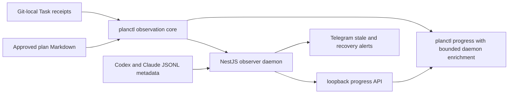

# Planctl observer daemon

Status: SPEC_DRAFT
Spec lock: unlocked
Implementation lock: unlocked
Active Delivery: none
Unattended decisions: allowed

<!-- plan:spec:start -->
## The Goal

Give the owner one truthful answer to “how far is the approved plan, what work
remains, and has an executing agent gone quiet?” without making the existing
code-production workflow depend on a background service.

The currency is **observable approved-Task coverage and detection latency**:

- `planctl progress <plan>` reports completed/total Tasks, completed/remaining
  predicted active minutes and credits, active Task elapsed time, and agent
  activity state from the canonical plan and Git-local Task receipts.
- With the daemon online, an active Task whose matched session JSONL has not
  appended an event for the configured stale interval is surfaced within one
  scheduled scan and produces one Telegram alert per stale transition.
- With the daemon offline, every existing `planctl` command keeps its current
  exit behavior; `planctl progress` still returns the local plan-only snapshot
  and explicitly reports `observer: unavailable` after a bounded 200 ms probe.
- A daemon restart does not repeat an already-sent stale alert, and resumed
  activity produces at most one recovery message before a future stale
  transition can alert again.
- No prompt text, assistant text, reasoning, tool input/output, bot token, or
  other transcript payload is persisted by the daemon or sent to Telegram.

## The target

### Owner flows

1. **Check progress:** from any managed repository, the owner runs
   `planctl progress docs/plans/<plan>.md`. The command prints the same plan
   totals whether the daemon is present; an online daemon enriches active Tasks
   with provider, last activity, idle duration and `running | stale | untracked`.
2. **Receive a stale alert:** the daemon's Nest scheduler scans configured
   Codex and Claude JSONL roots, correlates session metadata with versioned
   `start-task` receipts, derives plan context, and sends a deduplicated Telegram
   message containing plan/Stage/Task, progress, forecast versus elapsed time,
   worktree, last event kind and idle duration.
3. **Recover without ceremony:** when a stale JSONL appends again, the next
   scan records the recovery and can notify once. Completing the Task removes
   its start receipt, so it disappears from the active-agent view without a
   daemon-owned lifecycle mutation.
4. **Run without monitoring:** missing daemon, missing Telegram configuration,
   or a Task receipt with no supported session ID is explicit status, never a
   reason for plan authoring/execution commands to fail.

### Architectural decision

The dedicated root `planctl/` package owns the CLI, reusable observation core,
and NestJS daemon. Plan Markdown and Git-local Task receipts remain the only
execution truth. The daemon is a read model over those sources plus session
activity metadata; its only durable state is notification deduplication.



### Target tree

```text
planctl/
├── package.json                         # Bun package, Nest dependencies and agent:* verification scripts
├── bun.lock                             # exact package snapshot
├── tsconfig.json                        # strict TypeScript plus Nest decorator settings
├── README.md                            # CLI, daemon, configuration and privacy contract
├── deploy/planctld.service              # systemd --user unit template
├── fixtures/sessions/                   # sanitized Codex/Claude JSONL behavior fixtures
├── src/cli/main.ts                      # current commands plus progress and bounded daemon client
├── src/core/plan-gate.ts                # moved canonical lock/gate engine
├── src/core/plan-update.ts              # moved canonical writer and shared plan read model
├── src/core/plan-progress.ts            # pure weighted progress/forecast projection
├── src/core/task-run.ts                 # versioned start receipt and agent-session identity
├── src/daemon/main.ts                   # loopback-only Nest bootstrap
├── src/daemon/app.module.ts             # module composition and ScheduleModule ownership
├── src/daemon/config.ts                 # strict environment decoding
├── src/daemon/progress/                 # progress module, service and HTTP controller
├── src/daemon/sessions/                 # session port plus Codex/Claude JSONL adapters
├── src/daemon/stale/                    # scheduled correlation and transition policy
├── src/daemon/notifications/            # notifier port and Telegram adapter
├── src/daemon/state/                    # atomic alert-transition repository
└── test/                                # moved core tests plus progress/stale/API/install tests
bin/planctl                              # compatibility launcher into planctl/src/cli
bin/planctld                             # foreground daemon launcher for systemd/manual use
lib/setup-planctld.sh                    # idempotent dependency/unit/config installation
shared/code-production/agent-stack.ts   # vendors lightweight core/CLI to stable consumer paths
shared/code-production/templates/...    # stable consumer hooks continue calling vendored paths
install-server-linux.sh                  # server bootstrap opt-in/enable step
update.sh                                # refresh package and restart an installed user service
README.md                                # feature inventory and operator entrypoints
```

The Nest daemon is never copied into a consumer repository. `agent-stack`
continues to vendor the small TypeScript CLI/core under the existing
`.agents/code-production/runtime/` targets so installed hooks and plans do not
break when the source files move into `planctl/`.

### Core interfaces

```ts
type AgentProvider = "codex" | "claude";

type SessionIdentity =
  | { readonly kind: "identified"; readonly provider: AgentProvider; readonly id: string }
  | { readonly kind: "unavailable"; readonly reason: string };

interface TaskRunV2 {
  readonly version: 2;
  readonly worktreeRoot: string;
  readonly plan: string;
  readonly deliveryId: string;
  readonly stageId: string;
  readonly taskId: string;
  readonly startedAt: string;
  readonly baseHead: string;
  readonly session: SessionIdentity;
}

interface PlanProgress {
  readonly plan: string;
  readonly status: "SPEC_DRAFT" | "SPEC_LOCKED" | "APPROVED";
  readonly tasks: { readonly completed: number; readonly total: number };
  readonly predictedActiveMinutes: { readonly completed: number; readonly remaining: number };
  readonly predictedCredits: { readonly completed: number; readonly remaining: number };
  readonly completionPercent: number;
}

type AgentActivityState = "running" | "stale" | "untracked";

interface AgentObservation {
  readonly taskId: string;
  readonly session: SessionIdentity;
  readonly state: AgentActivityState;
  readonly lastEventKind: string | null;
  readonly lastUpdatedAt: string | null;
  readonly idleSeconds: number | null;
  readonly elapsedMinutes: number;
}

interface SessionSource {
  activity(session: SessionIdentity): Promise<AgentObservation | null>;
}

interface Notifier {
  stale(snapshot: AgentObservation, progress: PlanProgress): Promise<void>;
  recovered(snapshot: AgentObservation, progress: PlanProgress): Promise<void>;
}
```

The progress projection is one pure function used by both CLI and daemon.
There is no second Markdown parser. `TaskRunV2` is written atomically by
`start-task`; existing version-1 receipts remain completable but are reported
as `untracked` because they contain no trustworthy session identity.

### Stale and notification policy

- Nest `ScheduleModule` owns one configurable cron scan; default cadence is 60
  seconds and default stale interval is 15 minutes. Tests inject a clock and
  invoke the scan directly—no wall-clock sleeps.
- JSONL adapters read only identity, `cwd`, timestamps, record/event kind and
  file size/mtime. An incomplete trailing append is ignored in favor of the
  last complete JSON object; malformed metadata yields `untracked`, never a
  healthy result.
- Staleness requires an active Task receipt, a matching provider/session file,
  and `now - lastUpdatedAt >= staleInterval`. A quiet chat with no active
  `planctl` Task is not an agent to monitor.
- The alert repository atomically persists the last notified state under the
  configured XDG state directory. A notification failure is recorded and
  retried on the next scan; a successful state is not re-sent until a genuine
  transition occurs.
- Telegram is disabled only when both token and chat ID are absent. Supplying
  one without the other is invalid configuration and refuses daemon startup.
  The daemon health endpoint reports notification capability explicitly.
- The HTTP API binds `127.0.0.1` only. It exposes health, all active progress,
  and one validated repository/plan progress query; it never exposes transcript
  records or accepts plan mutations.

### Success metrics

- Synthetic plans prove exact Task counts, weighted completion percent,
  completed/remaining minutes and credits, partial Stage progress, and parallel
  Stage forecasts without dividing work by agent count.
- Codex and Claude fixtures prove session correlation, stale threshold boundary,
  truncated final JSONL handling, unknown receipt versions, and provider/session
  mismatches.
- A secret string embedded in every transcript payload is absent from API
  responses, state files, logs and captured Telegram messages.
- Three identical stale scans plus a daemon restart produce one stale alert;
  append/recovery plus a later stale transition produces one recovery and one
  new stale alert.
- An unreachable/hanging daemon cannot change existing command results and adds
  no more than the configured 200 ms probe to `planctl progress`.
- The existing 35 code-production tests remain green after their source move;
  `agent-stack` install/check fixtures prove the same seven stable vendored
  consumer targets.

### Constraints and deliberate exclusions

- TypeScript on Bun with NestJS (`@nestjs/core`, `@nestjs/common`,
  `@nestjs/platform-express`, `@nestjs/schedule`) is the required runtime even
  though a smaller HTTP loop would work; modules must preserve reusable seams.
- Delivery 1 supports local Codex and Claude JSONL files and Linux systemd
  `--user`. macOS launchd, remote/multi-host aggregation and Windows are later
  Deliveries.
- “Summarize” in Delivery 1 means deterministic plan context plus activity
  metadata. LLM transcript summarization, prompt/tool excerpts, agent control,
  restart/kill actions and a web dashboard are out of scope.
- The daemon monitors approved Tasks started through `planctl`; it does not
  guess that arbitrary chats are executing project work.
- The source repository currently has no `staging` branch and no root Bun
  package. This self-hosted plan uses `origin/main`, matching existing PRs; the
  dedicated `planctl/package.json` owns its seven `agent:*` adapters and scoped
  verification commands.

### Today, measured against the target

Pinned implementation base: `73e6c2a` (`origin/main`, 2026-08-29).

- `shared/code-production/runtime/planctl.ts` is 453 lines and exposes no
  `progress` command. Its version-1 Task receipt at lines 156-164 records plan,
  Task, time and base commit but no worktree or agent session; receipts live in
  the Git common directory at lines 234-237.
- `shared/code-production/runtime/plan-update.ts` is 1,191 lines. It already owns
  the canonical rendered Stage parser (`stageInputs`, line 437), Delivery
  metadata parser (line 484) and exported Task brief (line 550); progress must
  extend that read model rather than parse Markdown again.
- `shared/code-production/agent-stack.ts` is 252 lines and maps source runtime
  files to stable consumer targets at lines 89-119. That map is the compatibility
  seam for moving source ownership into `planctl/`.
- There is no root or nested `package.json`, Nest module, scheduler, Telegram
  adapter, progress projection, or Codex/Claude session identity use in the
  repository. The current four code-production test files pass **35/35** in
  **6.17 s** on the pinned base.
- Host schema inspection without reading payload content confirmed Codex
  `session_meta` contains `id/session_id` and `cwd`, appended records carry
  timestamps/event kinds, and 28 of 30 sampled recent completed logs ended in
  `event_msg/task_complete`. Claude JSONL records expose `sessionId`, `cwd`,
  `timestamp` and record type. Both formats can support metadata-only activity
  adapters; neither currently links to a Task receipt.

### Reuse map

- Extend `plan-update.ts`'s existing `stageInputs`, `deliveryMetas` and
  `taskExecutionBrief`; grep found no other plan progress/read-model owner.
- Extract `planctl.ts`'s existing Task receipt path/decoder into `task-run.ts`;
  preserve atomic writes and the completion ancestry checks rather than adding
  a daemon registry as execution truth.
- Extend `agent-stack.ts::managedFiles`; keep installed target paths and the
  manifest drift check unchanged.
- Reuse `lib/install-bin.sh` for `planctld` and the repository's existing
  systemd-user setup conventions in `lib/setup-cyrus.sh`; do not add a second
  binary-linker or service installer framework.
- Reuse `shared/skills/test-protocol` determinism/privacy rules and Bun's
  temporary-directory fixtures; live Telegram and personal transcripts are
  forbidden in tests.
- Repository-wide greps found no existing progress service, session source,
  Nest module, Telegram notifier or stale-agent policy to extend.

### Invariants

- **OBS-001:** one canonical plan projection produces identical numeric
  progress in CLI and daemon responses.
- **OBS-002:** observer absence or timeout never changes the exit status or
  writes of existing `planctl` commands.
- **OBS-003:** only an active Task receipt can produce `running` or `stale`; a
  recent unrelated JSONL cannot.
- **OBS-004:** the stale boundary is deterministic at `>=` the configured
  interval, and malformed/truncated session input cannot become healthy.
- **OBS-005:** one persisted transition produces at most one Telegram message,
  including across restart, while failed delivery remains retryable.
- **OBS-006:** transcript payload content and Telegram credentials never cross
  the metadata parser, HTTP response, persisted alert state or notification
  template boundary.
- **OBS-007:** existing version-1 receipts remain valid for Task completion and
  progress but are explicitly `untracked` for stale detection.
- **OBS-008:** consumer repositories retain the same seven vendored runtime/hook
  target paths and do not receive NestJS daemon code or dependencies.

### Open questions

None. The first Delivery is deliberately local, metadata-only and read-only;
future summarization or control behavior requires a new owner-approved plan.
<!-- plan:spec:end -->

<!-- plan:implementation:start -->
## Implementation contract
<!-- plan:implementation:end -->

<!-- plan:execution:start -->
## Execution log
<!-- plan:execution:end -->
