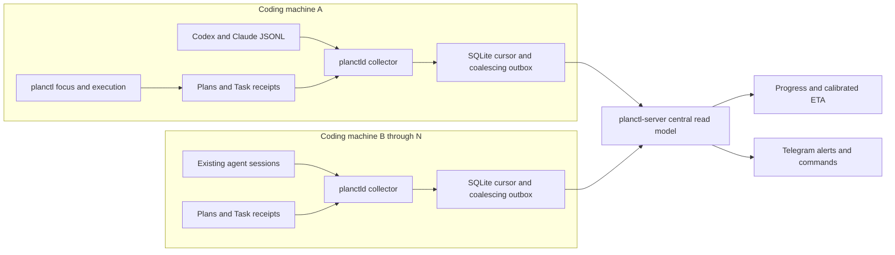

# Planctl observer daemon

Status: SPEC_LOCKED
Spec lock: sha256:82a658272d7a7f12f1c37cc23733bb99f4d08099baa5108f6ab0dd29980034b6 owner:the spec is good, lets plan
Implementation lock: unlocked
Active Delivery: none
Unattended decisions: allowed

<!-- plan:spec:start -->
## The Goal

Make long-running, multi-agent vibecoding robust and efficient across multiple
machines: every agent stays tied to the approved long-term plan, the owner can
see a defensible delivery estimate, and stalled or owner-blocked work becomes
visible without manually opening terminals.

The currency is **time to trustworthy intervention and forecast accuracy**:

- Every configured machine reports its active Codex and Claude sessions,
  current repository/branch, bound plan/Delivery/Stage/Task, last activity and
  machine health to one server.
- Each plan reports completed work, remaining predicted active work, remaining
  dependency critical path, calibrated ETA, calibration sample count, and
  whether owner waits make the calendar ETA unavailable.
- A session that stops updating becomes `stale` within one scan interval after
  its configured threshold. An agent that explicitly needs the owner becomes
  `awaiting_owner` immediately, with a safe one-line reason.
- Telegram sends deduplicated alerts for `stale`, `awaiting_owner`, recovery and
  machine-offline transitions. Authorized commands return portfolio progress,
  one-plan progress, all agents, stale agents, and agents awaiting the owner.
- An unavailable server never prevents local plan authoring or execution.
  Each machine coalesces its latest unsent snapshot and catches up after the
  connection returns; no agent waits on telemetry.
- The first completed Deliveries establish forecast error as a measured
  baseline. ETA responses always distinguish raw plan forecast from calibrated
  forecast and never present owner-wait time as known.

## The target

### Product roles

There are three explicit runtime roles inside one dedicated root `planctl/`
package:

1. **`planctl` CLI — agent focus protocol.** Existing plan authoring/execution
   commands remain canonical. `focus` shows the long-term Goal, current Task,
   exact scope, next dependency-ready work and local progress. `needs-owner`
   records a structured wait reason without mutating the approved plan;
   `start-task`/`resume-task` clears it. `progress` can show local or aggregated
   server state.
2. **`planctld` — per-machine collector.** One systemd-user process on every
   coding machine incrementally observes Codex/Claude JSONL metadata, live
   session processes, Git worktrees, plans and Task receipts. It persists
   cursors plus a coalescing outbox, computes local activity state, and sends
   versioned snapshots/heartbeats to the server.
3. **`planctl-server` — central control plane.** One NestJS service authenticates
   machines, idempotently ingests snapshots, stores current/history state in
   SQLite WAL, detects cross-machine transitions, calculates plan progress and
   delivery ETA, and owns Telegram alerts plus commands.

### Owner and agent flows

1. **Keep an agent focused:** before work, the agent runs `planctl start-task`
   and receives Goal → Delivery → Stage → Task, writes, forecast and RED. At any
   time `planctl focus` reprints this contract and warns when the session is
   unassigned, its plan revision differs from the server's canonical revision,
   or its elapsed active time exceeds forecast.
2. **Track existing agents:** `planctld` discovers live Codex/Claude processes
   and their JSONL session IDs even when they were not launched by planctl.
   Bound sessions contribute to plan progress and ETA; live sessions without a
   Task receipt appear as `unassigned` so existing work is visible without being
   falsely credited to a plan.
3. **Aggregate many machines:** each collector sends a heartbeat every 15
   seconds and a compact snapshot only when its content hash changes. Sequence
   numbers make retries idempotent. When the server is unavailable, the local
   SQLite outbox retains only the latest unacknowledged state per machine and
   sends it after reconnect, avoiding an unbounded event queue.
4. **Estimate delivery:** the server projects incomplete Tasks through the
   declared Stage dependency DAG. Active Task remaining time is
   `max(0, calibrated prediction - elapsed active time)`; queued work uses its
   calibrated prediction. The longest remaining dependency path is the ETA
   basis, while total remaining active minutes are reported separately. An
   `awaiting_owner` Task makes `estimatedDeliveryAt` null and exposes
   `blockedSince` plus active-work ETA instead of inventing owner response time.
5. **Ask Telegram:** an authorized owner sends `/progress`,
   `/progress <plan>`, `/agents`, `/stale`, or `/waiting`. The bot replies from
   the server read model. It also pushes one alert per state transition with
   machine, agent, plan/Task, elapsed versus predicted time, last safe activity
   kind, and the explicit owner-wait reason when present.
6. **Recover:** new JSONL activity changes `stale` to `working`; an agent calling
   `resume-task` changes `awaiting_owner` to `working`; collector reconnect
   changes `machine_offline` to online. Each recovery is persisted and notified
   once. Completed Task receipts remove the session from active plan work while
   retained history remains available for ETA calibration.

### Architectural decision

Plans and typed Task receipts remain execution truth; collectors publish
versioned observations, and the server owns only the distributed read model.
No central component edits a plan, advances a checkbox, resumes an agent or
guesses work completion.



### Identity and state model

- `machineId` is an owner-assigned stable slug, unique at the server.
- `agentId` is `<provider>:<sessionId>` within a machine. A restarted process
  with the same session remains the same agent observation.
- `repositoryId` is the normalized Git remote when present; a repository with
  no remote uses an explicit configured ID—never a guessed filesystem name.
- `planId` is `repositoryId + plan-relative-path`; `planRevision` is the locked
  implementation hash. Two machines reporting different revisions are shown as
  `plan_drift` and are not silently merged into one forecast.
- Agent state is one of `working | awaiting_owner | stale | unassigned |
  finished`; machine liveness is independently `online | offline`. An offline
  machine never causes all of its agents to be mislabeled stale.
- `awaiting_owner` requires the structured `planctl needs-owner` marker. A
  terminal turn with an active Task but no marker becomes `stale` or
  `attention_unknown`; transcript punctuation is never used to claim the owner
  owes a response.

### Delivery forecast

The server returns both an uncalibrated plan forecast and an observed forecast:

```ts
interface DeliveryForecast {
  readonly completionPercent: number;
  readonly remainingActiveMinutes: number;
  readonly remainingCriticalPathMinutes: number;
  readonly calibratedCriticalPathMinutes: number;
  readonly estimatedDeliveryAt: string | null;
  readonly blockedByOwner: number;
  readonly calibration: {
    readonly factor: number;
    readonly completedTaskSamples: number;
    readonly confidence: "low" | "medium" | "high";
  };
}
```

Calibration uses the median `actualActiveMinutes / predictedActiveMinutes` from
completed Tasks in the same repository, bounded to `0.5..3.0`. Fewer than three
samples uses factor `1.0` and confidence `low`; 3–9 samples is `medium`; 10 or
more is `high`. Total active work is never divided by machine/agent count.
Parallelism affects only the dependency critical path actually declared by the
plan.

### Distributed contracts

```ts
type AgentProvider = "codex" | "claude";

interface MachineHeartbeat {
  readonly protocolVersion: 1;
  readonly machineId: string;
  readonly sequence: number;
  readonly observedAt: string;
  readonly snapshotHash: string;
}

interface AgentSnapshot {
  readonly agentId: string;
  readonly provider: AgentProvider;
  readonly state: "working" | "awaiting_owner" | "stale" | "unassigned" | "finished";
  readonly repositoryId: string | null;
  readonly worktree: string | null;
  readonly branch: string | null;
  readonly planId: string | null;
  readonly planRevision: string | null;
  readonly taskId: string | null;
  readonly lastActivityAt: string;
  readonly idleSeconds: number;
  readonly elapsedActiveMinutes: number | null;
  readonly ownerWaitReason: string | null;
}

interface MachineSnapshot {
  readonly heartbeat: MachineHeartbeat;
  readonly agents: readonly AgentSnapshot[];
  readonly plans: readonly PlanProgressSnapshot[];
}
```

`POST /v1/machines/:machineId/snapshot` requires that machine's bearer token,
validates the URL ID against the token subject, accepts only a sequence greater
than the stored sequence, and returns the acknowledged sequence/hash. Server
offline status uses server receipt time; per-agent idle time is calculated on
the originating machine so cross-machine clock skew cannot create a stale
transition.

### Configuration

Configuration is file-based TOML, validated before either service starts. No
secret is stored directly in TOML: secret fields point to mode-`0600` files.
There is no silent environment/default discovery beyond the documented default
config paths.

#### Every coding machine — `~/.config/planctl/machine.toml`

```toml
version = 1
machine_id = "u3775"
repository_ids = { "/home/marketing/Coding/private-repo" = "private-repo" }

[server]
url = "https://planctl.example.ts.net"
token_file = "/home/marketing/.config/planctl/machine.token"
connect_timeout_ms = 1000
request_timeout_ms = 5000

[collector]
scan_seconds = 5
heartbeat_seconds = 15
stale_after_seconds = 900
session_lookback_days = 7
state_db = "/home/marketing/.local/state/planctl/machine.sqlite"
watch_roots = ["/home/marketing/Coding"]
codex_sessions = "/home/marketing/.codex/sessions"
claude_sessions = "/home/marketing/.claude/projects"
```

`watch_roots` limits Git/worktree discovery. JSONL roots must be explicit
absolute paths. `repository_ids` is required only for repositories without a
usable normalized remote. A collector refuses duplicate machine IDs, a token
file with broader permissions, `heartbeat_seconds >= stale_after_seconds`, or
paths outside configured roots.

#### Central host — `~/.config/planctl/server.toml`

```toml
version = 1
bind = "127.0.0.1:4789"
external_url = "https://planctl.example.ts.net"
database = "/home/planctl/.local/state/planctl/server.sqlite"
machine_offline_after_seconds = 60
history_retention_days = 90

[telegram]
bot_token_file = "/home/planctl/.config/planctl/telegram.token"
allowed_user_ids = [123456789]
default_chat_id = 123456789
long_poll_seconds = 30
```

The central Nest service binds the configured address; multi-machine transport
is expected to be protected by Tailscale Serve or an HTTPS reverse proxy.
Non-loopback plain HTTP `external_url` is rejected. Telegram uses long polling,
so no public bot webhook is required. Unknown users receive no plan data.

#### Bootstrap and validation

- `planctl config init --role machine|server` writes a commented template but
  never invents IDs, URLs or secrets.
- `planctl config check --role machine|server` validates schema, paths,
  permissions, endpoint security and connectivity without starting a service.
- `planctl-server machine create <machineId>` stores a hashed credential and
  prints the raw enrollment token once; that token is copied to the machine's
  configured token file.
- `lib/setup-planctl.sh --role machine|server` installs dependencies, binaries
  and the corresponding systemd-user unit only after `config check` succeeds.
- Config changes require an explicit service restart in Delivery 1; there is no
  partial hot reload.

### Telegram behavior

| Command/alert | Result |
|---|---|
| `/progress` | all active plans ordered by attention state, then ETA |
| `/progress <plan>` | Goal, completion, active Tasks, critical path, calibrated ETA and blockers |
| `/agents` | machine/agent/task/state/idle/elapsed summary |
| `/stale` | stale agents and machine-offline distinctions |
| `/waiting` | agents explicitly awaiting owner, safe reason and wait duration |
| stale alert | one message on transition into stale |
| owner-needed alert | one immediate message per new structured wait marker |
| recovery alert | one message when stale/waiting/offline clears |

Messages contain no raw transcript excerpts. Context comes from the approved
Goal/Task, Git metadata, activity record kind, numeric timing and the explicit
safe `needs-owner` reason supplied by the agent.

### Target tree

```text
planctl/
├── package.json                         # Bun/Nest package and seven agent:* scripts
├── bun.lock                             # exact dependency snapshot
├── tsconfig.json                        # strict TypeScript and Nest decorators
├── README.md                            # roles, commands, configuration and operations
├── deploy/                              # machine/server systemd-user unit templates
├── fixtures/sessions/                   # sanitized Codex/Claude JSONL fixtures
├── src/cli/                             # authoring, focus, progress, needs-owner and admin commands
├── src/core/                            # canonical plan writer/gate/read model/ETA contracts
├── src/machine/                         # collector modules, JSONL/process sources and SQLite outbox
├── src/server/                          # Nest ingest, registry, progress, ETA and SQLite modules
├── src/telegram/                        # authorized long-poll bot, commands and transition notifier
└── test/                                # core, machine, server, Telegram and protocol tests
bin/planctl                              # compatibility CLI launcher
bin/planctld                             # per-machine collector launcher
bin/planctl-server                       # central server launcher
lib/setup-planctl.sh                     # role-aware validated user-service installer
shared/code-production/agent-stack.ts   # vendors CLI/core to stable consumer paths
shared/skills/blueprint-start/SKILL.md   # requires structured owner-wait state
install-server-linux.sh                  # machine/server role setup entrypoint
update.sh                                # package refresh and installed-service restart
README.md                                # distributed planctl feature inventory
```

NestJS and server dependencies are never copied into consumer repositories.
`agent-stack` continues to vendor lightweight CLI/core files under the existing
`.agents/code-production/runtime/` paths so managed hooks do not break when
source ownership moves into `planctl/`.

### Efficiency and failure policy

- Collectors keep per-file byte offsets and parse only appended complete JSONL
  records. A truncated tail remains buffered until completed; malformed input
  becomes explicit source error, never healthy activity.
- Snapshots are content-hashed. Unchanged state sends only a heartbeat; changed
  state replaces the one coalesced outbox row. Retries use bounded exponential
  backoff with jitter and preserve the latest state across restart.
- The server transactionally accepts sequence + snapshot, so duplicate/out-of-
  order retries cannot regress state or duplicate Telegram alerts.
- Server unavailability is visible in local `planctl progress` and collector
  health but never changes existing authoring/execution command status.
- Machine offline and session stale are separate. A missing machine heartbeat
  alerts once at 60 seconds by default; its sessions retain their last known
  state and are labeled `machine_offline` in views.
- A Task scope or plan revision mismatch is `plan_drift`; it is excluded from
  ETA until reconciled rather than merged optimistically.

### Success metrics

- A deterministic fixture with 3 machines, 12 agents, 2 plans, parallel Stages,
  an owner wait, plan drift and an offline machine returns exact progress,
  remaining active work, critical path and calibrated ETA.
- With server loss across 20 collector scans, the outbox stays at one latest
  snapshot; reconnect acknowledges it and server state converges within one
  heartbeat without blocking a `planctl` work command.
- Three duplicate/out-of-order snapshot deliveries plus a server restart create
  one state transition and one Telegram alert.
- Stale is detected at exactly `idleSeconds >= stale_after_seconds`; owner wait
  is emitted immediately from `needs-owner`; machine offline is based only on
  server heartbeat receipt time.
- Telegram command fixtures prove authorization and exact `/progress`,
  `/agents`, `/stale`, `/waiting` answers without live Telegram.
- A secret marker placed in every JSONL payload is absent from wire snapshots,
  SQLite rows, logs, API responses and Telegram messages.
- A 100-machine/1,000-agent synthetic snapshot set is ingested idempotently and
  queried for progress within a measured target established in Stage 0; the
  target is recorded before optimization rather than guessed in this SPEC.
- Existing code-production tests remain green after source relocation, and
  installed consumer paths remain byte-identical to their canonical CLI/core
  sources.

### Constraints and deliberate exclusions

- TypeScript on Bun and NestJS are required. SQLite WAL is the Delivery-1
  persistence boundary; no PostgreSQL, Redis or message broker is introduced.
- Delivery 1 supports Linux systemd-user hosts, Codex and Claude. macOS launchd,
  Windows, browser UI and Kubernetes are later plans.
- The system observes and reports agents; it never sends prompts into a live
  session, kills/restarts a process, changes a plan, completes a Task, or lets a
  Telegram command mutate execution.
- “Summary” means deterministic approved-plan context and timing in Delivery 1.
  LLM transcript summarization and transcript upload are out of scope.
- Existing unassigned agents are tracked for activity/staleness but do not
  contribute to a plan ETA until they bind through `start-task`.
- The source repository has no `staging` branch. This self-hosted plan continues
  its evidence-backed `origin/main` PR workflow; `planctl/package.json` owns the
  seven `agent:*` commands from its own working directory.

### Today, measured against the target

Pinned implementation base: `73e6c2a` (`origin/main`, 2026-08-29).

- `shared/code-production/runtime/planctl.ts` is 453 lines and has no focus,
  progress, owner-wait, machine enrollment or distributed protocol commands.
  Its version-1 Task receipt records no worktree, machine or session identity.
- `shared/code-production/runtime/plan-update.ts` is 1,191 lines and already owns
  the canonical rendered Stage/Delivery/Task parser needed for progress and the
  dependency graph; a second Markdown parser is unnecessary.
- `shared/code-production/agent-stack.ts` is 252 lines and owns the source-to-
  stable-consumer mapping used to relocate CLI/core source safely.
- There is no package.json, Nest module, local collector, server, SQLite state,
  transport authentication, Telegram bot, progress projection, delivery ETA or
  configuration schema in the repository. The current code-production suite is
  green at 35/35 tests in 6.17 seconds.
- Metadata-only host inspection confirmed both Codex and Claude JSONL expose
  stable session identity, cwd and timestamps. Current Codex processes expose
  `CODEX_SESSION_ID`/`CODEX_THREAD_ID`, so a local collector can correlate live
  sessions without uploading transcript content.

### Reuse map

- Extend the existing `plan-update.ts` Stage/Delivery/Task read model for
  progress and ETA; repository-wide grep found no other progress owner.
- Extract the existing Task receipt path/decoder and preserve completion
  ancestry checks; add machine/session/wait metadata without creating a second
  execution registry.
- Extend `agent-stack.ts::managedFiles` while preserving consumer target paths
  and manifest drift checks.
- Reuse `lib/install-bin.sh` and existing systemd-user installation conventions;
  one role-aware installer replaces separate ad-hoc service scripts.
- Reuse Bun's `bun:sqlite`, Web `fetch`, crypto and TOML support. Add NestJS and
  scheduling packages only; do not add an ORM, queue, Telegram SDK or config
  framework unless implementation evidence proves the built-ins insufficient.
- Reuse `shared/skills/test-protocol` fixture/privacy rules. Tests use sanitized
  JSONL, fake clocks/transports and a fake Telegram boundary—never live accounts
  or personal transcripts.

### Invariants

- **CTL-001:** an agent can always name its approved Goal, current Task, exact
  scope and next dependency-ready work from one canonical plan read model.
- **CTL-002:** existing planctl authoring/execution succeeds identically while
  collector or server is unavailable; telemetry never gates work.
- **CTL-003:** every accepted machine snapshot is authenticated, versioned and
  strictly sequence-monotonic; replay cannot regress state or duplicate alerts.
- **CTL-004:** machine offline, session stale, awaiting owner, unassigned work
  and plan drift are distinct states with distinct evidence.
- **CTL-005:** delivery ETA is the calibrated remaining dependency critical
  path, never total work divided by agent count; owner wait makes calendar ETA
  unknown.
- **CTL-006:** an owner-response claim requires a structured `needs-owner`
  marker; transcript text is never heuristically classified as an obligation.
- **CTL-007:** collector restart/server outage loses no latest state and cannot
  grow an unbounded telemetry queue.
- **CTL-008:** one persisted transition yields at most one authorized Telegram
  alert, while failed delivery remains retryable.
- **CTL-009:** transcript payloads and raw credentials never enter snapshots,
  central persistence, logs, APIs or Telegram messages.
- **CTL-010:** plan revision mismatches are visible and excluded from forecasts;
  data from different revisions is never silently combined.
- **CTL-011:** version-1 Task receipts remain completable and locally reportable,
  but distributed correlation is explicitly unavailable until a version-2
  receipt is started.
- **CTL-012:** consumer repositories retain stable vendored runtime/hook paths
  and receive neither NestJS server code nor central persistence dependencies.

### Open questions

None. The initial system is a read-only distributed control plane with explicit
machine/server configuration and structured owner-wait signaling. Agent control,
LLM summaries and UI work require separate owner-approved plans.
<!-- plan:spec:end -->

<!-- plan:implementation:start -->
## Implementation contract
<!-- plan:implementation:end -->

<!-- plan:execution:start -->
## Execution log

- lock-spec sha256:82a658272d7a7f12f1c37cc23733bb99f4d08099baa5108f6ab0dd29980034b6 owner:the spec is good, lets plan
<!-- plan:execution:end -->
