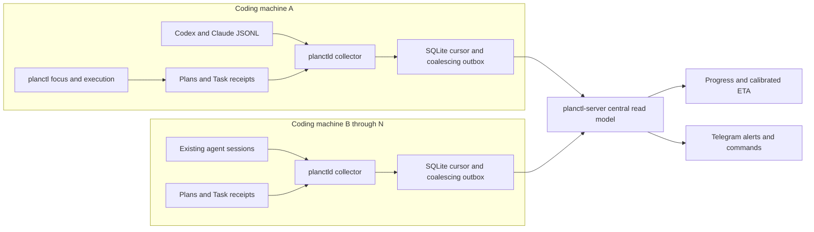

# Planctl observer daemon

Status: APPROVED
Spec lock: sha256:82a658272d7a7f12f1c37cc23733bb99f4d08099baa5108f6ab0dd29980034b6 owner:the spec is good, lets plan
Implementation lock: sha256:5301ecd18a44b5c0b0a5916590b9a5c4d3b095f1e78a762d9ff094e3b10d22a1 owner:$blueprint-start
Active Delivery: D1
Unattended decisions: allowed

<!-- plan:spec:start -->
## The Goal

Make long-running, multi-agent vibecoding robust and efficient across multiple
machines: every agent stays tied to the approved long-term plan, the owner can
see a defensible delivery estimate, and stalled or owner-blocked work becomes
visible without manually opening terminals.

The currency is **time to trustworthy intervention and forecast accuracy**:

- Every configured machine reports its active Codex and Claude sessions,
  current repository/branch, bound plan/Delivery/Stage/Task, last activity and
  machine health to one server.
- Each plan reports completed work, remaining predicted active work, remaining
  dependency critical path, calibrated ETA, calibration sample count, and
  whether owner waits make the calendar ETA unavailable.
- A session that stops updating becomes `stale` within one scan interval after
  its configured threshold. An agent that explicitly needs the owner becomes
  `awaiting_owner` immediately, with a safe one-line reason.
- Telegram sends deduplicated alerts for `stale`, `awaiting_owner`, recovery and
  machine-offline transitions. Authorized commands return portfolio progress,
  one-plan progress, all agents, stale agents, and agents awaiting the owner.
- An unavailable server never prevents local plan authoring or execution.
  Each machine coalesces its latest unsent snapshot and catches up after the
  connection returns; no agent waits on telemetry.
- The first completed Deliveries establish forecast error as a measured
  baseline. ETA responses always distinguish raw plan forecast from calibrated
  forecast and never present owner-wait time as known.

## The target

### Product roles

There are three explicit runtime roles inside one dedicated root `planctl/`
package:

1. **`planctl` CLI — agent focus protocol.** Existing plan authoring/execution
   commands remain canonical. `focus` shows the long-term Goal, current Task,
   exact scope, next dependency-ready work and local progress. `needs-owner`
   records a structured wait reason without mutating the approved plan;
   `start-task`/`resume-task` clears it. `progress` can show local or aggregated
   server state.
2. **`planctld` — per-machine collector.** One systemd-user process on every
   coding machine incrementally observes Codex/Claude JSONL metadata, live
   session processes, Git worktrees, plans and Task receipts. It persists
   cursors plus a coalescing outbox, computes local activity state, and sends
   versioned snapshots/heartbeats to the server.
3. **`planctl-server` — central control plane.** One NestJS service authenticates
   machines, idempotently ingests snapshots, stores current/history state in
   SQLite WAL, detects cross-machine transitions, calculates plan progress and
   delivery ETA, and owns Telegram alerts plus commands.

### Owner and agent flows

1. **Keep an agent focused:** before work, the agent runs `planctl start-task`
   and receives Goal → Delivery → Stage → Task, writes, forecast and RED. At any
   time `planctl focus` reprints this contract and warns when the session is
   unassigned, its plan revision differs from the server's canonical revision,
   or its elapsed active time exceeds forecast.
2. **Track existing agents:** `planctld` discovers live Codex/Claude processes
   and their JSONL session IDs even when they were not launched by planctl.
   Bound sessions contribute to plan progress and ETA; live sessions without a
   Task receipt appear as `unassigned` so existing work is visible without being
   falsely credited to a plan.
3. **Aggregate many machines:** each collector sends a heartbeat every 15
   seconds and a compact snapshot only when its content hash changes. Sequence
   numbers make retries idempotent. When the server is unavailable, the local
   SQLite outbox retains only the latest unacknowledged state per machine and
   sends it after reconnect, avoiding an unbounded event queue.
4. **Estimate delivery:** the server projects incomplete Tasks through the
   declared Stage dependency DAG. Active Task remaining time is
   `max(0, calibrated prediction - elapsed active time)`; queued work uses its
   calibrated prediction. The longest remaining dependency path is the ETA
   basis, while total remaining active minutes are reported separately. An
   `awaiting_owner` Task makes `estimatedDeliveryAt` null and exposes
   `blockedSince` plus active-work ETA instead of inventing owner response time.
5. **Ask Telegram:** an authorized owner sends `/progress`,
   `/progress <plan>`, `/agents`, `/stale`, or `/waiting`. The bot replies from
   the server read model. It also pushes one alert per state transition with
   machine, agent, plan/Task, elapsed versus predicted time, last safe activity
   kind, and the explicit owner-wait reason when present.
6. **Recover:** new JSONL activity changes `stale` to `working`; an agent calling
   `resume-task` changes `awaiting_owner` to `working`; collector reconnect
   changes `machine_offline` to online. Each recovery is persisted and notified
   once. Completed Task receipts remove the session from active plan work while
   retained history remains available for ETA calibration.

### Architectural decision

Plans and typed Task receipts remain execution truth; collectors publish
versioned observations, and the server owns only the distributed read model.
No central component edits a plan, advances a checkbox, resumes an agent or
guesses work completion.



### Identity and state model

- `machineId` is an owner-assigned stable slug, unique at the server.
- `agentId` is `<provider>:<sessionId>` within a machine. A restarted process
  with the same session remains the same agent observation.
- `repositoryId` is the normalized Git remote when present; a repository with
  no remote uses an explicit configured ID—never a guessed filesystem name.
- `planId` is `repositoryId + plan-relative-path`; `planRevision` is the locked
  implementation hash. Two machines reporting different revisions are shown as
  `plan_drift` and are not silently merged into one forecast.
- Agent state is one of `working | awaiting_owner | stale | unassigned |
  finished`; machine liveness is independently `online | offline`. An offline
  machine never causes all of its agents to be mislabeled stale.
- `awaiting_owner` requires the structured `planctl needs-owner` marker. A
  terminal turn with an active Task but no marker becomes `stale` or
  `attention_unknown`; transcript punctuation is never used to claim the owner
  owes a response.

### Delivery forecast

The server returns both an uncalibrated plan forecast and an observed forecast:

```ts
interface DeliveryForecast {
  readonly completionPercent: number;
  readonly remainingActiveMinutes: number;
  readonly remainingCriticalPathMinutes: number;
  readonly calibratedCriticalPathMinutes: number;
  readonly estimatedDeliveryAt: string | null;
  readonly blockedByOwner: number;
  readonly calibration: {
    readonly factor: number;
    readonly completedTaskSamples: number;
    readonly confidence: "low" | "medium" | "high";
  };
}
```

Calibration uses the median `actualActiveMinutes / predictedActiveMinutes` from
completed Tasks in the same repository, bounded to `0.5..3.0`. Fewer than three
samples uses factor `1.0` and confidence `low`; 3–9 samples is `medium`; 10 or
more is `high`. Total active work is never divided by machine/agent count.
Parallelism affects only the dependency critical path actually declared by the
plan.

### Distributed contracts

```ts
type AgentProvider = "codex" | "claude";

interface MachineHeartbeat {
  readonly protocolVersion: 1;
  readonly machineId: string;
  readonly sequence: number;
  readonly observedAt: string;
  readonly snapshotHash: string;
}

interface AgentSnapshot {
  readonly agentId: string;
  readonly provider: AgentProvider;
  readonly state: "working" | "awaiting_owner" | "stale" | "unassigned" | "finished";
  readonly repositoryId: string | null;
  readonly worktree: string | null;
  readonly branch: string | null;
  readonly planId: string | null;
  readonly planRevision: string | null;
  readonly taskId: string | null;
  readonly lastActivityAt: string;
  readonly idleSeconds: number;
  readonly elapsedActiveMinutes: number | null;
  readonly ownerWaitReason: string | null;
}

interface MachineSnapshot {
  readonly heartbeat: MachineHeartbeat;
  readonly agents: readonly AgentSnapshot[];
  readonly plans: readonly PlanProgressSnapshot[];
}
```

`POST /v1/machines/:machineId/snapshot` requires that machine's bearer token,
validates the URL ID against the token subject, accepts only a sequence greater
than the stored sequence, and returns the acknowledged sequence/hash. Server
offline status uses server receipt time; per-agent idle time is calculated on
the originating machine so cross-machine clock skew cannot create a stale
transition.

### Configuration

Configuration is file-based TOML, validated before either service starts. No
secret is stored directly in TOML: secret fields point to mode-`0600` files.
There is no silent environment/default discovery beyond the documented default
config paths.

#### Every coding machine — `~/.config/planctl/machine.toml`

```toml
version = 1
machine_id = "u3775"
repository_ids = { "/home/marketing/Coding/private-repo" = "private-repo" }

[server]
url = "https://planctl.example.ts.net"
token_file = "/home/marketing/.config/planctl/machine.token"
connect_timeout_ms = 1000
request_timeout_ms = 5000

[collector]
scan_seconds = 5
heartbeat_seconds = 15
stale_after_seconds = 900
session_lookback_days = 7
state_db = "/home/marketing/.local/state/planctl/machine.sqlite"
watch_roots = ["/home/marketing/Coding"]
codex_sessions = "/home/marketing/.codex/sessions"
claude_sessions = "/home/marketing/.claude/projects"
```

`watch_roots` limits Git/worktree discovery. JSONL roots must be explicit
absolute paths. `repository_ids` is required only for repositories without a
usable normalized remote. A collector refuses duplicate machine IDs, a token
file with broader permissions, `heartbeat_seconds >= stale_after_seconds`, or
paths outside configured roots.

#### Central host — `~/.config/planctl/server.toml`

```toml
version = 1
bind = "127.0.0.1:4789"
external_url = "https://planctl.example.ts.net"
database = "/home/planctl/.local/state/planctl/server.sqlite"
machine_offline_after_seconds = 60
history_retention_days = 90

[telegram]
bot_token_file = "/home/planctl/.config/planctl/telegram.token"
allowed_user_ids = [123456789]
default_chat_id = 123456789
long_poll_seconds = 30
```

The central Nest service binds the configured address; multi-machine transport
is expected to be protected by Tailscale Serve or an HTTPS reverse proxy.
Non-loopback plain HTTP `external_url` is rejected. Telegram uses long polling,
so no public bot webhook is required. Unknown users receive no plan data.

#### Bootstrap and validation

- `planctl config init --role machine|server` writes a commented template but
  never invents IDs, URLs or secrets.
- `planctl config check --role machine|server` validates schema, paths,
  permissions, endpoint security and connectivity without starting a service.
- `planctl-server machine create <machineId>` stores a hashed credential and
  prints the raw enrollment token once; that token is copied to the machine's
  configured token file.
- `lib/setup-planctl.sh --role machine|server` installs dependencies, binaries
  and the corresponding systemd-user unit only after `config check` succeeds.
- Config changes require an explicit service restart in Delivery 1; there is no
  partial hot reload.

### Telegram behavior

| Command/alert | Result |
|---|---|
| `/progress` | all active plans ordered by attention state, then ETA |
| `/progress <plan>` | Goal, completion, active Tasks, critical path, calibrated ETA and blockers |
| `/agents` | machine/agent/task/state/idle/elapsed summary |
| `/stale` | stale agents and machine-offline distinctions |
| `/waiting` | agents explicitly awaiting owner, safe reason and wait duration |
| stale alert | one message on transition into stale |
| owner-needed alert | one immediate message per new structured wait marker |
| recovery alert | one message when stale/waiting/offline clears |

Messages contain no raw transcript excerpts. Context comes from the approved
Goal/Task, Git metadata, activity record kind, numeric timing and the explicit
safe `needs-owner` reason supplied by the agent.

### Target tree

```text
planctl/
├── package.json                         # Bun/Nest package and seven agent:* scripts
├── bun.lock                             # exact dependency snapshot
├── tsconfig.json                        # strict TypeScript and Nest decorators
├── README.md                            # roles, commands, configuration and operations
├── deploy/                              # machine/server systemd-user unit templates
├── fixtures/sessions/                   # sanitized Codex/Claude JSONL fixtures
├── src/cli/                             # authoring, focus, progress, needs-owner and admin commands
├── src/core/                            # canonical plan writer/gate/read model/ETA contracts
├── src/machine/                         # collector modules, JSONL/process sources and SQLite outbox
├── src/server/                          # Nest ingest, registry, progress, ETA and SQLite modules
├── src/telegram/                        # authorized long-poll bot, commands and transition notifier
└── test/                                # core, machine, server, Telegram and protocol tests
bin/planctl                              # compatibility CLI launcher
bin/planctld                             # per-machine collector launcher
bin/planctl-server                       # central server launcher
lib/setup-planctl.sh                     # role-aware validated user-service installer
shared/code-production/agent-stack.ts   # vendors CLI/core to stable consumer paths
shared/skills/blueprint-start/SKILL.md   # requires structured owner-wait state
install-server-linux.sh                  # machine/server role setup entrypoint
update.sh                                # package refresh and installed-service restart
README.md                                # distributed planctl feature inventory
```

NestJS and server dependencies are never copied into consumer repositories.
`agent-stack` continues to vendor lightweight CLI/core files under the existing
`.agents/code-production/runtime/` paths so managed hooks do not break when
source ownership moves into `planctl/`.

### Efficiency and failure policy

- Collectors keep per-file byte offsets and parse only appended complete JSONL
  records. A truncated tail remains buffered until completed; malformed input
  becomes explicit source error, never healthy activity.
- Snapshots are content-hashed. Unchanged state sends only a heartbeat; changed
  state replaces the one coalesced outbox row. Retries use bounded exponential
  backoff with jitter and preserve the latest state across restart.
- The server transactionally accepts sequence + snapshot, so duplicate/out-of-
  order retries cannot regress state or duplicate Telegram alerts.
- Server unavailability is visible in local `planctl progress` and collector
  health but never changes existing authoring/execution command status.
- Machine offline and session stale are separate. A missing machine heartbeat
  alerts once at 60 seconds by default; its sessions retain their last known
  state and are labeled `machine_offline` in views.
- A Task scope or plan revision mismatch is `plan_drift`; it is excluded from
  ETA until reconciled rather than merged optimistically.

### Success metrics

- A deterministic fixture with 3 machines, 12 agents, 2 plans, parallel Stages,
  an owner wait, plan drift and an offline machine returns exact progress,
  remaining active work, critical path and calibrated ETA.
- With server loss across 20 collector scans, the outbox stays at one latest
  snapshot; reconnect acknowledges it and server state converges within one
  heartbeat without blocking a `planctl` work command.
- Three duplicate/out-of-order snapshot deliveries plus a server restart create
  one state transition and one Telegram alert.
- Stale is detected at exactly `idleSeconds >= stale_after_seconds`; owner wait
  is emitted immediately from `needs-owner`; machine offline is based only on
  server heartbeat receipt time.
- Telegram command fixtures prove authorization and exact `/progress`,
  `/agents`, `/stale`, `/waiting` answers without live Telegram.
- A secret marker placed in every JSONL payload is absent from wire snapshots,
  SQLite rows, logs, API responses and Telegram messages.
- A 100-machine/1,000-agent synthetic snapshot set is ingested idempotently and
  queried for progress within a measured target established in Stage 0; the
  target is recorded before optimization rather than guessed in this SPEC.
- Existing code-production tests remain green after source relocation, and
  installed consumer paths remain byte-identical to their canonical CLI/core
  sources.

### Constraints and deliberate exclusions

- TypeScript on Bun and NestJS are required. SQLite WAL is the Delivery-1
  persistence boundary; no PostgreSQL, Redis or message broker is introduced.
- Delivery 1 supports Linux systemd-user hosts, Codex and Claude. macOS launchd,
  Windows, browser UI and Kubernetes are later plans.
- The system observes and reports agents; it never sends prompts into a live
  session, kills/restarts a process, changes a plan, completes a Task, or lets a
  Telegram command mutate execution.
- “Summary” means deterministic approved-plan context and timing in Delivery 1.
  LLM transcript summarization and transcript upload are out of scope.
- Existing unassigned agents are tracked for activity/staleness but do not
  contribute to a plan ETA until they bind through `start-task`.
- The source repository has no `staging` branch. This self-hosted plan continues
  its evidence-backed `origin/main` PR workflow; `planctl/package.json` owns the
  seven `agent:*` commands from its own working directory.

### Today, measured against the target

Pinned implementation base: `73e6c2a` (`origin/main`, 2026-08-29).

- `shared/code-production/runtime/planctl.ts` is 453 lines and has no focus,
  progress, owner-wait, machine enrollment or distributed protocol commands.
  Its version-1 Task receipt records no worktree, machine or session identity.
- `shared/code-production/runtime/plan-update.ts` is 1,191 lines and already owns
  the canonical rendered Stage/Delivery/Task parser needed for progress and the
  dependency graph; a second Markdown parser is unnecessary.
- `shared/code-production/agent-stack.ts` is 252 lines and owns the source-to-
  stable-consumer mapping used to relocate CLI/core source safely.
- There is no package.json, Nest module, local collector, server, SQLite state,
  transport authentication, Telegram bot, progress projection, delivery ETA or
  configuration schema in the repository. The current code-production suite is
  green at 35/35 tests in 6.17 seconds.
- Metadata-only host inspection confirmed both Codex and Claude JSONL expose
  stable session identity, cwd and timestamps. Current Codex processes expose
  `CODEX_SESSION_ID`/`CODEX_THREAD_ID`, so a local collector can correlate live
  sessions without uploading transcript content.

### Reuse map

- Extend the existing `plan-update.ts` Stage/Delivery/Task read model for
  progress and ETA; repository-wide grep found no other progress owner.
- Extract the existing Task receipt path/decoder and preserve completion
  ancestry checks; add machine/session/wait metadata without creating a second
  execution registry.
- Extend `agent-stack.ts::managedFiles` while preserving consumer target paths
  and manifest drift checks.
- Reuse `lib/install-bin.sh` and existing systemd-user installation conventions;
  one role-aware installer replaces separate ad-hoc service scripts.
- Reuse Bun's `bun:sqlite`, Web `fetch`, crypto and TOML support. Add NestJS and
  scheduling packages only; do not add an ORM, queue, Telegram SDK or config
  framework unless implementation evidence proves the built-ins insufficient.
- Reuse `shared/skills/test-protocol` fixture/privacy rules. Tests use sanitized
  JSONL, fake clocks/transports and a fake Telegram boundary—never live accounts
  or personal transcripts.

### Invariants

- **CTL-001:** an agent can always name its approved Goal, current Task, exact
  scope and next dependency-ready work from one canonical plan read model.
- **CTL-002:** existing planctl authoring/execution succeeds identically while
  collector or server is unavailable; telemetry never gates work.
- **CTL-003:** every accepted machine snapshot is authenticated, versioned and
  strictly sequence-monotonic; replay cannot regress state or duplicate alerts.
- **CTL-004:** machine offline, session stale, awaiting owner, unassigned work
  and plan drift are distinct states with distinct evidence.
- **CTL-005:** delivery ETA is the calibrated remaining dependency critical
  path, never total work divided by agent count; owner wait makes calendar ETA
  unknown.
- **CTL-006:** an owner-response claim requires a structured `needs-owner`
  marker; transcript text is never heuristically classified as an obligation.
- **CTL-007:** collector restart/server outage loses no latest state and cannot
  grow an unbounded telemetry queue.
- **CTL-008:** one persisted transition yields at most one authorized Telegram
  alert, while failed delivery remains retryable.
- **CTL-009:** transcript payloads and raw credentials never enter snapshots,
  central persistence, logs, APIs or Telegram messages.
- **CTL-010:** plan revision mismatches are visible and excluded from forecasts;
  data from different revisions is never silently combined.
- **CTL-011:** version-1 Task receipts remain completable and locally reportable,
  but distributed correlation is explicitly unavailable until a version-2
  receipt is started.
- **CTL-012:** consumer repositories retain stable vendored runtime/hook paths
  and receive neither NestJS server code nor central persistence dependencies.

### Open questions

None. The initial system is a read-only distributed control plane with explicit
machine/server configuration and structured owner-wait signaling. Agent control,
LLM summaries and UI work require separate owner-approved plans.
<!-- plan:spec:end -->

<!-- plan:implementation:start -->
## Implementation contract

<!-- plan:delivery:D1:start -->
<!-- plan:delivery-meta:{"active":true,"depends":[]} -->
### PR Delivery D1 — Operate one distributed planctl control plane across coding machines

Branch: `feat/planctl-observer-daemon`; Depends: none; Gate: cd planctl && bun run agent:verify:pr.

Stage graph: `D1-S1 -> D1-S2 -> (D1-S3 || D1-S4 || D1-S6); D1-S4 -> D1-S5; (D1-S3 + D1-S5 + D1-S6) -> D1-S7`.

<!-- plan:stage:D1-S1:start -->
<!-- plan:stage-meta:{"deliveryId":"D1","depends":[],"parallelWith":[],"writes":["planctl/package.json","planctl/bun.lock","planctl/tsconfig.json","planctl/src/cli/main.ts","planctl/src/core/plan-gate.ts","planctl/src/core/plan-update.ts","planctl/test/package-boundary.test.ts","planctl/test/planctl.test.ts","planctl/test/plan-gate.test.ts","planctl/test/plan-update.test.ts","shared/code-production/runtime/planctl.ts","shared/code-production/runtime/plan-gate.ts","shared/code-production/runtime/plan-update.ts","shared/code-production/runtime/planctl.test.ts","shared/code-production/runtime/plan-gate.test.ts","shared/code-production/runtime/plan-update.test.ts","shared/code-production/agent-stack.ts","shared/code-production/agent-stack.test.ts","shared/code-production/README.md","shared/code-production/laws/development-process.md","shared/code-production/laws/git-workflow.md","shared/code-production/laws/plan-format.md","shared/code-production/laws/plan-protocol.md","bin/planctl"],"tempRoot":".tmp/code-production/planctl-observer-daemon/D1-S1"} -->
#### Stage D1-S1 — Launch the existing plan protocol from its dedicated Bun package

Owner: integrator; Profile: strong; Depends: none; Parallel with: none.
Writes: `planctl/package.json`, `planctl/bun.lock`, `planctl/tsconfig.json`, `planctl/src/cli/main.ts`, `planctl/src/core/plan-gate.ts`, `planctl/src/core/plan-update.ts`, `planctl/test/package-boundary.test.ts`, `planctl/test/planctl.test.ts`, `planctl/test/plan-gate.test.ts`, `planctl/test/plan-update.test.ts`, `shared/code-production/runtime/planctl.ts`, `shared/code-production/runtime/plan-gate.ts`, `shared/code-production/runtime/plan-update.ts`, `shared/code-production/runtime/planctl.test.ts`, `shared/code-production/runtime/plan-gate.test.ts`, `shared/code-production/runtime/plan-update.test.ts`, `shared/code-production/agent-stack.ts`, `shared/code-production/agent-stack.test.ts`, `shared/code-production/README.md`, `shared/code-production/laws/development-process.md`, `shared/code-production/laws/git-workflow.md`, `shared/code-production/laws/plan-format.md`, `shared/code-production/laws/plan-protocol.md`, `bin/planctl`.
Temp root: `.tmp/code-production/planctl-observer-daemon/D1-S1` (must be absent at handoff).
Predict: 90 active min / 30 credits.

##### Tasks

- [x] PLCTL_001 — run every existing plan command from the dedicated planctl package while installed consumer paths remain compatible — ab7b1c6331e5bf2e2035baa0e8594d4caf9f9848
      Writes: `planctl/package.json`, `planctl/bun.lock`, `planctl/tsconfig.json`, `planctl/src/cli/main.ts`, `planctl/src/core/plan-gate.ts`, `planctl/src/core/plan-update.ts`, `planctl/test/package-boundary.test.ts`, `planctl/test/planctl.test.ts`, `planctl/test/plan-gate.test.ts`, `planctl/test/plan-update.test.ts`, `shared/code-production/runtime/planctl.ts`, `shared/code-production/runtime/plan-gate.ts`, `shared/code-production/runtime/plan-update.ts`, `shared/code-production/runtime/planctl.test.ts`, `shared/code-production/runtime/plan-gate.test.ts`, `shared/code-production/runtime/plan-update.test.ts`, `shared/code-production/agent-stack.ts`, `shared/code-production/agent-stack.test.ts`, `shared/code-production/README.md`, `shared/code-production/laws/development-process.md`, `shared/code-production/laws/git-workflow.md`, `shared/code-production/laws/plan-format.md`, `shared/code-production/laws/plan-protocol.md`, `bin/planctl`.
      Predict: 90 active min / 30 credits.
      How: from planctl/, add the package adapter and tst_unit_planctl_package_001 first, observe RED on the missing canonical package entrypoint, then move the existing CLI/core/tests with git mv and repoint agent-stack sources without changing its seven installed targets
      RED: `bun run agent:test:backend -- test/package-boundary.test.ts -t tst_unit_planctl_package_001`

##### Acceptance criteria

- [x] `cd planctl && bun run agent:test:backend -- test/package-boundary.test.ts` exits 0 — bin/planctl and agent-stack use the dedicated package while consumers receive the same seven managed targets — ab7b1c6331e5bf2e2035baa0e8594d4caf9f9848
- [x] `cd planctl && bun test test/planctl.test.ts test/plan-gate.test.ts test/plan-update.test.ts` exits 0 — all pre-move plan authoring, locking and receipt behavior remains green — ab7b1c6331e5bf2e2035baa0e8594d4caf9f9848
- [ ] The source tree has one canonical copy of each planctl CLI/core module and NestJS dependencies remain package-local
- [x] Commit — ab7b1c6331e5bf2e2035baa0e8594d4caf9f9848

##### Results

<!-- plan:results:D1-S1:start -->
| Task | Commit | UTC start-end | Active / elapsed | Usage | Result / proof |
|---|---|---|---:|---|---|
| PLCTL_001 | ab7b1c6331e5bf2e2035baa0e8594d4caf9f9848 | 2026-08-29T16:44:58.223Z–2026-08-29T17:36:43.383Z | 45 / 51.75266666666667 min | unavailable: runner did not expose per-Stage token or credit usage | The canonical plan CLI/core now runs from the dedicated Bun package and vendors byte-identical lightweight sources to all seven stable consumer targets. |
<!-- plan:results:D1-S1:end -->
<!-- plan:stage:D1-S1:end -->

<!-- plan:stage:D1-S2:start -->
<!-- plan:stage-meta:{"deliveryId":"D1","depends":["D1-S1"],"parallelWith":[],"writes":["planctl/src/cli/main.ts","planctl/src/config/config.ts","planctl/src/core/plan-update.ts","planctl/src/core/plan-progress.ts","planctl/src/core/delivery-forecast.ts","planctl/src/core/task-run.ts","planctl/src/core/snapshot-protocol.ts","planctl/test/config.test.ts","planctl/test/plan-progress.test.ts","planctl/test/delivery-forecast.test.ts","planctl/test/task-run.test.ts","planctl/test/planctl.test.ts"],"tempRoot":".tmp/code-production/planctl-observer-daemon/D1-S2"} -->
#### Stage D1-S2 — Project canonical progress, ETA, identity and configuration contracts

Owner: core-agent; Profile: strong; Depends: D1-S1; Parallel with: none.
Writes: `planctl/src/cli/main.ts`, `planctl/src/config/config.ts`, `planctl/src/core/plan-update.ts`, `planctl/src/core/plan-progress.ts`, `planctl/src/core/delivery-forecast.ts`, `planctl/src/core/task-run.ts`, `planctl/src/core/snapshot-protocol.ts`, `planctl/test/config.test.ts`, `planctl/test/plan-progress.test.ts`, `planctl/test/delivery-forecast.test.ts`, `planctl/test/task-run.test.ts`, `planctl/test/planctl.test.ts`.
Temp root: `.tmp/code-production/planctl-observer-daemon/D1-S2` (must be absent at handoff).
Predict: 180 active min / 70 credits.

##### Tasks

- [x] PLCTL_002 — report identical weighted Task progress and remaining forecasts from every consumer of the canonical plan read model — e66d80a561f1be969c057c2af38b83e4f4dd6f63
      Writes: `planctl/src/core/plan-update.ts`, `planctl/src/core/plan-progress.ts`, `planctl/test/plan-progress.test.ts`.
      Predict: 60 active min / 23 credits.
      How: export the existing Stage and Delivery parse result from plan-update, derive counts/minutes/credits in one pure projection, and cover partial completion plus parallel Stages with fixed approved-plan fixtures
      RED: `bun run agent:test:backend -- test/plan-progress.test.ts -t tst_unit_planctl_progress_001`
- [x] PLCTL_003 — calculate raw and calibrated delivery ETA from the remaining dependency critical path without dividing work by agent count — e66d80a561f1be969c057c2af38b83e4f4dd6f63
      Writes: `planctl/src/core/delivery-forecast.ts`, `planctl/test/delivery-forecast.test.ts`.
      Predict: 60 active min / 24 credits.
      How: evaluate the Stage DAG with active elapsed time, apply the bounded median actual/predicted calibration rule, return confidence/sample count, and null calendar ETA whenever structured owner waits exist
      RED: `bun run agent:test:backend -- test/delivery-forecast.test.ts -t tst_unit_planctl_eta_001`
- [x] PLCTL_004 — decode strict machine/server configuration and write versioned session-aware Task receipts and snapshot contracts — e66d80a561f1be969c057c2af38b83e4f4dd6f63
      Writes: `planctl/src/cli/main.ts`, `planctl/src/config/config.ts`, `planctl/src/core/task-run.ts`, `planctl/src/core/snapshot-protocol.ts`, `planctl/test/config.test.ts`, `planctl/test/task-run.test.ts`, `planctl/test/planctl.test.ts`.
      Predict: 60 active min / 23 credits.
      How: manually narrow Bun TOML values, reject unsafe paths/permissions/timing, introduce protocolVersion and TaskRunV2 unions, and preserve version-1 completion while marking distributed correlation unavailable
      RED: `bun run agent:test:backend -- test/task-run.test.ts -t tst_unit_planctl_task_run_001`

##### Acceptance criteria

- [x] `cd planctl && bun run agent:test:backend -- test/plan-progress.test.ts test/delivery-forecast.test.ts` exits 0 — weighted progress and critical-path ETA cover partial, parallel, calibrated and owner-blocked plans — e66d80a561f1be969c057c2af38b83e4f4dd6f63
- [x] `cd planctl && bun run agent:test:backend -- test/config.test.ts test/task-run.test.ts` exits 0 — both TOML roles and both Task receipt versions are strict and deterministic — e66d80a561f1be969c057c2af38b83e4f4dd6f63
- [ ] Every CTL-001, CTL-004, CTL-005, CTL-006, CTL-010 and CTL-011 state/forecast branch carries a matching test traceability annotation
- [x] Commit — e66d80a561f1be969c057c2af38b83e4f4dd6f63

##### Results

<!-- plan:results:D1-S2:start -->
| Task | Commit | UTC start-end | Active / elapsed | Usage | Result / proof |
|---|---|---|---:|---|---|
| PLCTL_002 | e66d80a561f1be969c057c2af38b83e4f4dd6f63 | 2026-08-29T17:42:53.254Z–2026-08-29T18:26:30.244Z | 39 / 43.6165 min | unavailable: runner did not expose per-Stage token or credit usage | Canonical progress, calibrated critical-path ETA, strict TOML roles, TaskRunV1/V2 and protocol-v1 snapshot contracts now share one typed core. |
| PLCTL_003 | e66d80a561f1be969c057c2af38b83e4f4dd6f63 | 2026-08-29T17:42:53.254Z–2026-08-29T18:26:30.244Z | 39 / 43.6165 min | unavailable: runner did not expose per-Stage token or credit usage | Canonical progress, calibrated critical-path ETA, strict TOML roles, TaskRunV1/V2 and protocol-v1 snapshot contracts now share one typed core. |
| PLCTL_004 | e66d80a561f1be969c057c2af38b83e4f4dd6f63 | 2026-08-29T17:42:53.254Z–2026-08-29T18:26:30.244Z | 39 / 43.6165 min | unavailable: runner did not expose per-Stage token or credit usage | Canonical progress, calibrated critical-path ETA, strict TOML roles, TaskRunV1/V2 and protocol-v1 snapshot contracts now share one typed core. |
<!-- plan:results:D1-S2:end -->
<!-- plan:stage:D1-S2:end -->

<!-- plan:stage:D1-S3:start -->
<!-- plan:stage-meta:{"deliveryId":"D1","depends":["D1-S2"],"parallelWith":["D1-S4","D1-S6"],"writes":["planctl/src/machine/main.ts","planctl/src/machine/app.module.ts","planctl/src/machine/collector.service.ts","planctl/src/machine/discovery/git-worktree.source.ts","planctl/src/machine/sessions/session-source.ts","planctl/src/machine/sessions/jsonl-tail-reader.ts","planctl/src/machine/sessions/codex-session.source.ts","planctl/src/machine/sessions/claude-session.source.ts","planctl/src/machine/sessions/linux-process.source.ts","planctl/src/machine/state/machine-store.ts","planctl/src/machine/transport/server-client.ts","planctl/fixtures/sessions/codex-active.jsonl","planctl/fixtures/sessions/claude-active.jsonl","planctl/fixtures/sessions/truncated-tail.jsonl","planctl/test/machine-sessions.test.ts","planctl/test/machine-outbox.test.ts","planctl/test/machine-collector.test.ts","bin/planctld"],"tempRoot":".tmp/code-production/planctl-observer-daemon/D1-S3"} -->
#### Stage D1-S3 — Collect existing machine sessions and survive disconnected operation

Owner: machine-agent; Profile: strong; Depends: D1-S2; Parallel with: D1-S4, D1-S6.
Writes: `planctl/src/machine/main.ts`, `planctl/src/machine/app.module.ts`, `planctl/src/machine/collector.service.ts`, `planctl/src/machine/discovery/git-worktree.source.ts`, `planctl/src/machine/sessions/session-source.ts`, `planctl/src/machine/sessions/jsonl-tail-reader.ts`, `planctl/src/machine/sessions/codex-session.source.ts`, `planctl/src/machine/sessions/claude-session.source.ts`, `planctl/src/machine/sessions/linux-process.source.ts`, `planctl/src/machine/state/machine-store.ts`, `planctl/src/machine/transport/server-client.ts`, `planctl/fixtures/sessions/codex-active.jsonl`, `planctl/fixtures/sessions/claude-active.jsonl`, `planctl/fixtures/sessions/truncated-tail.jsonl`, `planctl/test/machine-sessions.test.ts`, `planctl/test/machine-outbox.test.ts`, `planctl/test/machine-collector.test.ts`, `bin/planctld`.
Temp root: `.tmp/code-production/planctl-observer-daemon/D1-S3` (must be absent at handoff).
Predict: 240 active min / 90 credits.

##### Tasks

- [x] PLCTL_005 — discover live Codex and Claude sessions and classify bound, unassigned, stale and malformed activity without reading payload content — db537da65f2b36bfe5eb76a33ae0040ce6a5d5c2
      Writes: `planctl/src/machine/discovery/git-worktree.source.ts`, `planctl/src/machine/sessions/session-source.ts`, `planctl/src/machine/sessions/jsonl-tail-reader.ts`, `planctl/src/machine/sessions/codex-session.source.ts`, `planctl/src/machine/sessions/claude-session.source.ts`, `planctl/src/machine/sessions/linux-process.source.ts`, `planctl/fixtures/sessions/codex-active.jsonl`, `planctl/fixtures/sessions/claude-active.jsonl`, `planctl/fixtures/sessions/truncated-tail.jsonl`, `planctl/test/machine-sessions.test.ts`.
      Predict: 90 active min / 35 credits.
      How: index explicit session roots and /proc identities, advance byte cursors only across complete JSON objects, correlate cwd/git/task receipts, and assert a fixture payload secret never enters observations
      RED: `bun run agent:test:backend -- test/machine-sessions.test.ts -t tst_svc_planctld_sessions_001`
- [x] PLCTL_006 — retain one latest machine snapshot across collector restart and any number of failed server sends — db537da65f2b36bfe5eb76a33ae0040ce6a5d5c2
      Writes: `planctl/src/machine/state/machine-store.ts`, `planctl/test/machine-outbox.test.ts`.
      Predict: 70 active min / 25 credits.
      How: use temporary real bun:sqlite WAL with cursor and single coalescing outbox rows, transactionally replace hashes/sequences, and drive reconnects with a fake clock and scripted transport
      RED: `bun run agent:test:backend -- test/machine-outbox.test.ts -t tst_svc_planctld_outbox_001`
- [x] PLCTL_007 — publish scheduled versioned heartbeats and changed snapshots without blocking local planctl work when the server is unavailable — db537da65f2b36bfe5eb76a33ae0040ce6a5d5c2
      Writes: `planctl/src/machine/main.ts`, `planctl/src/machine/app.module.ts`, `planctl/src/machine/collector.service.ts`, `planctl/src/machine/transport/server-client.ts`, `planctl/test/machine-collector.test.ts`, `bin/planctld`.
      Predict: 80 active min / 30 credits.
      How: compose a Nest application context with an injected clock/scheduler, hash observations, send heartbeat-or-snapshot through bounded authenticated fetch, retry in the background, and expose foreground process health
      RED: `bun run agent:test:backend -- test/machine-collector.test.ts -t tst_svc_planctld_collector_001`

##### Acceptance criteria

- [x] `cd planctl && bun run agent:test:backend -- test/machine-sessions.test.ts` exits 0 — Codex, Claude, live-process, truncated-tail, unassigned and privacy cases produce exact states — bd3eabe50439f004b793d6cecf151a9888c12015
- [ ] `cd planctl && bun run agent:test:backend -- test/machine-outbox.test.ts test/machine-collector.test.ts` exits 0 — twenty disconnected scans retain one latest snapshot and converge on reconnect
- [ ] No machine test uses a real home session, wall-clock sleep, live server or network provider
- [x] Commit — bd3eabe50439f004b793d6cecf151a9888c12015

##### Results

<!-- plan:results:D1-S3:start -->
| Task | Commit | UTC start-end | Active / elapsed | Usage | Result / proof |
|---|---|---|---:|---|---|
| PLCTL_005 | db537da65f2b36bfe5eb76a33ae0040ce6a5d5c2 | 2026-08-29T18:32:06.390Z–2026-08-29T19:51:28.000Z | 74 / 79.36 min | unavailable: runner did not expose per-Stage token or credit usage | Incremental privacy-safe Codex/Claude discovery, structured owner-wait correlation, SQLite WAL state, coalescing outbox, scheduled collection, and bounded snapshot/heartbeat transport are implemented. |
| PLCTL_006 | db537da65f2b36bfe5eb76a33ae0040ce6a5d5c2 | 2026-08-29T18:32:06.390Z–2026-08-29T19:51:28.000Z | 74 / 79.36 min | unavailable: runner did not expose per-Stage token or credit usage | Incremental privacy-safe Codex/Claude discovery, structured owner-wait correlation, SQLite WAL state, coalescing outbox, scheduled collection, and bounded snapshot/heartbeat transport are implemented. |
| PLCTL_007 | db537da65f2b36bfe5eb76a33ae0040ce6a5d5c2 | 2026-08-29T18:32:06.390Z–2026-08-29T19:51:28.000Z | 74 / 79.36 min | unavailable: runner did not expose per-Stage token or credit usage | Incremental privacy-safe Codex/Claude discovery, structured owner-wait correlation, SQLite WAL state, coalescing outbox, scheduled collection, and bounded snapshot/heartbeat transport are implemented. |
<!-- plan:results:D1-S3:end -->
<!-- plan:stage:D1-S3:end -->

<!-- plan:stage:D1-S4:start -->
<!-- plan:stage-meta:{"deliveryId":"D1","depends":["D1-S2"],"parallelWith":["D1-S3","D1-S6"],"writes":["planctl/src/server/main.ts","planctl/src/server/app.module.ts","planctl/src/server/auth/machine-auth.guard.ts","planctl/src/server/admin/machine-admin.service.ts","planctl/src/server/ingest/ingest.module.ts","planctl/src/server/ingest/ingest.controller.ts","planctl/src/server/ingest/ingest.service.ts","planctl/src/server/persistence/server-store.ts","planctl/src/server/transitions/transition.service.ts","planctl/src/server/progress/progress.module.ts","planctl/src/server/progress/progress.controller.ts","planctl/src/server/progress/progress.service.ts","planctl/test/server-ingest.test.ts","planctl/test/server-transitions.test.ts","planctl/test/server-progress.test.ts","bin/planctl-server"],"tempRoot":".tmp/code-production/planctl-observer-daemon/D1-S4"} -->
#### Stage D1-S4 — Ingest authenticated machine state into one central progress and ETA service

Owner: server-agent; Profile: strong; Depends: D1-S2; Parallel with: D1-S3, D1-S6.
Writes: `planctl/src/server/main.ts`, `planctl/src/server/app.module.ts`, `planctl/src/server/auth/machine-auth.guard.ts`, `planctl/src/server/admin/machine-admin.service.ts`, `planctl/src/server/ingest/ingest.module.ts`, `planctl/src/server/ingest/ingest.controller.ts`, `planctl/src/server/ingest/ingest.service.ts`, `planctl/src/server/persistence/server-store.ts`, `planctl/src/server/transitions/transition.service.ts`, `planctl/src/server/progress/progress.module.ts`, `planctl/src/server/progress/progress.controller.ts`, `planctl/src/server/progress/progress.service.ts`, `planctl/test/server-ingest.test.ts`, `planctl/test/server-transitions.test.ts`, `planctl/test/server-progress.test.ts`, `bin/planctl-server`.
Temp root: `.tmp/code-production/planctl-observer-daemon/D1-S4` (must be absent at handoff).
Predict: 300 active min / 110 credits.

##### Tasks

- [x] PLCTL_008 — accept each authenticated machine snapshot exactly once and reject wrong identity, version, replay and out-of-order sequence — 6b38f782b8eebea017b5eb57fba20efa7246aecd
      Writes: `planctl/src/server/main.ts`, `planctl/src/server/app.module.ts`, `planctl/src/server/auth/machine-auth.guard.ts`, `planctl/src/server/admin/machine-admin.service.ts`, `planctl/src/server/ingest/ingest.module.ts`, `planctl/src/server/ingest/ingest.controller.ts`, `planctl/src/server/ingest/ingest.service.ts`, `planctl/src/server/persistence/server-store.ts`, `planctl/test/server-ingest.test.ts`, `bin/planctl-server`.
      Predict: 120 active min / 45 credits.
      How: compile real Nest modules over temporary bun:sqlite WAL, hash per-machine bearer credentials, transact sequence/snapshot/receivedAt, and drive the HTTP controller in process without a live listener
      RED: `bun run agent:test:backend -- test/server-ingest.test.ts -t tst_int_planctl_ingest_001`
- [x] PLCTL_009 — persist distinct machine-offline, stale, owner-wait, unassigned, recovery and plan-drift transitions without duplicate events — 6b38f782b8eebea017b5eb57fba20efa7246aecd
      Writes: `planctl/src/server/persistence/server-store.ts`, `planctl/src/server/transitions/transition.service.ts`, `planctl/test/server-transitions.test.ts`.
      Predict: 80 active min / 30 credits.
      How: evaluate transitions against injected server receipt time, keep machine liveness separate from session activity, store one idempotent transition key, and exclude revision drift from canonical progress
      RED: `bun run agent:test:backend -- test/server-transitions.test.ts -t tst_svc_planctl_transitions_001`
- [x] PLCTL_010 — serve portfolio and per-plan progress with active agents, blockers, critical path and calibrated delivery forecast from persisted snapshots — 6b38f782b8eebea017b5eb57fba20efa7246aecd
      Writes: `planctl/src/server/progress/progress.module.ts`, `planctl/src/server/progress/progress.controller.ts`, `planctl/src/server/progress/progress.service.ts`, `planctl/test/server-progress.test.ts`.
      Predict: 100 active min / 35 credits.
      How: group matching plan revisions, join active observations and completed receipts, call the canonical progress/forecast core, order attention states first, and return null calendar ETA for owner waits
      RED: `bun run agent:test:backend -- test/server-progress.test.ts -t tst_int_planctl_progress_001`

##### Acceptance criteria

- [ ] `cd planctl && bun run agent:test:backend -- test/server-ingest.test.ts` exits 0 — authentication and strictly monotonic idempotent ingest hold against real temporary SQLite
- [ ] `cd planctl && bun run agent:test:backend -- test/server-transitions.test.ts test/server-progress.test.ts` exits 0 — every attention state and ETA field has exact persisted evidence
- [ ] The server exposes no plan mutation or agent-control route and rejects non-loopback plain-HTTP external configuration
- [x] Commit — bd3eabe50439f004b793d6cecf151a9888c12015

##### Results

<!-- plan:results:D1-S4:start -->
| Task | Commit | UTC start-end | Active / elapsed | Usage | Result / proof |
|---|---|---|---:|---|---|
| PLCTL_008 | 6b38f782b8eebea017b5eb57fba20efa7246aecd | 2026-08-29T18:32:32.124Z–2026-08-29T19:51:08.000Z | 75 / 78.6 min | unavailable: runner did not expose per-Stage token or credit usage | Authenticated idempotent ingest, durable transitions, and portfolio/per-plan progress APIs now share the collector's discriminated snapshot/heartbeat contract. |
| PLCTL_009 | 6b38f782b8eebea017b5eb57fba20efa7246aecd | 2026-08-29T18:32:32.124Z–2026-08-29T19:51:08.000Z | 75 / 78.6 min | unavailable: runner did not expose per-Stage token or credit usage | Authenticated idempotent ingest, durable transitions, and portfolio/per-plan progress APIs now share the collector's discriminated snapshot/heartbeat contract. |
| PLCTL_010 | 6b38f782b8eebea017b5eb57fba20efa7246aecd | 2026-08-29T18:32:32.124Z–2026-08-29T19:51:08.000Z | 75 / 78.6 min | unavailable: runner did not expose per-Stage token or credit usage | Authenticated idempotent ingest, durable transitions, and portfolio/per-plan progress APIs now share the collector's discriminated snapshot/heartbeat contract. |
<!-- plan:results:D1-S4:end -->
<!-- plan:stage:D1-S4:end -->

<!-- plan:stage:D1-S5:start -->
<!-- plan:stage-meta:{"deliveryId":"D1","depends":["D1-S4"],"parallelWith":[],"writes":["planctl/src/server/app.module.ts","planctl/src/server/persistence/server-store.ts","planctl/src/telegram/telegram.module.ts","planctl/src/telegram/telegram-client.ts","planctl/src/telegram/bot.service.ts","planctl/src/telegram/commands.service.ts","planctl/src/telegram/notifier.service.ts","planctl/fixtures/telegram/updates.json","planctl/test/telegram-commands.test.ts","planctl/test/telegram-alerts.test.ts"],"tempRoot":".tmp/code-production/planctl-observer-daemon/D1-S5"} -->
#### Stage D1-S5 — Answer authorized Telegram progress commands and deliver state-transition alerts

Owner: telegram-agent; Profile: strong; Depends: D1-S4; Parallel with: none.
Writes: `planctl/src/server/app.module.ts`, `planctl/src/server/persistence/server-store.ts`, `planctl/src/telegram/telegram.module.ts`, `planctl/src/telegram/telegram-client.ts`, `planctl/src/telegram/bot.service.ts`, `planctl/src/telegram/commands.service.ts`, `planctl/src/telegram/notifier.service.ts`, `planctl/fixtures/telegram/updates.json`, `planctl/test/telegram-commands.test.ts`, `planctl/test/telegram-alerts.test.ts`.
Temp root: `.tmp/code-production/planctl-observer-daemon/D1-S5` (must be absent at handoff).
Predict: 180 active min / 70 credits.

##### Tasks

- [x] PLCTL_011 — answer progress, agents, stale and waiting Telegram commands only for configured owner identities — 02a7ca879f47e601dc91042a41fe9004013712cf
      Writes: `planctl/src/server/app.module.ts`, `planctl/src/telegram/telegram.module.ts`, `planctl/src/telegram/telegram-client.ts`, `planctl/src/telegram/bot.service.ts`, `planctl/src/telegram/commands.service.ts`, `planctl/fixtures/telegram/updates.json`, `planctl/test/telegram-commands.test.ts`.
      Predict: 90 active min / 35 credits.
      How: long-poll through a narrow fetch client, authorize numeric user IDs before querying, map commands to the existing progress service, render deterministic bounded messages, and ignore unknown chats without leaking plan data
      RED: `bun run agent:test:backend -- test/telegram-commands.test.ts -t tst_svc_planctl_telegram_001`
- [x] PLCTL_012 — send one retryable Telegram alert for each stale, owner-needed, machine-offline and recovery transition across restart — 02a7ca879f47e601dc91042a41fe9004013712cf
      Writes: `planctl/src/server/persistence/server-store.ts`, `planctl/src/telegram/notifier.service.ts`, `planctl/test/telegram-alerts.test.ts`.
      Predict: 90 active min / 35 credits.
      How: claim pending transitions transactionally, mark only successful fake deliveries notified, retry failures, and construct context strictly from approved plan/task metadata plus explicit owner-wait reason
      RED: `bun run agent:test:backend -- test/telegram-alerts.test.ts -t tst_svc_planctl_alerts_001`

##### Acceptance criteria

- [ ] `cd planctl && bun run agent:test:backend -- test/telegram-commands.test.ts` exits 0 — all five commands authorize and render exact multi-machine progress answers
- [ ] `cd planctl && bun run agent:test:backend -- test/telegram-alerts.test.ts` exits 0 — duplicate scans/restarts send once while failed delivery remains retryable
- [ ] A fixture secret present in Telegram updates and session payloads appears in no rendered message, log assertion or persisted notification row
- [x] Commit — 02a7ca879f47e601dc91042a41fe9004013712cf

##### Results

<!-- plan:results:D1-S5:start -->
| Task | Commit | UTC start-end | Active / elapsed | Usage | Result / proof |
|---|---|---|---:|---|---|
| PLCTL_011 | 02a7ca879f47e601dc91042a41fe9004013712cf | 2026-08-29T20:01:22.514Z–2026-08-29T20:35:56.401Z | 31 / 34.56 min | unavailable: runner did not expose per-Stage token or credit usage | Five authorized progress commands and durable retryable transition alerts are implemented over a narrow Telegram boundary with bounded privacy-safe rendering. |
| PLCTL_012 | 02a7ca879f47e601dc91042a41fe9004013712cf | 2026-08-29T20:01:22.514Z–2026-08-29T20:35:56.401Z | 31 / 34.56 min | unavailable: runner did not expose per-Stage token or credit usage | Five authorized progress commands and durable retryable transition alerts are implemented over a narrow Telegram boundary with bounded privacy-safe rendering. |
<!-- plan:results:D1-S5:end -->
<!-- plan:stage:D1-S5:end -->

<!-- plan:stage:D1-S6:start -->
<!-- plan:stage-meta:{"deliveryId":"D1","depends":["D1-S2"],"parallelWith":["D1-S3","D1-S4"],"writes":["planctl/src/cli/main.ts","planctl/src/cli/render.ts","planctl/src/cli/server-client.ts","planctl/src/core/task-run.ts","planctl/test/focus.test.ts","planctl/test/owner-wait.test.ts","planctl/test/planctl.test.ts","shared/skills/blueprint-start/SKILL.md","shared/code-production/laws/development-process.md","shared/code-production/laws/plan-protocol.md"],"tempRoot":".tmp/code-production/planctl-observer-daemon/D1-S6"} -->
#### Stage D1-S6 — Keep agents focused and mark owner-required work explicitly

Owner: cli-agent; Profile: strong; Depends: D1-S2; Parallel with: D1-S3, D1-S4.
Writes: `planctl/src/cli/main.ts`, `planctl/src/cli/render.ts`, `planctl/src/cli/server-client.ts`, `planctl/src/core/task-run.ts`, `planctl/test/focus.test.ts`, `planctl/test/owner-wait.test.ts`, `planctl/test/planctl.test.ts`, `shared/skills/blueprint-start/SKILL.md`, `shared/code-production/laws/development-process.md`, `shared/code-production/laws/plan-protocol.md`.
Temp root: `.tmp/code-production/planctl-observer-daemon/D1-S6` (must be absent at handoff).
Predict: 150 active min / 55 credits.

##### Tasks

- [x] PLCTL_013 — show each agent the approved Goal, current exact Task, next ready work, drift and local or aggregated progress on demand — 9c510e12deccd033f69e9f8bab3a70d40364bb06
      Writes: `planctl/src/cli/main.ts`, `planctl/src/cli/render.ts`, `planctl/src/cli/server-client.ts`, `planctl/test/focus.test.ts`, `planctl/test/planctl.test.ts`.
      Predict: 80 active min / 30 credits.
      How: add focus/progress commands over the canonical read model, use bounded server reads only when explicitly requested, render source/status/forecast evidence, and keep existing command exit codes independent of telemetry
      RED: `bun run agent:test:backend -- test/focus.test.ts -t tst_cli_planctl_focus_001`
- [x] PLCTL_014 — record and clear a structured owner-response wait so agents never infer obligations from transcript punctuation — 9c510e12deccd033f69e9f8bab3a70d40364bb06
      Writes: `planctl/src/cli/main.ts`, `planctl/src/core/task-run.ts`, `planctl/test/owner-wait.test.ts`, `shared/skills/blueprint-start/SKILL.md`, `shared/code-production/laws/development-process.md`, `shared/code-production/laws/plan-protocol.md`.
      Predict: 70 active min / 25 credits.
      How: add needs-owner/resume-task atomic receipt operations, require one safe-line reason, clear on resume/start, and teach blueprint-start to emit the marker immediately before asking the owner
      RED: `bun run agent:test:backend -- test/owner-wait.test.ts -t tst_cli_planctl_owner_wait_001`

##### Acceptance criteria

- [x] `cd planctl && bun run agent:test:backend -- test/focus.test.ts` exits 0 — focused, unassigned, drifted, offline-server and owner-blocked views name their evidence — bd3eabe50439f004b793d6cecf151a9888c12015
- [x] `cd planctl && bun run agent:test:backend -- test/owner-wait.test.ts` exits 0 — only structured markers create owner obligations and resume clears them atomically — bd3eabe50439f004b793d6cecf151a9888c12015
- [ ] Existing planctl commands retain their pre-stage outputs and exit behavior when no machine/server configuration exists
- [x] Commit — bd3eabe50439f004b793d6cecf151a9888c12015

##### Results

<!-- plan:results:D1-S6:start -->
| Task | Commit | UTC start-end | Active / elapsed | Usage | Result / proof |
|---|---|---|---:|---|---|
| PLCTL_013 | 9c510e12deccd033f69e9f8bab3a70d40364bb06 | 2026-08-29T18:33:09.600Z–2026-08-29T19:18:20.543Z | 42 / 45.18 min | unavailable: runner did not expose per-Stage token or credit usage | Focus/progress render canonical Goal, Task, dependency-ready work and forecasts; bounded observer reads stay optional; atomic owner-wait markers drive owner obligations. |
| PLCTL_014 | 9c510e12deccd033f69e9f8bab3a70d40364bb06 | 2026-08-29T18:33:09.600Z–2026-08-29T19:18:20.543Z | 42 / 45.18 min | unavailable: runner did not expose per-Stage token or credit usage | Focus/progress render canonical Goal, Task, dependency-ready work and forecasts; bounded observer reads stay optional; atomic owner-wait markers drive owner obligations. |
<!-- plan:results:D1-S6:end -->
<!-- plan:stage:D1-S6:end -->

<!-- plan:stage:D1-S7:start -->
<!-- plan:stage-meta:{"deliveryId":"D1","depends":["D1-S3","D1-S5","D1-S6"],"parallelWith":[],"writes":["planctl/deploy/planctld.service","planctl/deploy/planctl-server.service","planctl/README.md","planctl/bench/distributed-benchmark.ts","planctl/test/distributed-e2e.test.ts","planctl/test/distributed-benchmark.test.ts","planctl/test/setup-planctl.test.ts","lib/setup-planctl.sh","lib/install-bin.sh","install-server-linux.sh","update.sh","README.md","shared/code-production/README.md"],"tempRoot":".tmp/code-production/planctl-observer-daemon/D1-S7"} -->
#### Stage D1-S7 — Install, integrate and measure the complete distributed control plane

Owner: integrator; Profile: strong; Depends: D1-S3, D1-S5, D1-S6; Parallel with: none.
Writes: `planctl/deploy/planctld.service`, `planctl/deploy/planctl-server.service`, `planctl/README.md`, `planctl/bench/distributed-benchmark.ts`, `planctl/test/distributed-e2e.test.ts`, `planctl/test/distributed-benchmark.test.ts`, `planctl/test/setup-planctl.test.ts`, `lib/setup-planctl.sh`, `lib/install-bin.sh`, `install-server-linux.sh`, `update.sh`, `README.md`, `shared/code-production/README.md`.
Temp root: `.tmp/code-production/planctl-observer-daemon/D1-S7` (must be absent at handoff).
Predict: 180 active min / 70 credits.

##### Tasks

- [ ] PLCTL_015 — converge three simulated machines through outage, owner wait, stale recovery, plan drift and Telegram progress without data leakage
      Writes: `planctl/test/distributed-e2e.test.ts`.
      Predict: 70 active min / 28 credits.
      How: compose real machine/server Nest modules over temporary SQLite, fake only clocks/fetch/Telegram, drive sequence/reconnect transitions, and assert exact final progress/ETA/alerts from sanitized fixtures
      RED: `bun run agent:test:e2e -- test/distributed-e2e.test.ts -t tst_int_planctl_distributed_001`
- [ ] PLCTL_016 — install validated machine or server roles idempotently without overwriting configuration or starting an invalid service
      Writes: `planctl/deploy/planctld.service`, `planctl/deploy/planctl-server.service`, `planctl/README.md`, `planctl/test/setup-planctl.test.ts`, `lib/setup-planctl.sh`, `lib/install-bin.sh`, `install-server-linux.sh`, `update.sh`, `README.md`, `shared/code-production/README.md`.
      Predict: 70 active min / 27 credits.
      How: generate role-specific systemd-user units from checked config, link all three binaries through the existing installer, refuse secret/config overwrite, and exercise install/update/restart against isolated fake home/systemctl fixtures
      RED: `bun run agent:test:backend -- test/setup-planctl.test.ts -t tst_int_planctl_install_001`
- [ ] PLCTL_017 — measure deterministic 100-machine and 1000-agent ingest and progress costs as the optimization baseline for later Deliveries
      Writes: `planctl/bench/distributed-benchmark.ts`, `planctl/test/distributed-benchmark.test.ts`, `planctl/README.md`.
      Predict: 40 active min / 15 credits.
      How: build a fixed-seed synthetic snapshot generator, prove exact result cardinality without wall-time assertions, then run a separate host benchmark that records p50/p95 ingest and query timings in Stage Results
      RED: `bun run agent:test:backend -- test/distributed-benchmark.test.ts -t tst_cert_planctl_scale_001`

##### Acceptance criteria

- [ ] `cd planctl && bun run agent:test:e2e -- test/distributed-e2e.test.ts` exits 0 — three machines converge with exact ETA, stale/waiting/offline distinctions and deduplicated Telegram output
- [ ] `cd planctl && bun run agent:test:backend -- test/setup-planctl.test.ts test/distributed-benchmark.test.ts` exits 0 — role installation is safe and the 100/1000 fixture produces exact cardinality
- [ ] `cd planctl && bun run agent:verify:pr` exits 0 — typecheck, lint, all deterministic tests and package build pass once on the integrated Delivery
- [ ] The Stage Results record host, p50/p95 ingest, p50/p95 progress query, snapshot bytes and the 100-machine/1000-agent optimization baseline
- [ ] Both registered machine/server temp trees and every Stage temp root are absent before publication
- [ ] Commit

##### Results

<!-- plan:results:D1-S7:start -->
| Task | Commit | UTC start-end | Active / elapsed | Usage | Result / proof |
|---|---|---|---:|---|---|
<!-- plan:results:D1-S7:end -->
<!-- plan:stage:D1-S7:end -->
<!-- plan:delivery:D1:end -->
<!-- plan:implementation:end -->

<!-- plan:execution:start -->
## Execution log

- lock-spec sha256:82a658272d7a7f12f1c37cc23733bb99f4d08099baa5108f6ab0dd29980034b6 owner:the spec is good, lets plan

- put-delivery D1

- put-stage D1-S1

- put-stage D1-S2

- put-stage D1-S3

- put-stage D1-S4

- put-stage D1-S5

- put-stage D1-S6

- put-stage D1-S7

- approve sha256:5301ecd18a44b5c0b0a5916590b9a5c4d3b095f1e78a762d9ff094e3b10d22a1 owner:$blueprint-start

- record-result D1-S1 commit:ab7b1c6331e5bf2e2035baa0e8594d4caf9f9848

- close D1-S1 partial commit:ab7b1c6331e5bf2e2035baa0e8594d4caf9f9848

- record-result D1-S2 commit:e66d80a561f1be969c057c2af38b83e4f4dd6f63

- close D1-S2 partial commit:e66d80a561f1be969c057c2af38b83e4f4dd6f63

- record-result D1-S3 commit:db537da65f2b36bfe5eb76a33ae0040ce6a5d5c2

- close D1-S3 partial commit:bd3eabe50439f004b793d6cecf151a9888c12015

- record-result D1-S4 commit:6b38f782b8eebea017b5eb57fba20efa7246aecd

- deviation D1-S4: MachineSnapshot does not carry completed-task calibration receipts or task-to-Stage elapsed mapping, so current collectors cannot populate observed calibration samples; resolve the wire evidence in D1-S7 or an owner amendment.

- close D1-S4 partial commit:bd3eabe50439f004b793d6cecf151a9888c12015

- record-result D1-S6 commit:9c510e12deccd033f69e9f8bab3a70d40364bb06

- close D1-S6 partial commit:bd3eabe50439f004b793d6cecf151a9888c12015

- record-result D1-S5 commit:02a7ca879f47e601dc91042a41fe9004013712cf

- deviation D1-S5: AgentSnapshot omits owner-wait startedAt, so /waiting reports duration as unavailable instead of inventing it.

- deviation D1-S5: D1-S5 does not authorize planctl/src/server/main.ts, so TelegramModule.registerWithTelegram is implemented but the production server bootstrap cannot yet pass configured Telegram credentials.

- deviation D1-S5: The existing planctl build script bundles Nest optional peers and fails on unresolved @nestjs/microservices, @nestjs/websockets, class-transformer, and class-validator; package.json is outside remaining Stage writes.

- close D1-S5 partial commit:02a7ca879f47e601dc91042a41fe9004013712cf

- deviation D1-S7: The Delivery gate passed typecheck, lint, and 48 tests but Bun bundling still cannot resolve Nest optional peers @nestjs/microservices, @nestjs/websockets, class-transformer, and class-validator; planctl/package.json is outside the owner-approved D1-S7 writes.
<!-- plan:execution:end -->
