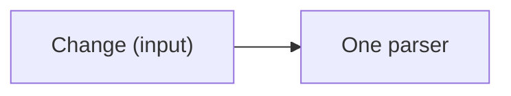

## The Goal

Reduce invalid changes from three per release to zero.

## Why now

The current parser accepts empty names.

## The target

### Interfaces

```typescript
export interface Change {
  readonly name: string;
  readonly accepted: boolean;
}
```



### What changes

Reject empty names before saving.

### Target tree

```text
src/change.ts — validate the change
src/save.ts — save accepted changes
test/change.test.ts — exercise the public call
```

### Invariants

An empty name never reaches storage.

### Reuse

Extend the existing parser and test harness.

## New names

| Name | Reason |
|---|---|
| Change | Names the existing public input. |

## Not verified

No live storage service was called.
