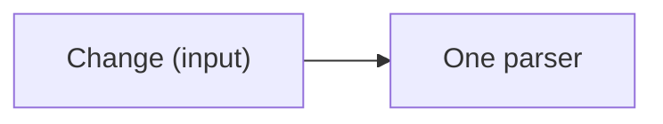

## The Goal

Reduce invalid changes from three per release to zero.

## Why now

The current parser accepts empty names.

## The target

### Reject an empty name


```mermaid
flowchart LR
  Input["Change (input)"] --> Parser["One parser"]
```

`parseChange` refuses an empty name before `saveChange` runs.

| Implementation map | Reject an empty name |
| --- | --- |
| Owner | `parseChange` in `src/change.ts` |
| Target files | `src/change.ts`; `src/save.ts` |
| Input / wake | one `Change` from the caller |
| Output / durable state | an accepted `Change` saved, or a refusal and nothing written |
| RED test | `test/change.test.ts`: an empty name is refused before saving |

### Interfaces

```typescript
export interface Change {
  readonly name: string;
  readonly accepted: boolean;
}
```

### What changes

Reject empty names before saving.

### Target tree

```text
src/change.ts — validate the change
src/save.ts — save accepted changes
test/change.test.ts — exercise the public call
```

### Invariants

An empty name never reaches storage.

### Reuse

Extend the existing parser and test harness.

## New names

| Name | Reason |
|---|---|
| Change | Names the existing public input. |

## Not verified

No live storage service was called.
