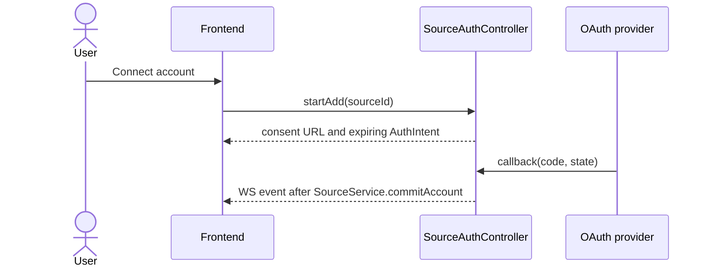

### Browser OAuth returns a provider URL and consumes one callback



`SourceAuthController.startAdd` binds an `AuthIntent` to user, Source and
deadline and returns the provider's consent URL. Only the registered callback
consumes the one-shot state and exchanges the code; expiry, replay or a
provider error closes the intent and commits nothing.

| Implementation map | Browser OAuth |
| --- | --- |
| Owner | `SourceAuthController` owns the intent; `SourceService.commitAccount` owns the account |
| Target files | `backend/src/services/sources/auth/source-auth.controller.ts`; `backend/src/services/sources/source.service.ts` |
| Input / wake | authenticated `startAdd(sourceId)`; the provider callback with `code` and `state` |
| Output / durable state | one committed account, or a closed intent and nothing written |
| RED test | `tst_bts_src_auth_001`: a replayed state commits nothing and the first commit stands |

```typescript
interface AuthIntent {
  readonly userId: string;
  readonly sourceId: string;
  readonly state: string;
  readonly expiresAt: string;
}
```
